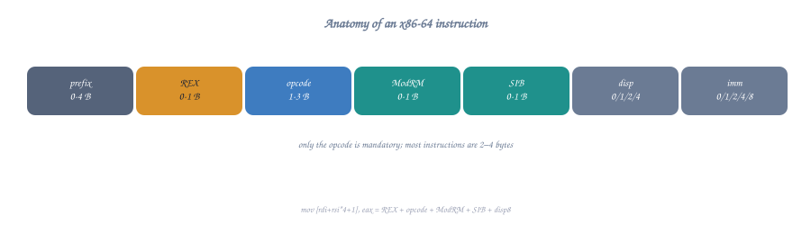
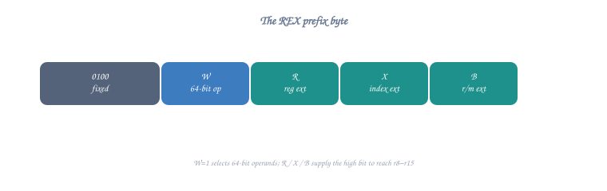
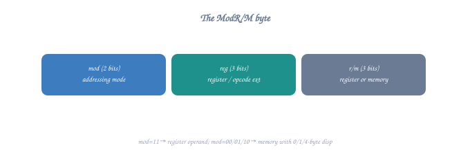
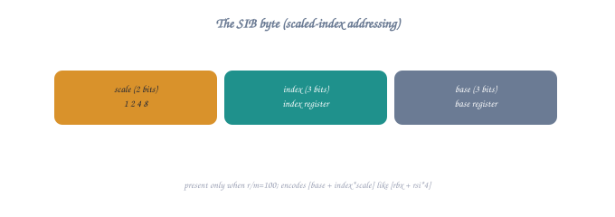

# 🔬 Instruction Encoding in x86-64

**Advanced Topic** - Understanding how assembly becomes machine code

---

## **Overview**

When you write assembly, NASM translates it into **machine code** - raw bytes that the CPU understands. Understanding this encoding helps you:
- 📏 Write more compact code
- ⚡ Understand performance differences
- 🐛 Debug at the lowest level
- 🧠 Appreciate CPU design

**Note for C Programmers:** This topic covers low-level machine code encoding that happens transparently when you compile C code. C programmers don't typically need to worry about instruction encoding - the compiler handles it automatically. However, understanding it helps explain why some operations are faster or more compact than others.

---

## **The Translation Process**

```
You Write:          mov rax, rbx
                         ↓
NASM Assembles:     48 89 D8      (3 bytes)
                         ↓
CPU Decodes:        "Move RBX into RAX"
                         ↓
CPU Executes:       RAX now contains value from RBX
```

---

## **Part 1: Instruction Format**

x86-64 instructions are **variable length** (1-15 bytes) with this structure:



<details class="ascii-diagram">
<summary>ASCII diagram</summary>
<pre><code>┌──────────┬────────┬───────┬─────┬──────────────┬───────────┐
│ Prefixes │ Opcode │ ModR/M│ SIB │ Displacement │ Immediate │
│  (0-4)   │ (1-3)  │ (0-1) │(0-1)│   (0,1,2,4)  │(0,1,2,4,8)│
└──────────┴────────┴───────┴─────┴──────────────┴───────────┘
  Optional  Required Optional Opt.    Optional      Optional

Minimum: 1 byte (opcode only)
Maximum: 15 bytes (all components)</code></pre>
</details>

### **Component Breakdown**

| Component | Size | Purpose | Example |
|-----------|------|---------|---------|
| **Prefixes** | 0-4 bytes | Modify instruction behavior | REX (64-bit), LOCK |
| **Opcode** | 1-3 bytes | The operation to perform | 0x89 (MOV), 0x31 (XOR) |
| **ModR/M** | 0-1 byte | Specifies operands | Register or memory |
| **SIB** | 0-1 byte | Complex addressing | base + index*scale |
| **Displacement** | 0,1,2,4 bytes | Memory offset | [rbx + 100] |
| **Immediate** | 0,1,2,4,8 bytes | Constant value | mov eax, 42 |

---

## **Part 2: The REX Prefix - 64-bit Mode**

The **REX prefix** (0x40-0x4F) enables 64-bit operations and extended registers.

### **REX Byte Structure**



<details class="ascii-diagram">
<summary>ASCII diagram</summary>
<pre><code>┌────┬───┬───┬───┬───┐
│0100│ W │ R │ X │ B │
└────┴───┴───┴───┴───┘
Fixed   │   │   │   └─ Extends ModR/M r/m field (R8-R15)
        │   │   └───── Extends SIB index field (R8-R15)
        │   └───────── Extends ModR/M reg field (R8-R15)
        └───────────── 1 = 64-bit operand, 0 = default

Common REX values:
0x48 (01001000) = REX.W - 64-bit operation
0x49 (01001001) = REX.W + REX.B - 64-bit with extended r/m
0x4C (01001100) = REX.W + REX.R + REX.X - full extensions</code></pre>
</details>

### **When REX is Required**

```nasm
; 64-bit operations - NEEDS REX.W
mov rax, rbx        ; 48 89 D8 (3 bytes)
add rax, rcx        ; 48 01 C8 (3 bytes)

; 32-bit operations - NO REX needed
mov eax, ebx        ; 89 D8 (2 bytes)
add eax, ecx        ; 01 C8 (2 bytes)

; Extended registers (R8-R15) - NEEDS REX
mov r8, rax         ; 49 89 C0 (3 bytes)
mov rax, r9         ; 4C 89 C8 (3 bytes)

; Accessing low bytes of RSI, RDI, RBP, RSP - NEEDS REX
mov sil, 0          ; 40 B6 00 (3 bytes)
```

### **REX Examples**

```nasm
; Example 1: mov rax, rbx
48 89 D8
│
└─ 0100 1000
        │
        └─ W=1 (64-bit operation)

; Example 2: mov r9, r10
4D 89 D1
│
└─ 0100 1101
        ││││
        │││└─ B=1 (r/m uses R8-R15)
        ││└── X=0 (not used)
        │└─── R=1 (reg uses R8-R15)
        └──── W=1 (64-bit)
```

---

## **Part 3: Opcodes**

The opcode identifies the operation. Can be 1-3 bytes.

### **Common 1-Byte Opcodes**

```
┌────────┬─────────────────────────────────┐
│ Opcode │ Operation                       │
├────────┼─────────────────────────────────┤
│ 0x01   │ ADD r/m, r                      │
│ 0x29   │ SUB r/m, r                      │
│ 0x31   │ XOR r/m, r                      │
│ 0x89   │ MOV r/m, r                      │
│ 0x8B   │ MOV r, r/m                      │
│ 0x50-57│ PUSH r (RAX-RDI)                │
│ 0x58-5F│ POP r (RAX-RDI)                 │
│ 0x90   │ NOP                             │
│ 0xC3   │ RET                             │
│ 0xEB   │ JMP short                       │
│ 0xFF   │ Various (INC, DEC, CALL, JMP)   │
└────────┴─────────────────────────────────┘
```

### **2-Byte Opcodes (0x0F prefix)**

```
┌─────────┬─────────────────────────────────┐
│ Opcode  │ Operation                       │
├─────────┼─────────────────────────────────┤
│ 0F 84   │ JZ/JE (conditional jump)        │
│ 0F 85   │ JNZ/JNE                         │
│ 0F AF   │ IMUL r, r/m                     │
│ 0F B6   │ MOVZX r, r/m8 (zero extend)     │
│ 0F BE   │ MOVSX r, r/m8 (sign extend)     │
└─────────┴─────────────────────────────────┘
```

### **Opcode Direction**

Many operations have two opcodes for different directions:

```nasm
mov eax, ebx        ; 89 D8 (opcode 0x89: MOV r/m, r)
mov ebx, eax        ; 8B D8 (opcode 0x8B: MOV r, r/m)

; The direction is encoded in the opcode itself!
```

---

## **Part 4: ModR/M Byte**

The **ModR/M** byte specifies operands and addressing modes.

### **ModR/M Structure**



<details class="ascii-diagram">
<summary>ASCII diagram</summary>
<pre><code>┌─────────┬─────────┬─────────┐
│   Mod   │   Reg   │   R/M   │
│ (2 bits)│ (3 bits)│ (3 bits)│
└─────────┴─────────┴─────────┘
  7   6    5   4   3  2   1   0</code></pre>
</details>

### **Mod Field (Addressing Mode)**

```
┌─────┬──────────────────────────────────────┐
│ Mod │ Meaning                              │
├─────┼──────────────────────────────────────┤
│ 00  │ [reg] - indirect, no displacement    │
│ 01  │ [reg + disp8] - 8-bit displacement   │
│ 10  │ [reg + disp32] - 32-bit displacement │
│ 11  │ Register direct (no memory access)   │
└─────┴──────────────────────────────────────┘
```

### **Reg Field (Register)**

```
┌─────┬──────────────────────────────────┐
│ Reg │ Without REX.R  │ With REX.R      │
├─────┼────────────────┼─────────────────┤
│ 000 │ RAX/EAX/AX/AL  │ R8/R8D/R8W/R8B  │
│ 001 │ RCX/ECX/CX/CL  │ R9/R9D/R9W/R9B  │
│ 010 │ RDX/EDX/DX/DL  │ R10/R10D/.../.. │
│ 011 │ RBX/EBX/BX/BL  │ R11/R11D/.../.. │
│ 100 │ RSP/ESP/SP/SPL │ R12/R12D/.../.. │
│ 101 │ RBP/EBP/BP/BPL │ R13/R13D/.../.. │
│ 110 │ RSI/ESI/SI/SIL │ R14/R14D/.../.. │
│ 111 │ RDI/EDI/DI/DIL │ R15/R15D/.../.. │
└─────┴────────────────┴─────────────────┘
```

### **R/M Field (Register/Memory)**

Same encoding as Reg field, but with special meaning when Mod=00/01/10:

```
When Mod != 11 (memory mode):
┌─────┬─────────────────────────────────────┐
│ R/M │ Meaning                             │
├─────┼─────────────────────────────────────┤
│ 000 │ [RAX/R8]                            │
│ 001 │ [RCX/R9]                            │
│ 010 │ [RDX/R10]                           │
│ 011 │ [RBX/R11]                           │
│ 100 │ SIB byte follows                    │
│ 101 │ [RIP + disp32] or [RBP + disp]      │
│ 110 │ [RSI/R14]                           │
│ 111 │ [RDI/R15]                           │
└─────┴─────────────────────────────────────┘
```

### **ModR/M Examples**

```nasm
; Example 1: mov rax, rbx
; Encoding: 48 89 D8
;           ModR/M byte = D8 = 11011000

D8 binary: 11 011 000
           │  │   └── R/M = 000 (RAX)
           │  └────── Reg = 011 (RBX)
           └───────── Mod = 11 (register direct)

Translation: "Move RBX (reg) to RAX (r/m)"

; Example 2: mov eax, [rbx]
; Encoding: 8B 03
;           ModR/M byte = 03 = 00000011

03 binary: 00 000 011
           │  │   └── R/M = 011 (RBX)
           │  └────── Reg = 000 (EAX)
           └───────── Mod = 00 (indirect, no disp)

Translation: "Move [RBX] (memory) to EAX (reg)"

; Example 3: add eax, [rbx + 8]
; Encoding: 03 43 08
;           ModR/M byte = 43 = 01000011
;           Displacement = 08

43 binary: 01 000 011
           │  │   └── R/M = 011 (RBX)
           │  └────── Reg = 000 (EAX)
           └───────── Mod = 01 (indirect with disp8)

Translation: "Add [RBX + 8] to EAX"
```

---

## **Part 5: SIB Byte (Scale-Index-Base)**

Used for complex addressing: `[base + index*scale + disp]`

### **SIB Structure**



<details class="ascii-diagram">
<summary>ASCII diagram</summary>
<pre><code>┌─────────┬─────────┬─────────┐
│  Scale  │  Index  │  Base   │
│ (2 bits)│ (3 bits)│ (3 bits)│
└─────────┴─────────┴─────────┘
  7   6    5   4   3  2   1   0</code></pre>
</details>

### **Scale Field**

```
┌───────┬────────────┐
│ Scale │ Multiplier │
├───────┼────────────┤
│  00   │    *1      │
│  01   │    *2      │
│  10   │    *4      │
│  11   │    *8      │
└───────┴────────────┘
```

### **Index and Base Fields**

Use same register encoding as ModR/M Reg field (000-111).

**Special Cases:**
- Index = 100 (RSP) means "no index"
- Base = 101 (RBP) with Mod=00 means disp32 only

### **SIB Examples**

```nasm
; Example 1: mov eax, [rbx + rcx*4]
; Encoding: 8B 04 8B
;           Opcode = 8B (MOV r, r/m)
;           ModR/M = 04 = 00000100
;           SIB = 8B = 10001011

ModR/M: 00 000 100
        │  │   └── R/M = 100 (SIB follows)
        │  └────── Reg = 000 (EAX)
        └───────── Mod = 00 (no displacement)

SIB: 10 001 011
     │  │   └── Base = 011 (RBX)
     │  └────── Index = 001 (RCX)
     └───────── Scale = 10 (*4)

Translation: "Move [RBX + RCX*4] to EAX"

; Example 2: mov eax, [rbx + rcx*4 + 8]
; Encoding: 8B 44 8B 08
;           Opcode = 8B
;           ModR/M = 44 = 01000100
;           SIB = 8B = 10001011
;           Disp8 = 08

ModR/M: 01 000 100
        │  │   └── R/M = 100 (SIB follows)
        │  └────── Reg = 000 (EAX)
        └───────── Mod = 01 (disp8 follows)

SIB: 10 001 011
     │  │   └── Base = 011 (RBX)
     │  └────── Index = 001 (RCX)
     └───────── Scale = 10 (*4)

Disp8: 08 (8 in decimal)

Translation: "Move [RBX + RCX*4 + 8] to EAX"

; Example 3: Array access pattern
; C code: array[i] where sizeof(int) = 4
mov eax, [rdi + rsi*4]  ; RDI=array base, RSI=index
; Encoding: 8B 04 B7
```

---

## **Part 6: Complete Encoding Examples**

### **Example 1: `nop`**

```
Assembly:   nop
Machine:    90

Analysis:
90 = Opcode for NOP (No Operation)

Total: 1 byte (shortest instruction!)
```

### **Example 2: `xor eax, eax`**

```
Assembly:   xor eax, eax
Machine:    31 C0

Analysis:
31 = Opcode (XOR r/m, r)
C0 = ModR/M byte

C0 = 11 000 000
     │  │   └── R/M = 000 (EAX)
     │  └────── Reg = 000 (EAX)
     └───────── Mod = 11 (register)

Total: 2 bytes
Why it's short: No prefixes, no immediate, register-to-register
```

### **Example 3: `mov eax, 0`**

```
Assembly:   mov eax, 0
Machine:    B8 00 00 00 00

Analysis:
B8 = Opcode (MOV EAX, imm32) - special short form
00 00 00 00 = 32-bit immediate (0)

Total: 5 bytes (1 opcode + 4 immediate)
Why it's long: Must encode the full 32-bit immediate value
```

### **Example 4: `mov rax, rbx`**

```
Assembly:   mov rax, rbx
Machine:    48 89 D8

Analysis:
48 = REX.W (enable 64-bit)
     0100 1000
         │
         └─ W=1 (64-bit operands)

89 = Opcode (MOV r/m, r)

D8 = ModR/M byte
     11 011 000
     │  │   └── R/M = 000 (RAX destination)
     │  └────── Reg = 011 (RBX source)
     └───────── Mod = 11 (register)

Total: 3 bytes (REX + opcode + ModR/M)
```

### **Example 5: `push rax`**

```
Assembly:   push rax
Machine:    50

Analysis:
50 = Opcode (PUSH RAX)

Note: PUSH has special 1-byte encodings for each register:
50 = PUSH RAX/R8
51 = PUSH RCX/R9
52 = PUSH RDX/R10
53 = PUSH RBX/R11
54 = PUSH RSP/R12
55 = PUSH RBP/R13
56 = PUSH RSI/R14
57 = PUSH RDI/R15

Total: 1 byte (most compact!)
```

### **Example 6: `mov dword [rdi + rsi*4 + 100], eax`**

```
Assembly:   mov dword [rdi + rsi*4 + 100], eax
Machine:    89 84 B7 64 00 00 00

Analysis:
89 = Opcode (MOV r/m, r)

84 = ModR/M byte
     10 000 100
     │  │   └── R/M = 100 (SIB follows)
     │  └────── Reg = 000 (EAX source)
     └───────── Mod = 10 (disp32 follows)

B7 = SIB byte
     10 110 111
     │  │   └── Base = 111 (RDI)
     │  └────── Index = 110 (RSI)
     └───────── Scale = 10 (*4)

64 00 00 00 = Displacement (100 in little-endian)

Total: 7 bytes (opcode + ModR/M + SIB + disp32)
```

### **Example 7: `mov r15, [r14 + 8]`**

```
Assembly:   mov r15, [r14 + 8]
Machine:    4D 8B 7E 08

Analysis:
4D = REX byte
     0100 1101
         ││││
         │││└─ B=1 (R/M uses R8-R15)
         ││└── X=0 (not used)
         │└─── R=1 (Reg uses R8-R15)
         └──── W=1 (64-bit)

8B = Opcode (MOV r, r/m)

7E = ModR/M byte
     01 111 110
     │  │   └── R/M = 110 (with REX.B = R14)
     │  └────── Reg = 111 (with REX.R = R15)
     └───────── Mod = 01 (disp8)

08 = Displacement (8)

Total: 4 bytes (REX + opcode + ModR/M + disp8)
```

---

## **Part 7: Why Instruction Size Matters**

### **Performance Impact**

```
Instruction Cache:
- L1 I-cache: 32-64 KB (very fast)
- Smaller code = more instructions fit in cache
- Cache miss = ~50-100 cycle penalty

Example:
1000 instances of "xor eax, eax" (2 bytes each) = 2 KB
1000 instances of "mov eax, 0" (5 bytes each) = 5 KB

Difference: 3 KB saved = more cache-friendly
```

### **Decoding Efficiency**

```
Modern CPUs decode multiple instructions per cycle:
- Shorter instructions = more can be decoded
- Simple instructions = faster decode

Intel/AMD can decode 4-5 instructions per cycle if:
✓ Instructions are short
✓ Instructions are simple
✓ No complex addressing modes
```

### **Branch Prediction**

```
Smaller code = shorter branch distances
- Short jumps: 2 bytes (JMP rel8)
- Long jumps: 5 bytes (JMP rel32)

More code fits in prediction buffers
```

---

## **Part 8: Optimization Techniques**

### **1. Choose Shorter Encodings**

```nasm
; BAD: 7 bytes
mov rax, 0              ; 48 C7 C0 00 00 00 00

; GOOD: 3 bytes (and faster!)
xor eax, eax            ; 31 C0
; Note: zeros upper 32 bits automatically in 64-bit mode
```

### **2. Use 32-bit When Possible**

```nasm
; If you only need 32-bit result:
xor eax, eax            ; 2 bytes (no REX needed)
; vs
xor rax, rax            ; 3 bytes (needs REX.W)

; Both zero the full 64-bit register!
```

### **3. Leverage Special Encodings**

```nasm
; PUSH/POP are compact
push rax                ; 1 byte
push rbx                ; 1 byte
; ... do work ...
pop rbx                 ; 1 byte
pop rax                 ; 1 byte

; vs saving to memory (much longer)
mov [temp1], rax        ; 7-8 bytes
mov [temp2], rbx        ; 7-8 bytes
```

### **4. Minimize Immediate Values**

```nasm
; BAD: 5 bytes
mov eax, 1              ; B8 01 00 00 00

; BETTER: 5 bytes total, but might be faster
xor eax, eax            ; 31 C0 (2 bytes)
inc eax                 ; FF C0 (2 bytes) or 48 FF C0 (3 bytes for RAX)

; CONTEXT MATTERS: If you already have EAX=0, just INC!
```

### **5. Use LEA for Arithmetic**

```nasm
; Instead of multiple operations:
add eax, ebx            ; 2 bytes
add eax, 8              ; 3-6 bytes
; Total: 5-8 bytes

; Use LEA (Load Effective Address):
lea eax, [ebx + eax + 8]; 3-4 bytes
; Does (EBX + EAX + 8) in one instruction!
```

### **6. Avoid Unnecessary Prefixes**

```nasm
; 64-bit REX prefix adds 1 byte
; If you don't need 64-bit, don't use it

; Accessing low 32-bits:
mov eax, [rdi]          ; No REX needed if EAX is enough
; vs
mov rax, [rdi]          ; Needs REX.W
```

---

## **Part 9: Tools for Exploration**

### **Using objdump**

```bash
# Create test file
cat > test.asm << 'EOF'
section .text
    global _start
_start:
    xor eax, eax
    mov eax, 0
    mov rax, rbx
    push rax
    mov eax, [rbx + rcx*4 + 8]
EOF

# Assemble
nasm -f elf64 test.asm -o test.o

# Disassemble with machine code
objdump -d test.o -M intel

# Output:
# 0: 31 c0                   xor    eax,eax
# 2: b8 00 00 00 00          mov    eax,0x0
# 7: 48 89 d8                mov    rax,rbx
# a: 50                      push   rax
# b: 8b 44 8b 08             mov    eax,DWORD PTR [rbx+rcx*4+0x8]
```

### **Using hexdump**

```bash
# View raw bytes
hexdump -C test.o | less

# Look for the .text section
```

### **Online Assembler**

- **Defuse Online x86 Assembler**: https://defuse.ca/online-x86-assembler.htm
  - Type assembly, get machine code instantly
  - Great for quick experiments

- **Godbolt Compiler Explorer**: https://godbolt.org/
  - See how C code compiles to assembly
  - Shows machine code bytes

### **NASM List File**

```bash
# Generate listing file with machine code
nasm -f elf64 -l test.lst test.asm

# View listing
cat test.lst

# Shows line numbers, addresses, machine code, and source
```

---

## **Part 10: Decoding Practice**

### **Exercise 1**

```
Machine code: 48 01 C3

Decode it:
48 = ?
01 = ?
C3 = ?

Assembly: ?
```

<details>
<summary>Solution</summary>

```
48 = REX.W (64-bit)
01 = ADD r/m, r
C3 = 11 000 011
     │  │   └── R/M = 011 (RBX)
     │  └────── Reg = 000 (RAX)
     └───────── Mod = 11 (register)

Assembly: add rbx, rax
```
</details>

### **Exercise 2**

```
Machine code: 89 D8

Decode it:
89 = ?
D8 = ?

Assembly: ?
```

<details>
<summary>Solution</summary>

```
89 = MOV r/m, r
D8 = 11 011 000
     │  │   └── R/M = 000 (EAX/RAX)
     │  └────── Reg = 011 (EBX/RBX)
     └───────── Mod = 11 (register)

Assembly: mov eax, ebx (or mov rax, rbx with REX)
Context determines size!
```
</details>

### **Exercise 3**

```
Machine code: 50

What instruction?
```

<details>
<summary>Solution</summary>

```
50 = PUSH RAX (or PUSH R8 with REX.B)

Single-byte encoding for PUSH register.
```
</details>

### **Exercise 4**

```
Machine code: 8B 04 8B

Decode it:
8B = ?
04 = ?
8B = ?

Assembly: ?
```

<details>
<summary>Solution</summary>

```
8B = MOV r, r/m
04 = 00 000 100
     │  │   └── R/M = 100 (SIB follows)
     │  └────── Reg = 000 (EAX)
     └───────── Mod = 00 (no disp)

8B = 10 001 011
     │  │   └── Base = 011 (RBX)
     │  └────── Index = 001 (RCX)
     └───────── Scale = 10 (*4)

Assembly: mov eax, [rbx + rcx*4]
```
</details>

---

## **Part 11: Advanced Topics**

### **RIP-Relative Addressing (64-bit)**

```nasm
; Position-independent code uses RIP-relative
mov rax, [rel myvar]    ; Encoded relative to instruction pointer

; Encoding uses ModR/M with special values:
; Mod = 00, R/M = 101 means [RIP + disp32]
```

### **VEX/EVEX Prefixes (AVX/AVX-512)**

```
SIMD instructions use longer prefixes:
- VEX: 2-3 byte prefix (AVX, AVX2)
- EVEX: 4 byte prefix (AVX-512)

Example:
vaddps xmm0, xmm1, xmm2  ; VEX prefix + opcode
```

### **Lock Prefix**

```nasm
; Atomic operations
lock add [counter], 1   ; 0xF0 prefix + normal encoding
```

### **Segment Overrides**

```nasm
; Rarely used in 64-bit mode
mov rax, gs:[0x28]      ; TLS access (0x65 prefix)
```

---

## **Summary Tables**

### **Instruction Length by Category**

```
┌──────────────────────┬───────┬─────────────────────┐
│ Instruction Type     │ Bytes │ Example             │
├──────────────────────┼───────┼─────────────────────┤
│ Simple ops           │ 1-2   │ NOP, PUSH, POP      │
│ Register-register    │ 2-3   │ ADD, MOV, XOR       │
│ Register-immediate   │ 5-7   │ MOV EAX, 42         │
│ Memory-register      │ 3-8   │ MOV [RBX], RAX      │
│ Complex addressing   │ 7-10  │ MOV [RBX+RCX*4+N],. │
└──────────────────────┴───────┴─────────────────────┘
```

### **Component Sizes**

```
┌──────────────┬───────┬──────────────────────────┐
│ Component    │ Bytes │ When Present             │
├──────────────┼───────┼──────────────────────────┤
│ REX prefix   │ 1     │ 64-bit or R8-R15         │
│ Opcode       │ 1-3   │ Always                   │
│ ModR/M       │ 1     │ Most instructions        │
│ SIB          │ 1     │ Complex addressing       │
│ Displacement │ 1-4   │ Memory with offset       │
│ Immediate    │ 1-8   │ Constant operand         │
└──────────────┴───────┴──────────────────────────┘
```

---

## **Key Takeaways**

1. ✅ **Variable Length**: Instructions are 1-15 bytes
2. ✅ **Structured Format**: Each component has a specific purpose
3. ✅ **REX is for 64-bit**: Required for 64-bit ops and R8-R15
4. ✅ **Shorter = Better**: Saves cache space and decoding time
5. ✅ **ModR/M is Complex**: Handles registers and all addressing modes
6. ✅ **SIB for Arrays**: Essential for `base + index*scale` patterns
7. ✅ **Special Encodings**: Some instructions have compact forms (PUSH, NOP)
8. ✅ **Optimization Matters**: Understanding encoding helps write better code

---

## **Further Reading**

### **Official Documentation**
- **Intel® 64 and IA-32 Architectures Software Developer's Manual**
  - Volume 2: Instruction Set Reference
  - Chapter 2: Instruction Format
  
- **AMD64 Architecture Programmer's Manual**
  - Volume 3: Instruction Reference

### **Articles & Guides**
- **Agner Fog's Optimization Manuals**: CPU-specific optimization
- **OSDev Wiki**: x86-64 instruction encoding
- **Felix Cloutier's x86 Reference**: Online instruction reference

### **Tools**
- **Intel XED**: Intel's encoder/decoder library
- **Capstone**: Disassembly framework
- **NASM Documentation**: Assembler-specific details

---

## **Next Steps**

Now that you understand instruction encoding:

1. ✅ Read disassembly output with understanding
2. ✅ Write more optimal assembly code
3. ✅ Debug at the machine code level
4. ✅ Appreciate compiler optimizations
5. ✅ Understand performance implications

**Continue with:** [Topic 3: Basic Instructions](../topics/topic-03-basic-instructions.md)

---

[← Back to Main](../README.md) | [Q&A Index](../README.md#-qa-section---deep-dives)

