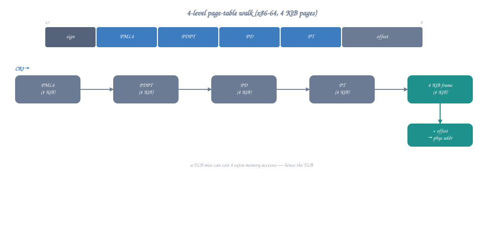

# Q&A: Virtual Memory Explained

## The Question

> Every pointer I use in assembly is a "virtual address." What does that mean? How does the CPU translate it to a real physical location? Why can two processes use the same address without conflict? And what's a page table?

---

## Quick Answer

Virtual memory is an illusion: every process thinks it has 256TB of contiguous memory starting at address 0. In reality, the CPU's MMU (Memory Management Unit) translates every virtual address to a physical address using a 4-level page table structure. Different processes have different page tables, so the same virtual address maps to different physical locations. Pages that haven't been accessed don't use any physical memory at all.

---

## The Translation (One Slide Version)



<details class="ascii-diagram">
<summary>ASCII diagram</summary>
<pre><code>Your instruction: mov rax, [0x7FFFF7A2C123]

CPU does (transparently, ~1ns with TLB hit):

  Virtual Address: 0x00007FFFF7A2C123
  ┌──────────┬─────────┬─────────┬─────────┬────────────┐
  │  PML4    │  PDPT   │   PD    │   PT    │   Offset   │
  │  255     │  507    │  418    │  44     │   0x123    │
  └────┬─────┴────┬────┴────┬────┴────┬────┴──────┬─────┘
       │          │         │         │           │
  CR3──┘          │         │         │           │
  [PML4 table]    │         │         │           │
   entry 255──────┘         │         │           │
  [PDPT table]              │         │           │
   entry 507────────────────┘         │           │
  [PD table]                          │           │
   entry 418──────────────────────────┘           │
  [Page Table]                                    │
   entry 44 → Physical Page 0x1F3A0 ──────────────┘
                                                  │
  Physical Address: 0x1F3A0000 + 0x123 = 0x1F3A0123
  ┌─────────────────────────────────────────────┐
  │ Physical RAM byte at 0x1F3A0123             │
  └─────────────────────────────────────────────┘</code></pre>
</details>

---

## Why Virtual Memory Exists

### Without Virtual Memory (1970s)

```
Physical RAM: 64KB total
┌──────────────────────────────────────────┐
│ OS: 0x0000-0x3FFF                        │
│ Program A: 0x4000-0x7FFF                 │
│ Program B: 0x8000-0xBFFF                 │
│ Free: 0xC000-0xFFFF                      │
└──────────────────────────────────────────┘

Problems:
  1. Programs must be compiled for specific addresses
  2. Program A can read/write Program B's memory (no protection!)
  3. Can't run program that needs more memory than physically available
  4. Can't run program whose address range overlaps another
  5. Memory fragmentation: 20KB free but not contiguous → can't use it
```

### With Virtual Memory (Modern)

```
Each process sees:
┌──────────────────────────────────────────┐
│ 0x000000000000 - 0x7FFFFFFFFFFF          │  256 TB for me alone!
│                                          │  (Even if only 16GB RAM exists)
│ My code at 0x400000                      │
│ My heap growing from 0x600000            │
│ My stack at 0x7FFFFFFFE000               │
└──────────────────────────────────────────┘

Process A and Process B can BOTH use address 0x400000
  → Different page tables → different physical pages
  → Complete isolation, no possible interference
```

---

## Page Tables: The 4-Level Structure

### Why 4 Levels?

```
48-bit virtual address → 256 TB address space
If we used a flat table: 2^48 / 4096 = 2^36 entries × 8 bytes = 512 GB
  → Table would be LARGER than most RAM!

Solution: hierarchical (only populate entries actually used)

Typical process uses:
  ~100 MB of mapped memory → needs only ~25,000 page table entries
  Rather than 68 billion entries in a flat table!

Each level is one 4KB page with 512 entries (2^9 = 512, × 8 bytes = 4096)
4 levels × 9 bits = 36 bits for indexing + 12 bits for page offset = 48 bits
```

### TLB: Why It's Not Slow

```
Full page table walk: 4 memory accesses (one per level)
  → ~400ns total (4 × ~100ns memory access)
  
TLB (Translation Lookaside Buffer): cache of recent translations
  → ~1ns for a TLB hit (99%+ hit rate for most programs)
  
TLB size: ~1500 entries
  → Covers 1500 × 4KB = ~6MB with 4KB pages
  → Covers 1500 × 2MB = ~3GB with huge pages!
  
TLB miss penalty: triggers hardware page table walk
  → CPU has dedicated Page Miss Handler (PMH) hardware
  → Walks page tables from CR3 automatically
  → Fills TLB entry, retries access transparently
```

---

## What a Page Fault Really Is

```
Access to virtual address 0x12345678:

Case 1: Valid mapping, page present
  → TLB hit (fast) or TLB miss + page walk → access succeeds
  → No fault, no kernel involvement

Case 2: Valid mapping, page NOT present (demand paging)
  → Page fault exception (#PF)
  → Kernel: "this address is valid (in VMA), just not loaded yet"
  → Allocate physical page, zero it, install PTE, resume
  → This is a MINOR page fault (no disk I/O)

Case 3: Valid mapping, page on disk (swapped out)
  → Page fault exception (#PF)
  → Kernel: "this page was swapped to disk"
  → Read from swap partition, install PTE, resume
  → This is a MAJOR page fault (disk I/O, ~10ms)

Case 4: Invalid address (no VMA covers it)
  → Page fault exception (#PF)
  → Kernel: "this address doesn't belong to this process"
  → Deliver SIGSEGV → program crashes (Segmentation Fault!)

Case 5: Permission violation (write to read-only)
  → Could be COW: kernel copies page, makes writable
  → Could be actual violation: SIGSEGV
```

---

## Observing Virtual Memory

### /proc/self/maps

```
$ cat /proc/self/maps
ADDRESS RANGE          PERMS  OFFSET   DEV   INODE  PATH
00400000-00401000      r-xp   00000000 08:01 131072 /usr/bin/cat
00601000-00602000      rw-p   00001000 08:01 131072 /usr/bin/cat
00602000-00623000      rw-p   00000000 00:00 0      [heap]
7f1234560000-7f1234720000 r-xp 00000000 08:01 262144 /lib/x86_64-linux-gnu/libc-2.31.so
7ffff7ffd000-7ffff7fff000 r-xp 00000000 00:00 0      [vdso]
7ffffffde000-7ffffffff000 rw-p 00000000 00:00 0      [stack]

Columns:
  Address range: virtual address start-end
  Perms: r(read) w(write) x(execute) p(private)/s(shared)
  Offset: offset into mapped file
  Dev: device (major:minor)
  Inode: file inode number
  Path: mapped file or special region name
```

### In Assembly

```nasm
; Read your own memory map:
mov rax, 2              ; sys_open
lea rdi, [rel .path]
xor rsi, rsi
syscall                 ; Open /proc/self/maps
; Read and print contents...

section .rodata
.path: db "/proc/self/maps", 0
```

---

## Key Insights

### 1. Virtual Memory is "Free" Until Touched

```
mmap(NULL, 1GB, PROT_READ|PROT_WRITE, MAP_PRIVATE|MAP_ANONYMOUS, -1, 0)
  → Returns immediately
  → Uses ZERO physical memory
  → Only allocates page table entries (pointing to nothing)
  → Physical pages allocated ONE AT A TIME on first write (page fault)
```

### 2. Two Processes, Same Virtual Address, Different Data

```
Process A: page table entry for 0x400000 → physical page 0x1A000
Process B: page table entry for 0x400000 → physical page 0x2B000

Same virtual address, completely different physical pages.
When CPU switches between A and B, it loads different CR3 → different page tables.
```

### 3. Shared Libraries: One Physical Copy, Many Virtual Mappings

```
libc.so loaded at:
  Process A: virtual 0x7f1234560000 → physical pages 0x100000-0x1C0000
  Process B: virtual 0x7f9876540000 → physical pages 0x100000-0x1C0000
  Process C: virtual 0x7f5555550000 → physical pages 0x100000-0x1C0000
  
Different virtual addresses, SAME physical pages!
Only ONE copy in RAM serves all processes.
```

---

## TL;DR

| Question | Answer |
|----------|--------|
| What's a virtual address? | An illusion — NOT a real RAM location |
| Who translates it? | MMU hardware (page table walk or TLB cache) |
| How fast? | ~1ns with TLB hit; ~400ns on TLB miss |
| Why 4 levels? | Sparse coverage — only allocate tables for used regions |
| What's a page? | 4KB unit of virtual-to-physical mapping |
| What's a page fault? | Address valid but page not in RAM → kernel handles it |
| What's SIGSEGV? | Page fault on address that ISN'T in your VMA list |
| What's CR3? | CPU register holding physical address of top-level page table |
| What happens on context switch? | New CR3 loaded → completely different address space |
| Can I see my own page tables? | No (kernel only), but /proc/self/maps shows mappings |
