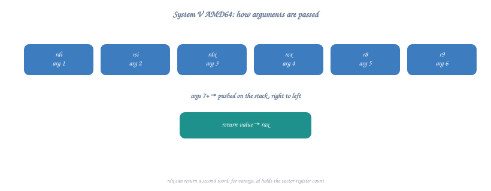

# 📘 Topic 9: Calling Conventions

Master the rules for passing parameters and calling functions across different platforms and ABIs.

---

## **Overview**

A **calling convention** is a standardized protocol that defines:
- 📥 How arguments are passed to functions
- 📤 How return values are returned
- 💾 Which registers must be preserved
- 🧹 Who cleans up the stack (caller vs callee)
- 📏 Stack alignment requirements

Different conventions exist for different architectures, operating systems, and languages.

---

## **Part 1: Why Calling Conventions Matter**

### **The Problem**

```nasm
; Without conventions, this is ambiguous:
call my_function

; Questions:
; - Where are the arguments?
; - Where does the result go?
; - Which registers can the function modify?
; - Who cleans the stack?
```

### **The Solution**

**Calling conventions** provide standard answers so code from different sources can work together.

**Benefits:**
- ✅ Different compilers produce compatible code
- ✅ Assembly can call C functions (and vice versa)
- ✅ Libraries can be shared
- ✅ Predictable behavior for debugging

---

## **Part 2: System V AMD64 ABI (Linux/Unix x86-64)**

This is the **standard for Linux, macOS, BSD** on 64-bit systems.

### **Parameter Passing**

**First 6 integer/pointer arguments** go in registers:



<details class="ascii-diagram">
<summary>ASCII diagram</summary>
<pre><code>┌─────────┬──────────┬──────────┬──────────┬──────────┬──────────┐
│  Arg 1  │  Arg 2   │  Arg 3   │  Arg 4   │  Arg 5   │  Arg 6   │
├─────────┼──────────┼──────────┼──────────┼──────────┼──────────┤
│   RDI   │   RSI    │   RDX    │   RCX    │   R8     │   R9     │
└─────────┴──────────┴──────────┴──────────┴──────────┴──────────┘</code></pre>
</details>

**Additional arguments** (7th, 8th, ...) go on the **stack** (right-to-left).

**Floating-point arguments** use **XMM0-XMM7** (8 registers).

### **Return Values**

```
Integer/Pointer: RAX
Floating-point:  XMM0
128-bit:         RDX:RAX (high:low)
```

### **Register Usage**

```
┌──────────────────┬───────────────────────────────────────┐
│ Register         │ Usage                                 │
├──────────────────┼───────────────────────────────────────┤
│ RAX              │ Return value, temp, syscalls          │
│ RBX, RBP         │ Callee-saved (must preserve)          │
│ R12, R13, R14,   │ Callee-saved (must preserve)          │
│ R15              │                                       │
│ RDI, RSI, RDX,   │ Argument passing, temp (caller-saved) │
│ RCX, R8, R9      │                                       │
│ R10, R11         │ Temp, caller-saved                    │
│ RSP              │ Stack pointer (must preserve)         │
│ RIP              │ Instruction pointer (hardware)        │
└──────────────────┴───────────────────────────────────────┘
```

### **Stack Alignment**

**RSP must be 16-byte aligned** before `call` instruction.
- `call` pushes 8-byte return address → RSP becomes misaligned by 8
- Function prologue must realign if needed

---

## **Part 3: System V Examples**

### **Example 1: Simple Function Call**

**C Equivalent:**
```c
int add(int a, int b) {
    return a + b;
}

int main() {
    int result = add(5, 10);
    return result;
}
```

**Assembly:**
```nasm
section .text
    global main

; int add(int a, int b)
add:
    ; a is in EDI, b is in ESI (32-bit ints use lower 32 bits)
    lea eax, [rdi + rsi]        ; result = a + b
    ret                         ; return in EAX

main:
    ; Call add(5, 10)
    mov edi, 5                  ; arg1 = 5
    mov esi, 10                 ; arg2 = 10
    call add
    
    ; RAX now contains 15
    mov rdi, rax                ; exit code = result
    mov rax, 60                 ; sys_exit
    syscall
```

---

### **Example 2: Six Arguments**

**C Equivalent:**
```c
long sum6(long a, long b, long c, long d, long e, long f) {
    return a + b + c + d + e + f;
}

int main() {
    long result = sum6(1, 2, 3, 4, 5, 6);
    return result;
}
```

**Assembly:**
```nasm
section .text
    global main

; long sum6(long a, long b, long c, long d, long e, long f)
sum6:
    ; a=RDI, b=RSI, c=RDX, d=RCX, e=R8, f=R9
    mov rax, rdi
    add rax, rsi
    add rax, rdx
    add rax, rcx
    add rax, r8
    add rax, r9
    ret                         ; return sum in RAX

main:
    mov rdi, 1                  ; arg1
    mov rsi, 2                  ; arg2
    mov rdx, 3                  ; arg3
    mov rcx, 4                  ; arg4
    mov r8, 5                   ; arg5
    mov r9, 6                   ; arg6
    call sum6
    
    ; RAX = 21
    mov rdi, rax
    mov rax, 60
    syscall
```

---

### **Example 3: More Than Six Arguments (Stack)**

**C Equivalent:**
```c
long sum8(long a, long b, long c, long d, long e, long f, long g, long h) {
    return a + b + c + d + e + f + g + h;
}

int main() {
    long result = sum8(1, 2, 3, 4, 5, 6, 7, 8);
    return result;
}
```

**Assembly:**
```nasm
section .text
    global main

; long sum8(long a, long b, long c, long d, long e, long f, long g, long h)
sum8:
    ; Args 1-6 in registers: RDI, RSI, RDX, RCX, R8, R9
    ; Args 7-8 on stack: [rsp+8] = g, [rsp+16] = h
    
    mov rax, rdi                ; sum = a
    add rax, rsi                ; sum += b
    add rax, rdx                ; sum += c
    add rax, rcx                ; sum += d
    add rax, r8                 ; sum += e
    add rax, r9                 ; sum += f
    add rax, [rsp + 8]          ; sum += g (7th arg)
    add rax, [rsp + 16]         ; sum += h (8th arg)
    ret

main:
    ; Push args 8, 7 (right-to-left) for stack alignment
    push 8                      ; arg8 (h)
    push 7                      ; arg7 (g)
    
    ; Register args 1-6
    mov rdi, 1                  ; arg1
    mov rsi, 2                  ; arg2
    mov rdx, 3                  ; arg3
    mov rcx, 4                  ; arg4
    mov r8, 5                   ; arg5
    mov r9, 6                   ; arg6
    call sum8
    
    ; Clean up stack (2 pushes × 8 bytes = 16 bytes)
    add rsp, 16
    
    ; RAX = 36
    mov rdi, rax
    mov rax, 60
    syscall
```

---

### **Example 4: Callee-Saved Registers**

**C Equivalent:**
```c
int helper(int x) {
    // Uses registers that must be preserved
    int temp1 = x * 2;      // Uses RBX
    int temp2 = x * 3;      // Uses R12
    return temp1 + temp2;
}

int main() {
    int result = helper(10);
    return result;
}
```

**Assembly:**
```nasm
section .text
    global main

; int helper(int x)
helper:
    ; Must save callee-saved registers before using them
    push rbx
    push r12
    
    ; x is in EDI
    mov ebx, edi
    shl ebx, 1                  ; temp1 = x * 2 (in RBX)
    
    lea r12d, [rdi + rdi*2]     ; temp2 = x * 3 (in R12)
    
    lea eax, [rbx + r12]        ; result = temp1 + temp2
    
    ; Restore callee-saved registers
    pop r12
    pop rbx
    ret

main:
    mov edi, 10
    call helper
    
    ; RAX = 50
    mov rdi, rax
    mov rax, 60
    syscall
```

---

## **Part 4: Microsoft x64 Calling Convention (Windows)**

### **Parameter Passing**

**First 4 arguments** go in registers (different from System V!):

```
┌─────────┬──────────┬──────────┬──────────┐
│  Arg 1  │  Arg 2   │  Arg 3   │  Arg 4   │
├─────────┼──────────┼──────────┼──────────┤
│   RCX   │   RDX    │   R8     │   R9     │
└─────────┴──────────┴──────────┴──────────┘
```

**All additional arguments** go on the stack.

**Shadow Space:** Caller must allocate 32 bytes (4 × 8) on stack for register args (even if not used).

### **Return Values**

```
Integer/Pointer: RAX
Floating-point:  XMM0
```

### **Register Usage**

```
┌──────────────────┬───────────────────────────────────────┐
│ Register         │ Usage                                 │
├──────────────────┼───────────────────────────────────────┤
│ RAX              │ Return value, temp                    │
│ RBX, RBP, RDI,   │ Callee-saved (must preserve)          │
│ RSI, R12-R15     │                                       │
│ RCX, RDX, R8, R9 │ Argument passing, temp                │
│ R10, R11         │ Temp, caller-saved                    │
│ RSP              │ Stack pointer                         │
└──────────────────┴───────────────────────────────────────┘
```

### **Stack Alignment**

RSP must be **16-byte aligned** before `call`.

---

## **Part 5: 32-bit Conventions (cdecl, stdcall, fastcall)**

### **cdecl (C Declaration)**

**Default for C on 32-bit x86.**

```nasm
; int add(int a, int b)
; C: add(5, 10)

; Caller:
push 10                     ; arg2 (right-to-left)
push 5                      ; arg1
call add
add esp, 8                  ; Caller cleans stack (2 args × 4 bytes)

; Callee:
add:
    push ebp
    mov ebp, esp
    mov eax, [ebp + 8]      ; arg1
    add eax, [ebp + 12]     ; arg2
    pop ebp
    ret                     ; No stack cleanup
```

**Characteristics:**
- Arguments pushed **right-to-left**
- **Caller** cleans the stack
- Allows variadic functions (printf)

---

### **stdcall (Standard Call)**

**Used by Windows API.**

```nasm
; int add(int a, int b)

; Caller:
push 10
push 5
call add
; Note: NO stack cleanup by caller

; Callee:
add:
    push ebp
    mov ebp, esp
    mov eax, [ebp + 8]
    add eax, [ebp + 12]
    pop ebp
    ret 8                   ; Callee cleans stack (return and pop 8 bytes)
```

**Characteristics:**
- Arguments pushed **right-to-left**
- **Callee** cleans the stack
- Cannot do variadic functions
- Slightly more efficient (smaller code)

---

### **fastcall**

**Uses registers for first few arguments.**

```nasm
; int add(int a, int b)

; Caller:
mov ecx, 5                  ; arg1 in ECX
mov edx, 10                 ; arg2 in EDX
call add

; Callee:
add:
    lea eax, [ecx + edx]    ; result = arg1 + arg2
    ret
```

**Characteristics:**
- First 2 args in **ECX, EDX**
- Remaining args on stack
- Faster (no memory access for first 2 args)

---

## **Part 6: Comparison Table**

```
┌──────────────┬───────────────┬──────────────┬─────────────┬──────────────┐
│ Convention   │ Architecture  │ Arg Order    │ Stack Cleanup│ Registers   │
├──────────────┼───────────────┼──────────────┼─────────────┼──────────────┤
│ System V     │ x64 Linux/Mac │ Reg then Stk │ Caller       │ RDI RSI RDX  │
│ AMD64        │               │              │              │ RCX R8 R9    │
├──────────────┼───────────────┼──────────────┼─────────────┼──────────────┤
│ Microsoft    │ x64 Windows   │ Reg then Stk │ Caller       │ RCX RDX R8   │
│ x64          │               │              │ (shadow!)    │ R9           │
├──────────────┼───────────────┼──────────────┼─────────────┼──────────────┤
│ cdecl        │ x86 (32-bit)  │ Right-to-left│ Caller       │ None         │
│              │               │ on stack     │              │              │
├──────────────┼───────────────┼──────────────┼─────────────┼──────────────┤
│ stdcall      │ x86 (32-bit)  │ Right-to-left│ Callee       │ None         │
│              │ Windows       │ on stack     │              │              │
├──────────────┼───────────────┼──────────────┼─────────────┼──────────────┤
│ fastcall     │ x86 (32-bit)  │ ECX, EDX,    │ Callee       │ ECX, EDX     │
│              │               │ then stack   │              │              │
└──────────────┴───────────────┴──────────────┴─────────────┴──────────────┘
```

---

## **Part 7: Practical Example - Mixed Convention**

### **Calling C from Assembly (System V)**

**C Code (mylib.c):**
```c
#include <stdio.h>

int multiply(int a, int b) {
    return a * b;
}

void print_result(int result) {
    printf("Result: %d\n", result);
}
```

**Assembly (main.asm):**
```nasm
section .text
    extern multiply
    extern print_result
    global main

main:
    ; Call multiply(6, 7)
    mov edi, 6                  ; arg1 = 6
    mov esi, 7                  ; arg2 = 7
    call multiply               ; result in EAX
    
    ; Call print_result(result)
    mov edi, eax                ; arg1 = result
    call print_result
    
    ; Exit
    xor eax, eax                ; return 0
    ret
```

**Compile and Link:**
```bash
nasm -f elf64 main.asm -o main.o
gcc -c mylib.c -o mylib.o
gcc main.o mylib.o -o program
./program
# Output: Result: 42
```

---

## **Part 8: Stack Frame Layout**

### **System V AMD64 Stack Frame**

```
Higher Addresses
┌─────────────────┐
│   Arg 8         │ ← [rbp + 24]
│   Arg 7         │ ← [rbp + 16]
│ Return Address  │ ← [rbp + 8] (pushed by call)
├─────────────────┤
│ Saved RBP       │ ← RBP (current frame base)
├─────────────────┤
│ Local Var 1     │ ← [rbp - 8]
│ Local Var 2     │ ← [rbp - 16]
│ ...             │
├─────────────────┤
│ Saved Regs      │ (if needed)
├─────────────────┤
│ Alignment       │ (padding to 16 bytes)
└─────────────────┘ ← RSP (stack top)
Lower Addresses
```

---

## **Part 9: Common Mistakes**

### **❌ Mistake 1: Wrong Argument Order**

```nasm
; WRONG - System V uses RDI, RSI, not RCX, RDX
mov rcx, 5                  ; ❌ Wrong register!
mov rdx, 10
call my_function

; CORRECT
mov rdi, 5                  ; ✓ RDI for 1st arg (System V)
mov rsi, 10                 ; ✓ RSI for 2nd arg
call my_function
```

---

### **❌ Mistake 2: Not Preserving Callee-Saved Registers**

```nasm
; WRONG
my_function:
    mov rbx, rdi            ; ❌ Destroyed RBX without saving!
    ; ... use rbx ...
    ret

; CORRECT
my_function:
    push rbx                ; ✓ Save RBX
    mov rbx, rdi
    ; ... use rbx ...
    pop rbx                 ; ✓ Restore RBX
    ret
```

---

### **❌ Mistake 3: Forgetting Stack Cleanup**

```nasm
; cdecl convention - caller cleans
push 10
push 5
call add
; ❌ MISSING: add esp, 8

; CORRECT
push 10
push 5
call add
add esp, 8                  ; ✓ Caller cleans stack
```

---

### **❌ Mistake 4: Stack Misalignment**

```nasm
; WRONG - RSP not 16-byte aligned
main:
    push rax                ; RSP -= 8 (now misaligned!)
    call function           ; ❌ Function expects aligned stack
    
; CORRECT
main:
    push rax                ; RSP -= 8
    sub rsp, 8              ; Align to 16 bytes
    call function           ; ✓ Stack aligned
    add rsp, 8
    pop rax
```

---

## **Part 10: Debugging Tips**

### **Check Calling Convention**

```bash
# Check how GCC compiles a function
gcc -S -O2 test.c -o test.s
cat test.s

# Check what convention is used
objdump -d program | less
```

### **GDB Tips**

```bash
gdb ./program

# View registers before call
(gdb) info registers

# Check stack
(gdb) x/10xg $rsp

# Step into function
(gdb) si

# View arguments (System V)
(gdb) print $rdi
(gdb) print $rsi
```

---

## **✅ Practice Exercises**

### **Exercise 1: Convert to Assembly**

Write assembly for this C function using System V:
```c
int average(int a, int b, int c) {
    return (a + b + c) / 3;
}
```

<details>
<summary>Solution</summary>

```nasm
; int average(int a, int b, int c)
average:
    ; a=EDI, b=ESI, c=EDX
    lea eax, [rdi + rsi]    ; sum = a + b
    add eax, edx            ; sum += c
    
    mov ecx, 3
    cdq                     ; Sign-extend EAX to EDX:EAX
    idiv ecx                ; EAX = sum / 3
    
    ret
```
</details>

---

### **Exercise 2: Call from Assembly**

Write assembly that calls this C function:
```c
int max(int x, int y);
```

<details>
<summary>Solution</summary>

```nasm
section .text
    extern max
    global main

main:
    mov edi, 42             ; arg1 = 42
    mov esi, 17             ; arg2 = 17
    call max
    
    ; RAX contains max(42, 17) = 42
    mov rdi, rax            ; exit code
    mov rax, 60
    syscall
```
</details>

---

### **Exercise 3: Fix the Bug**

What's wrong with this code?
```nasm
my_function:
    mov r12, rdi            ; Use R12 for something
    ; ... more code ...
    ret
```

<details>
<summary>Solution</summary>

R12 is callee-saved and must be preserved!

```nasm
my_function:
    push r12                ; Save R12
    mov r12, rdi
    ; ... more code ...
    pop r12                 ; Restore R12
    ret
```
</details>

---

## **📋 Quick Reference Card**

### **System V AMD64 (Linux/macOS)**
```
Args (int):  RDI, RSI, RDX, RCX, R8, R9, then stack
Return:      RAX
Callee-save: RBX, RBP, R12-R15
Alignment:   16-byte before call
```

### **Microsoft x64 (Windows)**
```
Args (int):  RCX, RDX, R8, R9, then stack
Return:      RAX
Shadow:      32 bytes
Callee-save: RBX, RBP, RDI, RSI, R12-R15
Alignment:   16-byte before call
```

### **32-bit cdecl**
```
Args:        Stack (right-to-left)
Return:      EAX
Cleanup:     Caller
Callee-save: EBX, ESI, EDI, EBP
```

---

## **🎯 Knowledge Check**

Before moving to Topic 10, verify you understand:
- ✅ What a calling convention is and why it matters
- ✅ System V AMD64 parameter passing (RDI, RSI, RDX, RCX, R8, R9)
- ✅ Microsoft x64 differences (RCX, RDX, R8, R9 and shadow space)
- ✅ Callee-saved vs caller-saved registers
- ✅ Stack alignment requirements (16-byte)
- ✅ How to call C functions from assembly
- ✅ cdecl vs stdcall vs fastcall (32-bit)

---

**🎉 Excellent!** You now understand calling conventions!

**Next:** Topic 10: Procedures

---

[← Previous Topic](topic-08-functions.md) | [Back to Main](../README.md) | [Next Topic →](topic-10-procedures.md)

