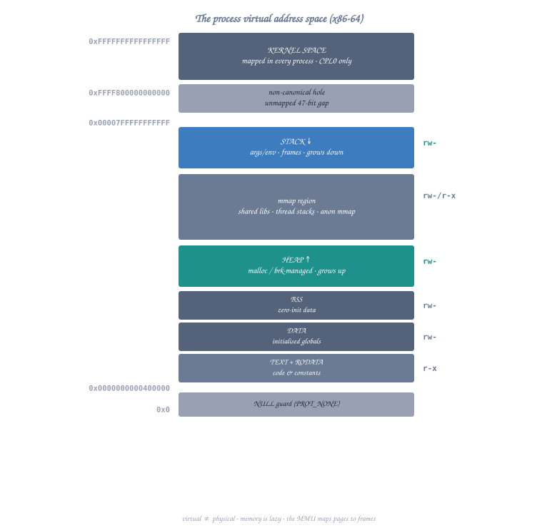
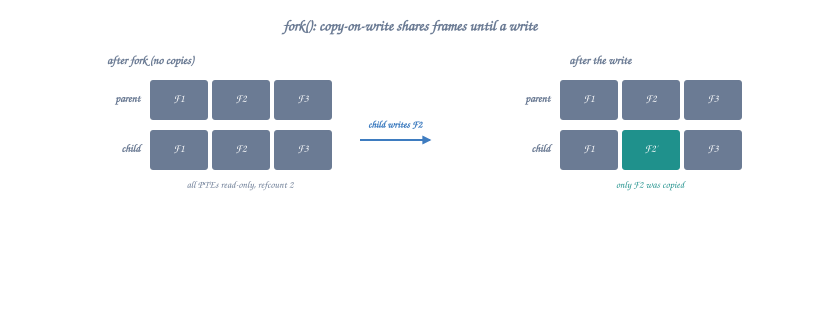
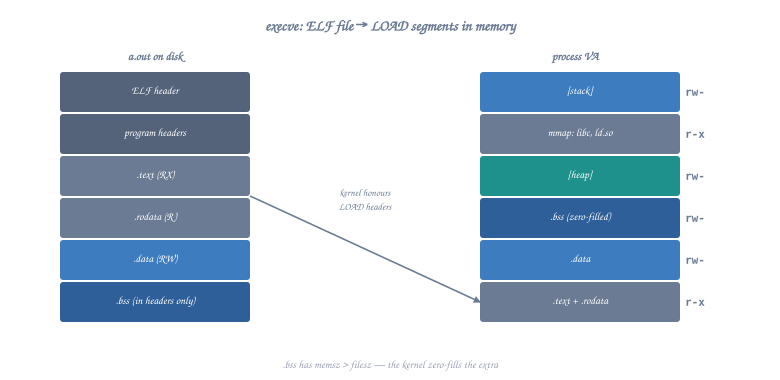

# Topic 22: Process Internals

## Overview

Every running program on Linux is a **process** — an isolated instance with its own virtual address space, file descriptors, and execution state. This topic examines how processes are created, how `fork()` duplicates a process, how `execve()` replaces a process image, and how the kernel manages all of this — explained entirely at the assembly level.

```c
// What happens in C:
pid_t pid = fork();
if (pid == 0) {
    // Child process
    execve("/bin/ls", argv, envp);
} else {
    // Parent process
    wait(&status);
}

// Under the hood:
// 1. fork() → sys_clone/sys_fork → kernel duplicates process descriptor
// 2. Copy-on-write page tables are set up (no actual memory copy!)
// 3. Child gets PID 0 return, parent gets child's PID
// 4. execve() → kernel loads new ELF binary, replaces address space
// 5. wait() → parent sleeps until child changes state
```

---

## Part 1: Process Memory Layout



<details class="ascii-diagram">
<summary>ASCII diagram</summary>
<pre><code>Process Virtual Address Space (x86-64 Linux):

0x0000000000000000 ┌──────────────────────────┐
                   │      NULL page           │ (unmapped, catches NULL deref)
0x0000000000001000 ├──────────────────────────┤
                   │                          │
                   │      (unmapped)          │
                   │                          │
~0x0000000000400000├──────────────────────────┤
                   │      .text (code)        │ (r-x) executable
                   ├──────────────────────────┤
                   │      .rodata             │ (r--) read-only data
                   ├──────────────────────────┤
                   │      .data               │ (rw-) initialized data
                   ├──────────────────────────┤
                   │      .bss                │ (rw-) zero-initialized
                   ├──────────────────────────┤ ← program break (brk)
                   │                          │
                   │      HEAP ↓              │ (grows up)
                   │                          │
                   ├──────────────────────────┤
                   │                          │
                   │   Memory-mapped region   │ (shared libraries, mmap)
                   │                          │
                   ├──────────────────────────┤
                   │                          │
                   │      STACK ↑             │ (grows down)
                   │                          │
~0x00007FFFFFFFFFFF├──────────────────────────┤
                   │   Kernel space           │ (not accessible from user mode)
0xFFFFFFFFFFFFFFFF └──────────────────────────┘</code></pre>
</details>

### Examining Our Own Process

```nasm
section .text
    global _start

_start:
    ; Get our PID
    mov rax, 39             ; sys_getpid
    syscall
    mov r12, rax            ; Save PID

    ; Get parent PID
    mov rax, 110            ; sys_getppid
    syscall
    mov r13, rax            ; Save PPID

    ; Get user ID
    mov rax, 102            ; sys_getuid
    syscall
    mov r14, rax            ; Save UID

    ; Print PID (convert to string first)
    mov rdi, r12
    call print_number

    mov rax, 60
    xor rdi, rdi
    syscall

; Convert integer to string and print
; Input: RDI = number to print
print_number:
    push rbp
    mov rbp, rsp
    sub rsp, 32            ; Buffer on stack

    lea rsi, [rbp-1]       ; Point to end of buffer
    mov byte [rsi], 10     ; Newline
    mov rcx, 1             ; Length counter

    mov rax, rdi           ; Number to convert
    mov r8, 10             ; Divisor

.digit_loop:
    xor rdx, rdx
    div r8                 ; RAX = quotient, RDX = remainder
    add dl, '0'            ; Convert to ASCII
    dec rsi
    mov [rsi], dl
    inc rcx
    test rax, rax
    jnz .digit_loop

    ; Write the string
    mov rax, 1             ; sys_write
    mov rdi, 1             ; stdout
    mov rdx, rcx           ; length
    syscall

    leave
    ret
```

---

## Part 2: fork() — Process Duplication

### The fork() Syscall

```nasm
; fork() creates an exact copy of the current process
; Returns: child PID to parent, 0 to child, -1 on error

section .data
    parent_msg db "I am the parent. Child PID: "
    parent_len equ $ - parent_msg
    child_msg  db "I am the child!", 10
    child_len  equ $ - child_msg
    newline    db 10

section .text
    global _start

_start:
    ; Fork!
    mov rax, 57             ; sys_fork
    syscall

    ; After fork, both parent and child execute here
    ; RAX = 0 in child, > 0 (child PID) in parent

    test rax, rax
    jz .child               ; RAX == 0 → we're the child
    js .fork_error          ; RAX < 0 → error

.parent:
    ; We're the parent, RAX = child's PID
    mov r12, rax           ; Save child PID

    ; Print parent message
    mov rax, 1
    mov rdi, 1
    lea rsi, [rel parent_msg]
    mov rdx, parent_len
    syscall

    ; Print child PID
    mov rdi, r12
    call print_number

    ; Wait for child to finish
    mov rax, 61             ; sys_wait4
    mov rdi, -1             ; Wait for any child
    xor rsi, rsi            ; status = NULL
    xor rdx, rdx            ; options = 0
    xor r10, r10            ; rusage = NULL
    syscall

    ; Exit parent
    mov rax, 60
    xor rdi, rdi
    syscall

.child:
    ; We're the child
    mov rax, 1
    mov rdi, 1
    lea rsi, [rel child_msg]
    mov rdx, child_len
    syscall

    ; Exit child
    mov rax, 60
    xor rdi, rdi
    syscall

.fork_error:
    mov rax, 60
    mov rdi, 1
    syscall
```

### What fork() Actually Does in the Kernel



<details class="ascii-diagram">
<summary>ASCII diagram</summary>
<pre><code>Before fork():                    After fork():

Parent Process:                   Parent Process:        Child Process:
┌──────────────────┐              ┌──────────────────┐  ┌──────────────────┐
│ PID: 1000        │              │ PID: 1000        │  │ PID: 1001        │
│ PPID: 999        │              │ PPID: 999        │  │ PPID: 1000       │
├──────────────────┤              ├──────────────────┤  ├──────────────────┤
│ Registers:       │              │ Registers:       │  │ Registers:       │
│  RAX = (syscall) │              │  RAX = 1001      │  │  RAX = 0         │
│  RSP = 0x7fff... │              │  RSP = 0x7fff... │  │  RSP = 0x7fff... │
│  RIP = next_inst │              │  RIP = next_inst │  │  RIP = next_inst │
├──────────────────┤              ├──────────────────┤  ├──────────────────┤
│ Page Tables:     │              │ Page Tables:     │  │ Page Tables:     │
│  VA→PA mapping   │    COW →     │  VA→PA (R/O)     │  │  VA→PA (R/O)     │
│  (read/write)    │              │  Same physical   │  │  Same physical   │
│                  │              │  pages!          │  │  pages!          │
├──────────────────┤              ├──────────────────┤  ├──────────────────┤
│ File Descriptors:│              │ FDs: 0,1,2,...   │  │ FDs: 0,1,2,...   │
│  0: stdin        │              │ (same as before) │  │ (duplicated)     │
│  1: stdout       │              │                  │  │                  │
│  2: stderr       │              │                  │  │                  │
└──────────────────┘              └──────────────────┘  └──────────────────┘
                                          │                     │
                                          └─────────┬───────────┘
                                                    │
                                          ┌─────────┴───────────┐
                                          │ SAME Physical Pages │
                                          │ (Copy-on-Write)     │
                                          └─────────────────────┘</code></pre>
</details>

### Copy-on-Write (COW) Mechanism

```nasm
; Copy-on-Write demonstration:
; After fork, parent and child share physical pages
; Pages are marked read-only in both
; On first WRITE, a page fault occurs and the kernel copies the page

section .data
    shared_data dq 42       ; This data is shared after fork (COW)

section .text
    global _start

_start:
    mov rax, 57             ; sys_fork
    syscall
    test rax, rax
    jz .child

.parent:
    ; Parent modifies shared_data
    ; This triggers a COW page fault:
    ; 1. CPU tries to write to read-only page
    ; 2. Page fault → kernel checks: is this a COW page? YES
    ; 3. Kernel allocates new physical page
    ; 4. Copies content from original page
    ; 5. Updates parent's page table to point to new page (now RW)
    ; 6. Returns to user code, write succeeds
    mov qword [rel shared_data], 100    ; ← COW fault here!

    ; Wait for child
    mov rax, 61
    mov rdi, -1
    xor rsi, rsi
    xor rdx, rdx
    xor r10, r10
    syscall

    mov rax, 60
    xor rdi, rdi
    syscall

.child:
    ; Child reads shared_data — no COW fault (read is fine)
    mov rax, [rel shared_data]  ; Still reads 42!
    
    ; Child modifies — triggers its OWN COW fault
    mov qword [rel shared_data], 200    ; ← COW fault here!
    ; Now child has its own private copy of this page
    
    mov rax, 60
    xor rdi, rdi
    syscall
```

---

## Part 3: clone() — The Real Process Creation

### fork() is Actually clone()

On modern Linux, `fork()` is implemented as a wrapper around `clone()`:

```nasm
; clone() is the underlying syscall for fork(), vfork(), and pthread_create()
;
; long clone(unsigned long flags, void *stack,
;            int *parent_tid, int *child_tid,
;            unsigned long tls);
;
; Syscall number: 56 (sys_clone)
; RDI = flags
; RSI = child_stack (NULL = share parent's stack → fork behavior)
; RDX = parent_tid pointer
; R10 = child_tid pointer
; R8  = TLS descriptor

; fork() equivalent using clone():
fork_via_clone:
    mov rax, 56             ; sys_clone
    mov rdi, 17             ; SIGCHLD (= flags for basic fork)
    xor rsi, rsi            ; child_stack = NULL (use parent's)
    xor rdx, rdx            ; parent_tid = NULL
    xor r10, r10            ; child_tid = NULL
    xor r8, r8              ; tls = NULL
    syscall
    ret

; Creating a thread (shares everything except stack):
; CLONE_VM | CLONE_FS | CLONE_FILES | CLONE_SIGHAND | CLONE_THREAD |
; CLONE_SYSVSEM | CLONE_SETTLS | CLONE_PARENT_SETTID | CLONE_CHILD_CLEARTID
CLONE_THREAD_FLAGS equ 0x3D0F00  ; Combined thread flags

create_thread:
    ; Input: RDI = function pointer, RSI = argument
    push rbx
    push r12
    push r13
    mov r12, rdi            ; Save function
    mov r13, rsi            ; Save argument

    ; Allocate stack for new thread (8KB)
    mov rax, 9              ; sys_mmap
    xor rdi, rdi
    mov rsi, 8192           ; 8KB stack
    mov rdx, 3              ; PROT_READ | PROT_WRITE
    mov r10, 34             ; MAP_PRIVATE | MAP_ANONYMOUS
    mov r8, -1
    xor r9, r9
    syscall
    mov rbx, rax            ; Stack base

    ; Stack grows down, so point to top
    lea rsi, [rbx + 8192 - 8]

    ; Put function address and arg on new stack
    ; (child will pop these after clone returns)
    mov [rsi], r12          ; function pointer
    mov [rsi - 8], r13     ; argument
    sub rsi, 16

    ; Clone with thread flags
    mov rax, 56             ; sys_clone
    mov rdi, CLONE_THREAD_FLAGS
    ; RSI already = child stack top
    xor rdx, rdx
    xor r10, r10
    xor r8, r8
    syscall

    ; In parent: RAX = child TID
    ; In child: RAX = 0, starts executing at return address on new stack

    pop r13
    pop r12
    pop rbx
    ret
```

---

## Part 4: execve() — Replacing the Process Image

### How execve() Works

```nasm
; execve() replaces the ENTIRE process image with a new program
; The current code, data, heap, and stack are all destroyed
; Only PID and open file descriptors (without CLOEXEC) survive

; long execve(const char *filename, char *const argv[],
;             char *const envp[]);

section .data
    prog_path db "/bin/ls", 0
    arg0      db "ls", 0
    arg1      db "-la", 0
    arg2      db "/tmp", 0

    ; argv array (array of pointers, NULL-terminated)
    argv      dq arg0, arg1, arg2, 0

    ; envp array (array of "KEY=VALUE" strings, NULL-terminated)
    env0      db "PATH=/usr/bin:/bin", 0
    env1      db "HOME=/root", 0
    envp      dq env0, env1, 0

section .text
    global _start

_start:
    ; Execute /bin/ls -la /tmp
    mov rax, 59             ; sys_execve
    lea rdi, [rel prog_path] ; filename
    lea rsi, [rel argv]      ; argv[]
    lea rdx, [rel envp]      ; envp[]
    syscall

    ; If execve returns, it FAILED (only returns on error)
    ; RAX = -errno
    neg rax                 ; Make positive errno
    mov rdi, rax
    mov rax, 60             ; sys_exit
    syscall
```

### What the Kernel Does During execve()



<details class="ascii-diagram">
<summary>ASCII diagram</summary>
<pre><code>execve("/bin/ls", argv, envp) kernel path:

1. Open the file, read ELF header
   ┌────────────────────────────────────┐
   │ Check: is it executable?           │
   │ Check: do we have permission?      │
   │ Read: ELF magic (7f 45 4c 46)      │
   │ Parse: program headers (PT_LOAD)   │
   └────────────────────────────────────┘

2. Destroy old address space
   ┌────────────────────────────────────┐
   │ Unmap all user pages               │
   │ Release old page tables            │
   │ Close CLOEXEC file descriptors     │
   │ Reset signal handlers to default   │
   └────────────────────────────────────┘

3. Set up new address space
   ┌────────────────────────────────────┐
   │ Map .text segment (R-X)            │
   │ Map .data segment (RW-)            │
   │ Map .bss (zero pages, RW-)         │
   │ Map interpreter (ld-linux.so)      │
   │ Set up new stack:                  │
   │   [top of stack]                   │
   │   platform string                  │
   │   random bytes (16 for AT_RANDOM)  │
   │   environment strings              │
   │   argument strings                 │
   │   padding                          │
   │   auxv[] (auxiliary vector)        │
   │   NULL                             │
   │   envp[n]=NULL                     │
   │   envp[1]                          │
   │   envp[0]                          │
   │   NULL                             │
   │   argv[argc-1]                     │
   │   ...                              │
   │   argv[0]                          │
   │   argc                             │
   │   [bottom = initial RSP]           │
   └────────────────────────────────────┘

4. Set registers and jump
   ┌────────────────────────────────────┐
   │ RSP = top of new stack             │
   │ RIP = entry point (from ELF)       │
   │ All other registers = 0            │
   │ Return to user mode                │
   └────────────────────────────────────┘</code></pre>
</details>

### The Initial Stack After execve

```nasm
; When _start runs after execve, the stack looks like this:
; RSP → [argc]            (8 bytes)
;        [argv[0]]        (pointer to first arg string)
;        [argv[1]]        (pointer to second arg string)
;        ...
;        [NULL]           (argv terminator)
;        [envp[0]]        (pointer to first env string)
;        [envp[1]]        (pointer to second env string)
;        ...
;        [NULL]           (envp terminator)
;        [auxv[0].type]   (auxiliary vector entry)
;        [auxv[0].value]
;        ...
;        [AT_NULL, 0]     (auxv terminator)

section .text
    global _start

_start:
    ; Read argc
    mov rdi, [rsp]          ; argc

    ; Read argv[0] (program name)
    mov rsi, [rsp + 8]     ; argv[0] pointer

    ; Find envp (skip past argv + NULL)
    lea rbx, [rsp + 8]    ; Start of argv array
    mov rcx, rdi           ; argc
    inc rcx                ; +1 for NULL terminator
    lea rbx, [rbx + rcx*8] ; rbx = &envp[0]

    ; Print each environment variable
.print_env:
    mov rsi, [rbx]
    test rsi, rsi
    jz .done_env

    ; Calculate string length
    mov rdi, rsi
    xor rcx, rcx
.strlen:
    cmp byte [rdi + rcx], 0
    je .got_len
    inc rcx
    jmp .strlen
.got_len:
    ; Print it
    mov rax, 1             ; sys_write
    mov rdi, 1             ; stdout
    mov rdx, rcx           ; length
    syscall

    ; Newline
    push 10
    mov rax, 1
    mov rdi, 1
    mov rsi, rsp
    mov rdx, 1
    syscall
    pop rax

    add rbx, 8            ; Next envp entry
    jmp .print_env

.done_env:
    mov rax, 60
    xor rdi, rdi
    syscall
```

### Auxiliary Vector (auxv)

```nasm
; The auxiliary vector provides information from the kernel:
; AT_PHDR (3)     = Program headers address
; AT_PHENT (4)    = Size of program header entry
; AT_PHNUM (5)    = Number of program headers
; AT_PAGESZ (6)   = System page size (usually 4096)
; AT_BASE (7)     = Interpreter base address
; AT_ENTRY (9)    = Program entry point
; AT_UID (11)     = Real user ID
; AT_EUID (12)    = Effective user ID
; AT_GID (13)     = Real group ID
; AT_EGID (14)    = Effective group ID
; AT_RANDOM (25)  = Address of 16 random bytes
; AT_NULL (0)     = End of auxv

; Reading auxiliary vector:
read_auxv:
    ; After envp, find auxv
    ; (assumes RBX points past envp NULL)
    add rbx, 8             ; Skip envp NULL terminator

.auxv_loop:
    mov rax, [rbx]         ; type
    test rax, rax
    jz .auxv_done          ; AT_NULL = end

    mov rcx, [rbx + 8]    ; value

    ; Check for specific entries
    cmp rax, 6            ; AT_PAGESZ?
    je .got_pagesize
    cmp rax, 25           ; AT_RANDOM?
    je .got_random

    add rbx, 16           ; Next entry (type + value)
    jmp .auxv_loop

.got_pagesize:
    mov [page_size], rcx
    add rbx, 16
    jmp .auxv_loop

.got_random:
    mov [random_addr], rcx
    add rbx, 16
    jmp .auxv_loop

.auxv_done:
    ret

section .bss
    page_size   resq 1
    random_addr resq 1
```

---

## Part 5: fork + exec Pattern (Spawning a Program)

```nasm
; The standard Unix pattern: fork() then execve()
; Parent creates child, child becomes new program

section .data
    shell      db "/bin/sh", 0
    sh_arg0    db "sh", 0
    sh_arg1    db "-c", 0
    sh_arg2    db "echo Hello from child process! PID=$$", 0
    sh_argv    dq sh_arg0, sh_arg1, sh_arg2, 0
    sh_envp    dq 0

    wait_msg   db "Child exited with status: "
    wait_len   equ $ - wait_msg

section .bss
    child_status resd 1

section .text
    global _start

_start:
    ; Fork
    mov rax, 57             ; sys_fork
    syscall
    test rax, rax
    jz .child
    js .error

.parent:
    mov r12, rax           ; Save child PID

    ; Wait for child
    mov rax, 61            ; sys_wait4
    mov rdi, r12           ; Wait for specific child
    lea rsi, [rel child_status]
    xor rdx, rdx          ; options = 0
    xor r10, r10          ; rusage = NULL
    syscall

    ; Extract exit status: bits 15-8 of status word
    mov eax, [rel child_status]
    shr eax, 8
    and eax, 0xFF          ; Exit code

    ; Print exit status
    mov rdi, 1
    lea rsi, [rel wait_msg]
    mov rdx, wait_len
    mov rax, 1
    syscall

    ; (would print the number here)
    mov rax, 60
    xor rdi, rdi
    syscall

.child:
    ; Replace ourselves with /bin/sh
    mov rax, 59            ; sys_execve
    lea rdi, [rel shell]
    lea rsi, [rel sh_argv]
    lea rdx, [rel sh_envp]
    syscall

    ; Only reached on execve failure
    mov rax, 60
    mov rdi, 127           ; Convention for exec failure
    syscall

.error:
    mov rax, 60
    mov rdi, 1
    syscall
```

---

## Part 6: Process Signals

```nasm
; Signals are asynchronous notifications delivered to processes
; Common signals:
;   SIGTERM (15) - polite termination request
;   SIGKILL (9)  - forced kill (cannot be caught)
;   SIGSEGV (11) - segmentation fault
;   SIGCHLD (17) - child process status change
;   SIGUSR1 (10) - user-defined signal 1

; Sending a signal:
; long kill(pid_t pid, int sig);
send_signal:
    mov rax, 62            ; sys_kill
    ; RDI = pid (already set by caller)
    ; RSI = signal number (already set by caller)
    syscall
    ret

; Installing a signal handler:
; We need the rt_sigaction syscall (13)
; struct sigaction {
;     void (*sa_handler)(int);    // or sa_sigaction for SA_SIGINFO
;     unsigned long sa_flags;
;     void (*sa_restorer)(void);  // internal, set by libc
;     sigset_t sa_mask;           // signals to block during handler
; };

section .bss
    old_action resb 152     ; sizeof(struct sigaction) on x86-64

section .data
    caught_msg db "Signal caught!", 10
    caught_len equ $ - caught_msg

    ; Our sigaction structure
    align 8
    new_action:
        dq signal_handler      ; sa_handler
        dq 0x04000000          ; sa_flags = SA_RESTORER
        dq sig_restorer        ; sa_restorer
        times 16 db 0          ; sa_mask (128 bytes / 8 = 16 qwords... actually 128 bytes)

section .text
    global _start

; Signal handler — called asynchronously by kernel
signal_handler:
    ; WARNING: only async-signal-safe operations here!
    ; Cannot use malloc, printf, etc.
    push rax
    push rdi
    push rsi
    push rdx

    mov rax, 1
    mov rdi, 1
    lea rsi, [rel caught_msg]
    mov rdx, caught_len
    syscall

    pop rdx
    pop rsi
    pop rdi
    pop rax
    ret

; Signal restorer (required by kernel for return from signal handler)
sig_restorer:
    mov rax, 15            ; sys_rt_sigreturn
    syscall

_start:
    ; Install handler for SIGUSR1 (signal 10)
    mov rax, 13            ; sys_rt_sigaction
    mov rdi, 10            ; SIGUSR1
    lea rsi, [rel new_action]
    lea rdx, [rel old_action]
    mov r10, 8             ; sigsetsize
    syscall

    ; Send SIGUSR1 to ourselves
    mov rax, 39            ; sys_getpid
    syscall
    mov rdi, rax           ; pid = self
    mov rsi, 10            ; sig = SIGUSR1
    mov rax, 62            ; sys_kill
    syscall

    ; Signal handler will execute before we get here
    ; (or between these instructions)

    mov rax, 60
    xor rdi, rdi
    syscall
```

---

## Part 7: Process Groups and Sessions

```nasm
; Process hierarchy:
; Session → Process Groups → Processes
;
; Session Leader: typically the login shell
; Process Group: related processes (e.g., a pipeline: ls | grep | wc)
; Foreground Group: receives terminal input
; Background Group: runs without terminal input

; Get process group ID
get_pgid:
    mov rax, 121           ; sys_getpgid
    xor rdi, rdi           ; pid=0 means current process
    syscall
    ret                    ; RAX = PGID

; Set process group (used by shells for job control)
set_pgid:
    mov rax, 109           ; sys_setpgid
    ; RDI = pid (0 = self)
    ; RSI = pgid (0 = use pid as new pgid)
    syscall
    ret

; Create new session (setsid) — used by daemons
create_session:
    mov rax, 112           ; sys_setsid
    syscall
    ; RAX = new session ID (= our PID), or -errno
    ret

; Implementing a simple daemon:
daemonize:
    ; Step 1: fork and parent exits
    mov rax, 57
    syscall
    test rax, rax
    jnz .parent_exit       ; Parent exits
    ; (child continues)

    ; Step 2: Create new session
    mov rax, 112           ; setsid
    syscall

    ; Step 3: fork again (prevents reacquiring terminal)
    mov rax, 57
    syscall
    test rax, rax
    jnz .parent_exit

    ; Step 4: Close stdin/stdout/stderr
    mov rax, 3             ; sys_close
    xor rdi, rdi           ; fd 0
    syscall
    mov rax, 3
    mov rdi, 1             ; fd 1
    syscall
    mov rax, 3
    mov rdi, 2             ; fd 2
    syscall

    ; Step 5: Change working directory to /
    mov rax, 80            ; sys_chdir
    lea rdi, [rel .root]
    syscall

    ; Now we're a proper daemon
    ret

.parent_exit:
    mov rax, 60
    xor rdi, rdi
    syscall

section .rodata
.root: db "/", 0
```

---

## Part 8: Pipes — Inter-Process Communication

```nasm
; pipe() creates a unidirectional data channel
; Used for parent-child communication and shell pipelines

section .bss
    pipe_fds resq 1         ; [read_fd, write_fd] (2 × 4 bytes)
    buffer   resb 256

section .data
    message db "Hello through the pipe!", 10
    msg_len equ $ - message

section .text
    global _start

_start:
    ; Create pipe
    mov rax, 22             ; sys_pipe
    lea rdi, [rel pipe_fds]
    syscall
    test rax, rax
    js .error

    ; pipe_fds[0] = read end, pipe_fds[1] = write end
    mov r12d, dword [rel pipe_fds]     ; Read FD
    mov r13d, dword [rel pipe_fds + 4] ; Write FD

    ; Fork
    mov rax, 57
    syscall
    test rax, rax
    jz .child

.parent:
    ; Parent writes to pipe
    ; Close read end (parent only writes)
    mov rax, 3             ; sys_close
    mov edi, r12d
    syscall

    ; Write message
    mov rax, 1             ; sys_write
    mov edi, r13d          ; Write to pipe write-end
    lea rsi, [rel message]
    mov rdx, msg_len
    syscall

    ; Close write end (signals EOF to reader)
    mov rax, 3
    mov edi, r13d
    syscall

    ; Wait for child
    mov rax, 61
    mov rdi, -1
    xor rsi, rsi
    xor rdx, rdx
    xor r10, r10
    syscall

    mov rax, 60
    xor rdi, rdi
    syscall

.child:
    ; Child reads from pipe
    ; Close write end (child only reads)
    mov rax, 3
    mov edi, r13d
    syscall

    ; Read from pipe
    mov rax, 0             ; sys_read
    mov edi, r12d          ; Read from pipe read-end
    lea rsi, [rel buffer]
    mov rdx, 256
    syscall
    mov r14, rax           ; Bytes read

    ; Print what we read to stdout
    mov rax, 1
    mov rdi, 1
    lea rsi, [rel buffer]
    mov rdx, r14
    syscall

    ; Close read end
    mov rax, 3
    mov edi, r12d
    syscall

    mov rax, 60
    xor rdi, rdi
    syscall

.error:
    mov rax, 60
    mov rdi, 1
    syscall
```

### Implementing Shell Pipeline: `ls | wc -l`

```nasm
; Implementing: ls | wc -l
; Parent creates pipe, forks twice:
;   Child 1: exec("ls"), stdout → pipe write end
;   Child 2: exec("wc", "-l"), stdin → pipe read end

section .data
    ls_path   db "/bin/ls", 0
    ls_arg0   db "ls", 0
    ls_argv   dq ls_arg0, 0

    wc_path   db "/usr/bin/wc", 0
    wc_arg0   db "wc", 0
    wc_arg1   db "-l", 0
    wc_argv   dq wc_arg0, wc_arg1, 0

    null_envp dq 0

section .bss
    pipe_fds2 resd 2

section .text
    global _start

_start:
    ; Create pipe
    mov rax, 22
    lea rdi, [rel pipe_fds2]
    syscall

    mov r12d, [rel pipe_fds2]      ; Read end
    mov r13d, [rel pipe_fds2 + 4]  ; Write end

    ; Fork first child (ls)
    mov rax, 57
    syscall
    test rax, rax
    jz .child_ls

    ; Fork second child (wc)
    mov rax, 57
    syscall
    test rax, rax
    jz .child_wc

    ; Parent: close both pipe ends
    mov rax, 3
    mov edi, r12d
    syscall
    mov rax, 3
    mov edi, r13d
    syscall

    ; Wait for both children
    mov rax, 61
    mov rdi, -1
    xor rsi, rsi
    xor rdx, rdx
    xor r10, r10
    syscall
    mov rax, 61
    mov rdi, -1
    xor rsi, rsi
    xor rdx, rdx
    xor r10, r10
    syscall

    mov rax, 60
    xor rdi, rdi
    syscall

.child_ls:
    ; Redirect stdout to pipe write end
    mov rax, 33            ; sys_dup2
    mov edi, r13d          ; oldfd = pipe write
    mov esi, 1             ; newfd = stdout
    syscall

    ; Close both original pipe fds
    mov rax, 3
    mov edi, r12d
    syscall
    mov rax, 3
    mov edi, r13d
    syscall

    ; exec ls
    mov rax, 59
    lea rdi, [rel ls_path]
    lea rsi, [rel ls_argv]
    lea rdx, [rel null_envp]
    syscall
    ; Exit on failure
    mov rax, 60
    mov rdi, 1
    syscall

.child_wc:
    ; Redirect stdin to pipe read end
    mov rax, 33            ; sys_dup2
    mov edi, r12d          ; oldfd = pipe read
    xor esi, esi           ; newfd = stdin
    syscall

    ; Close both original pipe fds
    mov rax, 3
    mov edi, r12d
    syscall
    mov rax, 3
    mov edi, r13d
    syscall

    ; exec wc -l
    mov rax, 59
    lea rdi, [rel wc_path]
    lea rsi, [rel wc_argv]
    lea rdx, [rel null_envp]
    syscall
    ; Exit on failure
    mov rax, 60
    mov rdi, 1
    syscall
```

---

## Exercises

1. **Fork bomb guard**: Write a program that forks, but the child checks if it's been forked more than 3 times (pass a counter via shared memory or argument) and stops.

2. **Mini shell**: Implement a program that reads a command from stdin, forks, and exec's it. Handle exit status reporting.

3. **Pipe chain**: Implement a 3-stage pipeline in assembly (e.g., `cat file | sort | uniq`).

4. **Process tree**: Fork multiple children, have each report its PID and PPID, demonstrating the process hierarchy.

5. **Daemon**: Write a proper daemon that detaches from the terminal and writes periodic timestamps to a log file.

---

## Key Takeaways

| Concept | Assembly Reality |
|---------|-----------------|
| fork() | sys_clone(SIGCHLD, NULL, ...) → kernel copies task_struct |
| COW | Pages shared read-only; write triggers fault → kernel copies page |
| execve() | Destroys address space, loads ELF, sets up stack, jumps to entry |
| wait() | Parent sleeps in kernel until child's state changes |
| Signals | Kernel modifies process stack to call handler on next return to userspace |
| Pipes | Kernel buffer (64KB default); read blocks when empty, write blocks when full |
| _start stack | [argc][argv...][NULL][envp...][NULL][auxv...][AT_NULL] |

---

## Next Topic

[Topic 23: Virtual Memory & Paging →](topic-23-virtual-memory.md) — How the CPU translates virtual addresses to physical, page tables, TLB, and page fault handling.
