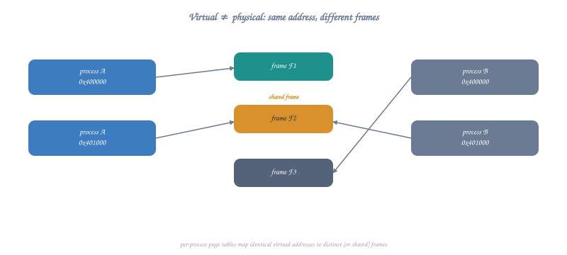
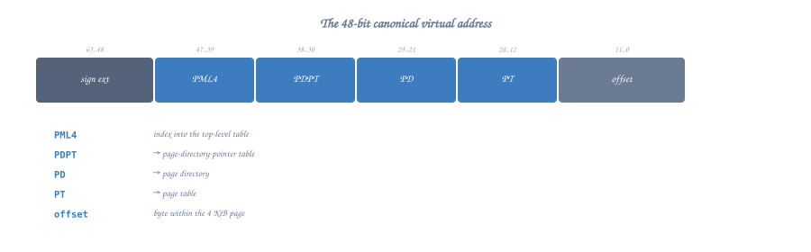
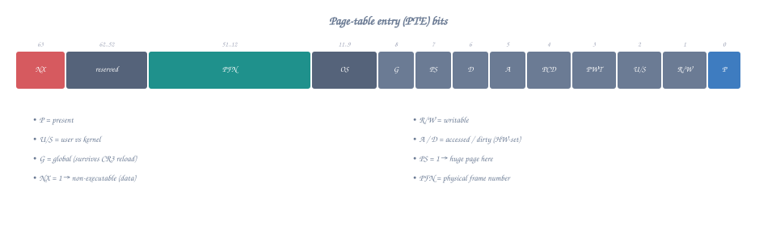
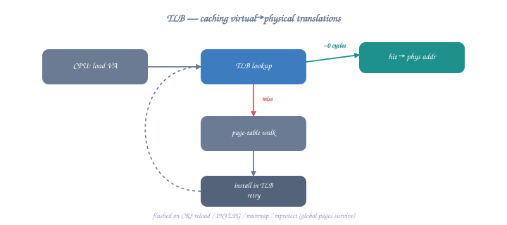
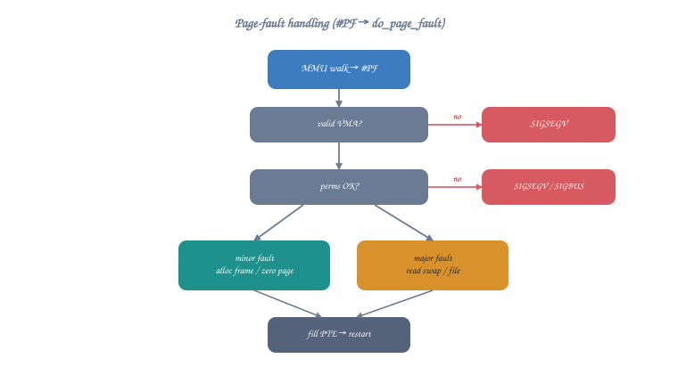

# Topic 23: Virtual Memory & Paging

## Overview

Virtual memory is the fundamental abstraction that makes modern operating systems possible. Every process believes it has the entire address space to itself, but the CPU's Memory Management Unit (MMU) transparently translates virtual addresses to physical addresses using **page tables**. This topic explains the entire translation mechanism at the hardware level and shows how the OS manages it.

```c
// Every pointer in your program is a VIRTUAL address:
int *p = malloc(sizeof(int));  // p = 0x55555576a2a0 (virtual)
*p = 42;
// The CPU translates 0x55555576a2a0 → some physical address
// (e.g., 0x000000001F3A02A0) transparently

// You NEVER see physical addresses in user space
// Only the kernel manages the virtual → physical mapping
```

---

## Part 1: Why Virtual Memory?

### Problems Without Virtual Memory

```
Without virtual memory (DOS era):
- Programs must know their load address at compile time
- Two programs cannot use the same address
- One buggy program can corrupt any other program's memory
- No memory protection whatsoever
- Physical RAM is the only limit

With virtual memory:
- Every process has isolated address space (0x0 to 0x7FFFFFFFFFFF)
- Protection: process A cannot access process B's memory
- Overcommit: allocate more virtual memory than physical RAM exists
- Demand paging: only load pages actually accessed
- Shared libraries: one physical copy, mapped into many processes
- Memory-mapped files: access files as if they were arrays
```

### The Translation



<details class="ascii-diagram">
<summary>ASCII diagram</summary>
<pre><code>        Virtual Address (48-bit on x86-64)
        ┌─────────────────────────────────┐
        │ 0x00007FFFF7A2C000              │
        └───────────────┬─────────────────┘
                        │
                   MMU (Hardware)
                   Page Table Walk
                        │
                        ▼
        Physical Address (52-bit max)
        ┌─────────────────────────────────┐
        │ 0x000000001F3A0000              │
        └─────────────────────────────────┘

The MMU does this for EVERY memory access:
- Every instruction fetch
- Every data read
- Every data write
At full CPU speed (with TLB cache hits)</code></pre>
</details>

---

## Part 2: Page Table Structure (x86-64, 4-Level)

### Virtual Address Breakdown



<details class="ascii-diagram">
<summary>ASCII diagram</summary>
<pre><code>63        48 47    39 38    30 29    21 20    12 11        0
┌──────────┬────────┬────────┬────────┬────────┬──────────┐
│  Sign    │ PML4   │  PDPT  │   PD   │   PT   │  Offset  │
│  Extend  │ Index  │ Index  │ Index  │ Index  │          │
│ (16 bits)│(9 bits)│(9 bits)│(9 bits)│(9 bits)│(12 bits) │
└──────────┴────────┴────────┴────────┴────────┴──────────┘
                │        │        │        │         │
                │        │        │        │         └── Byte within 4KB page
                │        │        │        └── Index into Page Table (512 entries)
                │        │        └── Index into Page Directory (512 entries)
                │        └── Index into Page Directory Pointer Table (512 entries)
                └── Index into Page Map Level 4 (512 entries)

Each level: 512 entries × 8 bytes = 4KB (one page)
Total addressable: 2^48 = 256 TB of virtual address space</code></pre>
</details>

### Page Table Entry (PTE) Format



<details class="ascii-diagram">
<summary>ASCII diagram</summary>
<pre><code>63  62     52 51                      12 11  9 8 7 6 5 4 3 2 1 0
┌───┬────────┬──────────────────────────┬─────┬─┬─┬─┬─┬─┬─┬─┬─┬─┐
│NX │ Avail  │  Physical Page Number    │Avail│G│ │D│A│ │ │U│R│P│
│   │        │  (40 bits = up to 52-bit │     │ │S│ │ │C│T│/│/│ │
│   │        │   physical address)      │     │ │ │ │ │D│W│S│W│ │
└───┴────────┴──────────────────────────┴─────┴─┴─┴─┴─┴─┴─┴─┴─┴─┘

Bit  Name         Meaning
 0   Present (P)  Page is in physical memory (1=yes, 0=page fault)
 1   Read/Write   0=read-only, 1=read-write
 2   User/Super   0=kernel only, 1=user accessible
 3   Write-Through  Page-level write-through caching
 4   Cache Disable  Disable caching for this page
 5   Accessed (A)   Set by CPU on any access (used by page replacement)
 6   Dirty (D)      Set by CPU on write (page table level only)
 7   Page Size (S)  1=large page (2MB at PD level, 1GB at PDPT level)
 8   Global (G)     Don't flush from TLB on CR3 switch
11:9 Available      OS can use these bits
51:12 Phys Addr     Physical address of next level / actual page
 63  NX (No Execute) 1=page cannot contain executable code</code></pre>
</details>

### Manual Page Table Walk (What the CPU Does)

```nasm
; This is what the MMU hardware does for every memory access:
; (You can't execute this in user mode — CR3 is privileged)
; This is for educational understanding only.

; Given: virtual address in RAX
; Goal: find physical address

; Step 0: CR3 contains the physical address of PML4 table
; mov rbx, cr3          ; (privileged! kernel only)
;                       ; RBX = physical address of PML4

; Step 1: Extract PML4 index (bits 47-39)
; mov rcx, rax
; shr rcx, 39
; and rcx, 0x1FF         ; 9-bit index (0-511)
; ; PML4 entry at: [CR3 + RCX*8]
; mov rdx, [rbx + rcx*8] ; Read PML4 entry
; ; Check Present bit
; test rdx, 1
; jz .page_fault          ; Not present!
; ; Extract physical address of PDPT
; and rdx, 0x000FFFFFFFFFF000  ; Mask to get physical page address
; mov rbx, rdx

; Step 2: Extract PDPT index (bits 38-30)
; mov rcx, rax
; shr rcx, 30
; and rcx, 0x1FF
; mov rdx, [rbx + rcx*8] ; Read PDPT entry
; test rdx, 1
; jz .page_fault
; test rdx, 0x80         ; Check PS bit (1GB page?)
; jnz .huge_page_1gb
; and rdx, 0x000FFFFFFFFFF000
; mov rbx, rdx

; Step 3: Extract PD index (bits 29-21)
; mov rcx, rax
; shr rcx, 21
; and rcx, 0x1FF
; mov rdx, [rbx + rcx*8] ; Read PD entry
; test rdx, 1
; jz .page_fault
; test rdx, 0x80         ; Check PS bit (2MB page?)
; jnz .huge_page_2mb
; and rdx, 0x000FFFFFFFFFF000
; mov rbx, rdx

; Step 4: Extract PT index (bits 20-12)
; mov rcx, rax
; shr rcx, 12
; and rcx, 0x1FF
; mov rdx, [rbx + rcx*8] ; Read PT entry (final level)
; test rdx, 1
; jz .page_fault
; ; Extract physical page address
; and rdx, 0x000FFFFFFFFFF000
;
; Step 5: Add page offset (bits 11-0)
; mov rcx, rax
; and rcx, 0xFFF          ; 12-bit offset
; or rdx, rcx            ; Physical address = page base + offset
; ; RDX now contains the physical address!
```

### Visualizing a Complete Translation

```
Example: Translating virtual address 0x00007FFFF7A2C123

Binary: 0000000000000000 0|111111111 111111011 110100010 110000010 0100100011

Split into fields:
  PML4 Index  = 0b011111111 = 255
  PDPT Index  = 0b111111011 = 507
  PD Index    = 0b110100010 = 418
  PT Index    = 0b110000010 = 386 (0x182)
  Offset      = 0b000100100011 = 0x123

Walk:
  CR3 → PML4 physical base (e.g., 0x1000)
  PML4[255] → PDPT physical base (e.g., 0x5000)
  PDPT[507] → PD physical base (e.g., 0x9000)
  PD[418]   → PT physical base (e.g., 0xD000)
  PT[386]   → Physical page (e.g., 0x1F3A0000)
  Final:    → 0x1F3A0000 + 0x123 = 0x1F3A0123

Total memory accesses for one translation: 4 (without TLB!)
```

---

## Part 3: The TLB (Translation Lookaside Buffer)

### Why the TLB is Critical



<details class="ascii-diagram">
<summary>ASCII diagram</summary>
<pre><code>Without TLB:
  Every memory access requires 4 additional memory accesses (page walk)
  Effective memory access time: 5 × memory_latency ≈ 500ns
  
With TLB (hit):
  Translation cached in hardware
  Effective memory access time: 1 × memory_latency ≈ 100ns
  
TLB hit rate is typically 99%+ for most workloads

Typical TLB sizes (modern CPU):
┌─────────────────────────────────────────────────────┐
│ L1 iTLB: 64 entries (4KB pages) + 8 entries (2MB)   │
│ L1 dTLB: 64 entries (4KB pages) + 32 entries (2MB)  │
│ L2 sTLB: 1536 entries (4KB + 2MB, unified)          │
└─────────────────────────────────────────────────────┘

TLB entry:
┌──────────────────┬──────────────────────┬────────┐
│ Virtual Page Num │ Physical Page Frame  │ Flags  │
│ (tag)            │ (translation result) │ RWXUGD │
└──────────────────┴──────────────────────┴────────┘</code></pre>
</details>

### TLB Flush Events

```nasm
; TLB must be flushed when page tables change:
;
; 1. Context switch (new CR3 value)
;    - mov cr3, rax  → flushes entire TLB (except Global pages)
;    - This is why context switches are expensive!
;
; 2. Single page invalidation:
;    - invlpg [address]  → flushes one TLB entry
;    - Used when unmapping/protecting a single page
;
; 3. PCID (Process Context ID) optimization:
;    - Tag TLB entries with process ID
;    - CR3 switch doesn't flush if PCID matches
;    - Reduces context switch overhead significantly

; Kernel code to flush a single TLB entry:
; invlpg [rdi]          ; Invalidate page containing address in RDI

; Effect on user-space performance:
; - Many mmap/munmap calls → many TLB flushes → slowdown
; - Large pages (2MB/1GB) → fewer TLB entries needed → better coverage
; - Accessing memory across many pages → TLB misses → performance wall
```

### Demonstrating TLB Effects in User Space

```nasm
; Benchmark: sequential vs stride access patterns
; Sequential: stays within TLB coverage
; Large stride: causes TLB misses

section .bss
    ; Allocate 64MB buffer (16384 pages)
    align 4096
    big_buffer resb 67108864

section .text
    global _start

_start:
    ; Pattern 1: Sequential access (TLB-friendly)
    ; Each page is accessed after the previous one
    ; TLB can prefetch/predict next pages
    lea rdi, [rel big_buffer]
    mov rcx, 67108864 / 8  ; 8M qword accesses
    xor rax, rax

.seq_loop:
    add rax, [rdi]
    add rdi, 8             ; Sequential: next qword
    dec rcx
    jnz .seq_loop

    ; Pattern 2: Page-stride access (TLB-hostile)
    ; Jump 4096 bytes (1 page) each iteration
    ; Each access hits a different page → TLB miss
    lea rdi, [rel big_buffer]
    mov rcx, 16384         ; Visit each page once
    xor rax, rax

.stride_loop:
    add rax, [rdi]
    add rdi, 4096          ; Stride = page size
    dec rcx
    jnz .stride_loop

    ; Pattern 2 will be MUCH slower due to TLB misses
    ; (measurable with rdtsc or perf stat)

    mov rax, 60
    xor rdi, rdi
    syscall
```

---

## Part 4: Page Sizes

### 4KB Pages (Standard)

```
Standard 4KB page:
- Offset field: 12 bits (2^12 = 4096)
- 4-level page table walk
- Good for: general purpose, fine-grained protection
- Downside: many TLB entries needed for large data
```

### 2MB Huge Pages

```
2MB page (eliminates one level of translation):
- Offset field: 21 bits (2^21 = 2MB)
- 3-level page table walk (PML4 → PDPT → PD → done)
- Page Directory entry has PS=1 (Page Size bit)
- 512× fewer TLB entries needed for same coverage!

Use cases: databases, HPC, large in-memory structures
```

### 1GB Gigantic Pages

```
1GB page (eliminates two levels):
- Offset field: 30 bits (2^30 = 1GB)
- 2-level page table walk (PML4 → PDPT → done)
- PDPT entry has PS=1

Use cases: scientific computing, huge databases
```

### Using Huge Pages from Assembly

```nasm
; Request 2MB huge pages via mmap

MAP_HUGETLB  equ 0x40000
MAP_HUGE_2MB equ (21 << 26)  ; log2(2MB) = 21, shifted to bits 31-26

section .text
    global _start

_start:
    ; Allocate 2MB with huge page
    mov rax, 9              ; sys_mmap
    xor rdi, rdi            ; addr = NULL
    mov rsi, 2097152        ; length = 2MB (must be multiple of page size)
    mov rdx, 3              ; PROT_READ | PROT_WRITE
    mov r10, 34 | MAP_HUGETLB | MAP_HUGE_2MB  ; MAP_PRIVATE|ANON|HUGETLB
    mov r8, -1
    xor r9, r9
    syscall

    cmp rax, -4096
    ja .no_hugepages        ; Might fail if not configured

    ; Use the huge page memory
    mov r12, rax
    mov qword [r12], 42    ; This single page fault maps 2MB!

    ; Only ONE TLB entry covers all 2MB
    ; Compare: 4KB pages would need 512 TLB entries!

    ; Cleanup
    mov rdi, r12
    mov rsi, 2097152
    mov rax, 11             ; sys_munmap
    syscall

    mov rax, 60
    xor rdi, rdi
    syscall

.no_hugepages:
    ; Huge pages not available, fall back to regular pages
    mov rax, 9
    xor rdi, rdi
    mov rsi, 2097152
    mov rdx, 3
    mov r10, 34             ; MAP_PRIVATE | MAP_ANONYMOUS
    mov r8, -1
    xor r9, r9
    syscall
    ; Continue with regular pages...
    mov rax, 60
    xor rdi, rdi
    syscall
```

---

## Part 5: Page Faults in Detail

### Types of Page Faults



<details class="ascii-diagram">
<summary>ASCII diagram</summary>
<pre><code>Page Fault (Exception #14) occurs when:
1. Page Not Present (P=0) - page not in physical memory
2. Protection Violation - access violates permissions
3. Reserved Bit Set - malformed page table entry

CPU pushes error code with fault details:
┌─────────────────────────────────────────┐
│ Bit 0 (P): 0=not-present, 1=protection  │
│ Bit 1 (W): 0=read access, 1=write       │
│ Bit 2 (U): 0=kernel mode, 1=user mode   │
│ Bit 3 (R): 1=reserved bit violation     │
│ Bit 4 (I): 1=instruction fetch          │
└─────────────────────────────────────────┘

CR2 register contains the faulting virtual address.</code></pre>
</details>

### Kernel Page Fault Handler (Conceptual)

```
page_fault_handler(error_code, fault_addr = CR2):

  1. Find VMA containing fault_addr
     → vma = find_vma(current->mm, fault_addr)
     → if (no VMA): send SIGSEGV (segfault!)
     
  2. Check permissions against VMA flags
     → if (write && !(vma->flags & VM_WRITE)): SIGSEGV
     → if (exec && !(vma->flags & VM_EXEC)): SIGSEGV
     
  3. Handle the fault by type:
  
     a. Demand paging (first access to mmap'd region):
        → Allocate physical page
        → Zero it (anonymous) or read from file (file-backed)
        → Install PTE: present=1, permissions from VMA
        → Return to user code (instruction retried)
     
     b. Copy-on-Write (write to COW page):
        → Allocate new physical page
        → Copy content from shared page
        → Update PTE to point to new page with write permission
        → Decrement reference count on old page
        → Return to user code (write succeeds on retry)
     
     c. Swap-in (page was swapped to disk):
        → Read page from swap device
        → Allocate physical page
        → Copy data from swap to new page
        → Install PTE
        → Return to user code
     
     d. Stack growth (fault just below stack VMA):
        → Expand stack VMA downward
        → Allocate page
        → Install PTE
        → Return to user code
```

### Triggering and Observing Page Faults

```nasm
; This program deliberately triggers different types of page faults
; Run with: strace -e trace=fault ./program  (or perf stat)

section .text
    global _start

_start:
    ; 1. Demand page fault (first access to mmap'd memory)
    mov rax, 9
    xor rdi, rdi
    mov rsi, 4096
    mov rdx, 3              ; PROT_READ | PROT_WRITE
    mov r10, 34             ; MAP_PRIVATE | MAP_ANONYMOUS
    mov r8, -1
    xor r9, r9
    syscall
    mov r12, rax

    ; Page fault #1: first write to fresh page
    mov byte [r12], 'X'    ; ← Minor page fault here!

    ; 2. No fault: same page, already present
    mov byte [r12 + 100], 'Y'  ; ← No fault, page already mapped

    ; 3. Another demand fault: touch a different page
    mov byte [r12 + 4096], 'Z'  ; Wait—this is beyond our mapping!
    ; Actually this would SIGSEGV because we only mapped 4096 bytes
    ; Let's map more:
    mov rax, 9
    xor rdi, rdi
    mov rsi, 8192           ; Map 2 pages
    mov rdx, 3
    mov r10, 34
    mov r8, -1
    xor r9, r9
    syscall
    mov r13, rax

    mov byte [r13], 'A'         ; ← Page fault (page 1)
    mov byte [r13 + 4096], 'B'  ; ← Page fault (page 2)
    mov byte [r13 + 1], 'C'     ; ← No fault (page 1 already mapped)

    ; 4. Stack page fault (stack grows on demand too!)
    ; The kernel maps a few pages for initial stack
    ; Deep recursion causes stack growth faults
    sub rsp, 65536          ; Jump 16 pages down the stack
    mov byte [rsp], 'S'    ; ← Stack growth page fault!
    add rsp, 65536          ; Restore

    ; Cleanup
    mov rdi, r12
    mov rsi, 4096
    mov rax, 11
    syscall
    mov rdi, r13
    mov rsi, 8192
    mov rax, 11
    syscall

    mov rax, 60
    xor rdi, rdi
    syscall
```

---

## Part 6: Memory Protection

### mprotect() — Changing Page Permissions

```nasm
; mprotect() changes the protection on existing pages
; Syscall 10: mprotect(addr, len, prot)
; addr MUST be page-aligned

section .text
    global _start

_start:
    ; Allocate a page with RW permission
    mov rax, 9
    xor rdi, rdi
    mov rsi, 4096
    mov rdx, 3              ; PROT_READ | PROT_WRITE
    mov r10, 34
    mov r8, -1
    xor r9, r9
    syscall
    mov r12, rax

    ; Write some data
    mov qword [r12], 0xDEADCAFE

    ; Make it read-only
    mov rax, 10             ; sys_mprotect
    mov rdi, r12            ; addr (page-aligned)
    mov rsi, 4096           ; length
    mov rdx, 1              ; PROT_READ only
    syscall

    ; This read works fine:
    mov rax, [r12]          ; OK

    ; This write would trigger SIGSEGV:
    ; mov qword [r12], 0   ; ← SIGSEGV! Protection violation!

    ; Make it executable (for JIT code)
    mov rax, 10             ; sys_mprotect
    mov rdi, r12
    mov rsi, 4096
    mov rdx, 5              ; PROT_READ | PROT_EXEC (no write!)
    syscall

    ; Page is now executable but not writable (W^X security)

    mov rax, 60
    xor rdi, rdi
    syscall
```

### Guard Pages (Stack Overflow Detection)

```nasm
; Guard pages: PROT_NONE pages that trigger SIGSEGV on access
; Used to detect stack overflow and buffer overruns

; How the kernel implements stack guards:
;
; High address ┌──────────────────┐
;              │ Stack (RW)       │ ← RSP starts here
;              │                  │
;              │ ↓ grows down     │
;              ├──────────────────┤
;              │ GUARD PAGE       │ ← PROT_NONE (access = SIGSEGV)
;              │ (no permissions) │
;              ├──────────────────┤
;              │ More stack       │ ← Kernel grows stack past guard
;              │ (not yet mapped) │    on controlled page faults
; Low address  └──────────────────┘

; Implementing our own guard page:
create_guarded_buffer:
    ; Allocate 3 pages: [guard][data][guard]
    mov rax, 9
    xor rdi, rdi
    mov rsi, 12288          ; 3 pages
    mov rdx, 3              ; PROT_READ | PROT_WRITE
    mov r10, 34
    mov r8, -1
    xor r9, r9
    syscall
    mov r12, rax            ; Base address

    ; Set first page as guard (PROT_NONE)
    mov rax, 10
    mov rdi, r12
    mov rsi, 4096
    xor rdx, rdx           ; PROT_NONE
    syscall

    ; Set last page as guard (PROT_NONE)
    mov rax, 10
    lea rdi, [r12 + 8192]
    mov rsi, 4096
    xor rdx, rdx           ; PROT_NONE
    syscall

    ; Return pointer to middle page (usable data)
    lea rax, [r12 + 4096]
    ret
    ; Any underflow (write before buffer) hits first guard → SIGSEGV
    ; Any overflow (write past buffer) hits last guard → SIGSEGV
```

---

## Part 7: Shared Memory

### Processes Sharing Physical Pages

```nasm
; Two processes can share memory via mmap with MAP_SHARED
; or using the shmget/shmat system (System V) or memfd_create

; Method 1: mmap MAP_SHARED on a file (or memfd)
; Both processes mmap the same file → same physical pages

; Create anonymous shared memory (parent-child):
section .bss
    shared_ptr resq 1

section .text
    global _start

_start:
    ; Create shared anonymous mapping
    ; MAP_SHARED means fork'd child shares the SAME physical pages
    ; (no Copy-on-Write!)
    mov rax, 9              ; sys_mmap
    xor rdi, rdi
    mov rsi, 4096
    mov rdx, 3              ; PROT_READ | PROT_WRITE
    mov r10, 33             ; MAP_SHARED | MAP_ANONYMOUS (0x21)
    mov r8, -1
    xor r9, r9
    syscall
    mov [shared_ptr], rax
    mov r12, rax

    ; Write initial value
    mov qword [r12], 0

    ; Fork
    mov rax, 57
    syscall
    test rax, rax
    jz .child

.parent:
    ; Wait a bit for child to write (naive synchronization)
    mov rax, 35             ; sys_nanosleep
    lea rdi, [rel .timespec]
    xor rsi, rsi
    syscall

    ; Read value written by child (SAME physical page!)
    mov rax, [r12]         ; Should be 42 (written by child)
    mov rdi, rax
    mov rax, 60
    syscall

.child:
    ; Write to shared memory
    mov qword [r12], 42    ; Parent will see this!
    mov rax, 60
    xor rdi, rdi
    syscall

section .rodata
.timespec:
    dq 0                   ; seconds
    dq 100000000           ; nanoseconds (100ms)
```

---

## Part 8: Kernel Virtual Address Space

```
x86-64 Linux kernel memory map (5-level paging disabled):

User space:   0x0000000000000000 — 0x00007FFFFFFFFFFF (128 TB)
              [per-process, different page tables]

Hole:         0x0000800000000000 — 0xFFFF7FFFFFFFFFFF 
              [non-canonical addresses, access = #GP fault]

Kernel space: 0xFFFF800000000000 — 0xFFFFFFFFFFFFFFFF (128 TB)
              [same mapping in all processes]
              
Kernel sub-regions:
  0xFFFF800000000000: Direct mapping of all physical memory
                      (kernel can access any phys addr by adding offset)
  0xFFFFa00000000000: vmalloc region (non-contiguous kernel allocs)
  0xFFFFe00000000000: kernel text (.text, .data, .rodata)
  0xFFFFFFFF80000000: modules
  0xFFFFFFFFFF600000: vsyscall page (legacy, deprecated)

Why kernel is in EVERY process's page tables:
  - Syscalls don't need to switch page tables
  - Exception handlers available immediately
  - User/Supervisor bit prevents user-mode access
  - KPTI (Meltdown mitigation) unmaps most kernel pages from user view
```

---

## Part 9: ASLR (Address Space Layout Randomization)

```nasm
; ASLR randomizes memory layout to prevent exploits:
; - Stack: random base address
; - mmap: random base address
; - Heap (brk): small random offset
; - PIE executables: random load address

; Observe ASLR by printing stack address across runs:
section .data
    msg db "Stack RSP = 0x"
    msg_len equ $ - msg
    hex_chars db "0123456789abcdef"

section .bss
    hex_buf resb 16

section .text
    global _start

_start:
    ; Print prefix
    mov rax, 1
    mov rdi, 1
    lea rsi, [rel msg]
    mov rdx, msg_len
    syscall

    ; Convert RSP to hex string
    mov rax, rsp
    lea rdi, [rel hex_buf]
    mov rcx, 16            ; 16 hex digits for 64-bit value

.hex_loop:
    dec rcx
    mov rdx, rax
    and rdx, 0xF           ; Low nibble
    lea rsi, [rel hex_chars]
    mov dl, [rsi + rdx]   ; Hex character
    mov [rdi + rcx], dl
    shr rax, 4
    test rcx, rcx
    jnz .hex_loop

    ; Print hex value
    mov rax, 1
    mov rdi, 1
    lea rsi, [rel hex_buf]
    mov rdx, 16
    syscall

    ; Newline
    push 10
    mov rax, 1
    mov rdi, 1
    mov rsi, rsp
    mov rdx, 1
    syscall
    pop rax

    ; Each run shows a different address!
    ; Disable ASLR: echo 0 > /proc/sys/kernel/randomize_va_space
    
    mov rax, 60
    xor rdi, rdi
    syscall
```

---

## Part 10: Memory-Mapped Files

```nasm
; Map a file into memory — access it like an array
; Changes to memory are written back to the file (MAP_SHARED)
; or kept private (MAP_PRIVATE, COW semantics)

section .data
    filename db "testfile.txt", 0

section .text
    global _start

_start:
    ; Open file
    mov rax, 2              ; sys_open
    lea rdi, [rel filename]
    mov rsi, 2              ; O_RDWR
    mov rdx, 0644o          ; mode (for creation)
    syscall
    mov r12, rax            ; fd

    ; Get file size with fstat
    sub rsp, 144            ; struct stat buffer
    mov rax, 5              ; sys_fstat
    mov rdi, r12
    mov rsi, rsp
    syscall
    mov r13, [rsp + 48]    ; st_size field offset
    add rsp, 144

    ; Memory-map the file
    mov rax, 9              ; sys_mmap
    xor rdi, rdi            ; addr = NULL
    mov rsi, r13            ; length = file size
    mov rdx, 3              ; PROT_READ | PROT_WRITE
    mov r10, 1              ; MAP_SHARED (writes go to file)
    mov r8, r12             ; fd
    xor r9, r9              ; offset = 0
    syscall
    mov r14, rax            ; Mapped address

    ; Now the entire file is accessible as memory!
    ; Reading file[0]:
    mov al, [r14]          ; First byte of file (no read() syscall!)

    ; Modifying the file:
    mov byte [r14], 'H'    ; Writes directly to file!
    mov byte [r14+1], 'i'

    ; Sync changes to disk
    mov rax, 26             ; sys_msync
    mov rdi, r14
    mov rsi, r13
    mov rdx, 4              ; MS_SYNC
    syscall

    ; Unmap
    mov rax, 11             ; sys_munmap
    mov rdi, r14
    mov rsi, r13
    syscall

    ; Close file
    mov rax, 3
    mov rdi, r12
    syscall

    mov rax, 60
    xor rdi, rdi
    syscall
```

---

## Exercises

1. **Page counter**: Write a program that allocates N pages with mmap, touches them one at a time, and uses the `perf` tool to count page faults.

2. **TLB benchmark**: Compare access time for sequential vs random access patterns across a large array. Use `rdtsc` to measure.

3. **Self-modifying code**: Allocate RW memory, write machine code into it, mprotect to RX, then call it. Make the generated code compute factorial.

4. **Shared memory counter**: Two processes increment a shared counter. Observe the race condition, then fix it with atomic operations (next topic: synchronization).

5. **Memory map dump**: Write a program that reads and parses `/proc/self/maps`, printing each region's address range, permissions, and mapped file.

---

## Key Takeaways

| Concept | Hardware/OS Reality |
|---------|-------------------|
| Virtual Address | 48-bit, split into 4 × 9-bit indexes + 12-bit offset |
| Page Table | 4 levels, each is a 4KB page with 512 × 8-byte entries |
| TLB | Hardware cache of recent translations; miss = 4 memory accesses |
| Page Fault | CPU exception #14; kernel handles by mapping physical page |
| Huge Pages | 2MB/1GB pages reduce TLB pressure for large data |
| COW | Pages shared read-only; write fault → kernel copies page |
| mprotect | Changes PTE permission bits; takes effect immediately |
| ASLR | Kernel randomizes mmap/stack/heap base addresses |
| Shared Memory | Multiple PTEs (different processes) point to same physical page |

---

## Next Topic

[Topic 24: I/O Internals →](topic-24-io-internals.md) — How write(), read(), and printf() work from syscall to hardware.
