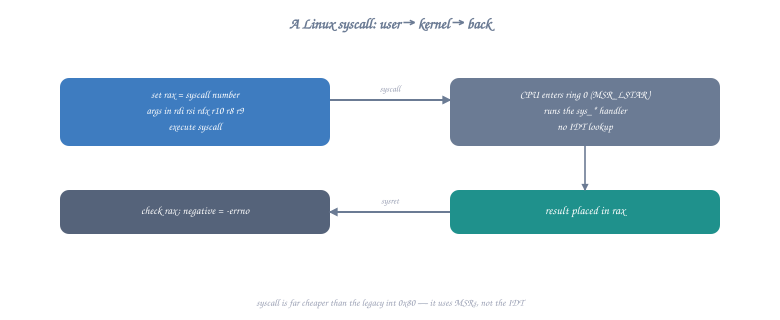

# Topic 24: I/O Internals — How Print and Read Actually Work

## Overview

When you call `write(1, "Hello\n", 6)`, the string doesn't teleport to your screen. It travels through layers of kernel buffering, device drivers, terminal emulators, and finally hardware. This topic traces the complete path of a byte from your assembly `syscall` instruction to pixels on screen, and similarly for keyboard input reaching your `read()` call.

```c
// The journey of printf("Hello\n"):
// 1. printf() formats string into user-space buffer (stdio)
// 2. Buffer flush triggers write() syscall
// 3. Kernel copies data to kernel buffer (page cache / pipe buffer)
// 4. Kernel wakes up the terminal device driver
// 5. Driver sends bytes to PTY (pseudo-terminal)
// 6. Terminal emulator reads from PTY master
// 7. Terminal emulator renders glyphs to screen (GPU/framebuffer)
```

---

## Part 1: The write() Syscall Path

### User Space → Kernel

```nasm
; Every write starts here:
mov rax, 1              ; sys_write
mov rdi, 1              ; fd = STDOUT (file descriptor 1)
lea rsi, [rel msg]      ; buf = address of data
mov rdx, 6             ; count = number of bytes
syscall                 ; ← Transition to kernel mode
; RAX = bytes written (or -errno)

section .rodata
    msg db "Hello", 10
```

### What Happens Inside `syscall`



<details class="ascii-diagram">
<summary>ASCII diagram</summary>
<pre><code>CPU executes SYSCALL instruction:
┌─────────────────────────────────────────────────────────────────────┐
│ 1. Save user RIP → RCX (return address)                             │
│ 2. Save user RFLAGS → R11                                           │
│ 3. Load kernel RIP from MSR_LSTAR (IA32_LSTAR = 0xC0000082)         │
│ 4. Load kernel CS/SS from MSR_STAR                                  │
│ 5. Mask RFLAGS with MSR_SFMASK (disable interrupts)                 │
│ 6. Set CPL = 0 (kernel privilege level)                             │
│ 7. Continue execution at kernel entry point                         │
└─────────────────────────────────────────────────────────────────────┘

Kernel syscall entry (entry_SYSCALL_64):
┌─────────────────────────────────────────────────────────────────────┐
│ 1. Switch to kernel stack (from TSS.RSP0)                           │
│ 2. Save all user registers on kernel stack (pt_regs)                │
│ 3. Look up RAX in sys_call_table[]                                  │
│ 4. Call sys_write(fd=RDI, buf=RSI, count=RDX)                       │
│ 5. Store return value in RAX slot of saved registers                │
│ 6. Restore user registers from kernel stack                         │
│ 7. Execute SYSRET (return to user mode)                             │
└─────────────────────────────────────────────────────────────────────┘</code></pre>
</details>

### Inside sys_write()

```
sys_write(unsigned int fd, const char *buf, size_t count):

1. Get file struct from fd table:
   file = current->files->fd_array[fd]
   
2. Validate:
   - Is fd valid? (0 ≤ fd < max_fds)
   - Is file open for writing? (file->f_mode & FMODE_WRITE)
   - Is buf in user-accessible memory? (access_ok(buf, count))
   
3. Copy from user space to kernel:
   copy_from_user(kernel_buf, user_buf, count)
   (Can't use user pointer directly — page might be swapped out!)
   
4. Call file operation:
   file->f_op->write(file, kernel_buf, count, &pos)
   
   For a terminal (stdout):
   → tty_write() → line discipline → driver → PTY/UART
   
   For a regular file:
   → ext4_file_write() → page cache → disk I/O
   
   For a pipe:
   → pipe_write() → pipe buffer (wakes up reader)
   
   For a socket:
   → sock_sendmsg() → TCP/IP stack → NIC driver
   
5. Return bytes written (or -EFAULT, -EINVAL, -EIO...)
```

---

## Part 2: File Descriptors Explained

### The fd Table

```
Process task_struct:
┌──────────────────┐
│ ...              │
│ files ───────────┼──→ files_struct:
│ ...              │    ┌──────────────────────────────────┐
└──────────────────┘    │ fd_array[0] → file (stdin)       │
                        │ fd_array[1] → file (stdout)      │
                        │ fd_array[2] → file (stderr)      │
                        │ fd_array[3] → file (opened...)   │
                        │ ...                              │
                        └──────────────────────────────────┘
                                         │
                                         ▼
                        struct file:
                        ┌──────────────────────────────────┐
                        │ f_op → file_operations {         │
                        │   .read = tty_read,              │
                        │   .write = tty_write,            │
                        │   .poll = tty_poll,              │
                        │   ...                            │
                        │ }                                │
                        │ f_pos (current offset)           │
                        │ f_flags (O_RDONLY, O_NONBLOCK..) │
                        │ f_mode (FMODE_READ|FMODE_WRITE)  │
                        │ inode → actual file/device       │
                        └──────────────────────────────────┘
```

### File Descriptor Operations in Assembly

```nasm
; Standard file descriptors:
; 0 = stdin  (keyboard input)
; 1 = stdout (terminal output)
; 2 = stderr (error output)

; Open a file and get a new fd:
section .data
    filepath db "/tmp/output.txt", 0

section .text
open_file:
    mov rax, 2              ; sys_open
    lea rdi, [rel filepath]
    mov rsi, 0102o          ; O_CREAT | O_WRONLY (octal)
    mov rdx, 0644o          ; mode: rw-r--r--
    syscall
    ; RAX = new fd (e.g., 3) or -errno
    ret

; Duplicate a file descriptor (used for redirection):
; dup2(old_fd, new_fd) — makes new_fd point to same file as old_fd
redirect_stdout:
    ; RDI = fd of our file
    mov rax, 33             ; sys_dup2
    ; RDI = oldfd (already set)
    mov rsi, 1              ; newfd = stdout
    syscall
    ; Now all writes to fd 1 (stdout) go to our file!
    ret

; After redirect_stdout(file_fd):
; mov rax, 1; mov rdi, 1; ... syscall  → writes to FILE, not terminal!
```

---

## Part 3: Terminal I/O — The Full Path

### From write() to Pixels

```
Your assembly program writes "Hello\n":

┌──────────────────┐
│ User Process     │ write(1, "Hello\n", 6)
└────────┬─────────┘
         │ syscall
┌────────┴─────────┐
│ Kernel: VFS      │ sys_write → file->f_op->write
└────────┬─────────┘
         │
┌────────┴─────────┐
│ TTY Layer        │ tty_write() 
│ Line Discipline  │ (N_TTY: handle echo, line editing)
└────────┬─────────┘
         │
┌────────┴─────────┐
│ PTY Driver       │ Write to PTY slave → appears on PTY master
└────────┬─────────┘
         │ (wake up reader on master side)
┌────────┴─────────────────┐
│ Terminal Emulator Process│ (xterm, alacritty, etc.)
│ read() from PTY master   │
│ Parse ANSI escape codes  │
│ Render glyphs (font)     │
│ Draw to window buffer    │
└────────┬─────────────────┘
         │
┌────────┴─────────┐
│ Display Server   │ (X11/Wayland compositor)
│ Compositing      │
└────────┬─────────┘
         │
┌────────┴─────────┐
│ GPU / Framebuffer│ Pixels on screen!
└──────────────────┘
```

### Line Discipline (Canonical vs Raw Mode)

```nasm
; The line discipline processes terminal I/O:
;
; Canonical mode (default, "cooked"):
;   - Input buffered until Enter is pressed
;   - Backspace works (line editing)
;   - Ctrl+C sends SIGINT
;   - Ctrl+D sends EOF
;
; Raw mode (used by vim, tmux, games):
;   - Each keypress delivered immediately
;   - No echo, no signals, no editing
;   - Application handles everything

; Setting raw mode requires ioctl on the terminal:
; ioctl(fd, TCSETS, &termios_struct)
; This is complex — here's the assembly:

section .bss
    termios resb 60         ; struct termios (Linux x86-64)

section .text
; Get current terminal settings
get_termios:
    mov rax, 16             ; sys_ioctl
    xor rdi, rdi            ; fd = stdin
    mov rsi, 0x5401         ; TCGETS
    lea rdx, [rel termios]
    syscall
    ret

; Set terminal to raw mode
set_raw_mode:
    call get_termios

    ; Modify termios fields:
    ; c_lflag: disable ICANON (canonical) and ECHO
    ; c_lflag is at offset 12 in struct termios
    mov eax, [rel termios + 12]
    and eax, ~(0x02 | 0x08)   ; Clear ICANON (0x02) and ECHO (0x08)
    mov [rel termios + 12], eax

    ; c_cc[VMIN] = 1 (minimum chars for read)
    ; c_cc[VTIME] = 0 (no timeout)
    ; c_cc is at offset 17
    mov byte [rel termios + 17 + 6], 1   ; VMIN
    mov byte [rel termios + 17 + 5], 0   ; VTIME

    ; Apply new settings
    mov rax, 16             ; sys_ioctl
    xor rdi, rdi            ; fd = stdin
    mov rsi, 0x5402         ; TCSETS
    lea rdx, [rel termios]
    syscall
    ret

; Restore terminal (should be called before exit!)
restore_termios:
    mov rax, 16
    xor rdi, rdi
    mov rsi, 0x5402         ; TCSETS
    lea rdx, [rel termios]  ; Original settings (saved at start)
    syscall
    ret

; Read single keypress in raw mode:
read_key:
    sub rsp, 8
    mov rax, 0              ; sys_read
    xor rdi, rdi            ; fd = stdin
    mov rsi, rsp            ; buffer (on stack)
    mov rdx, 1              ; read 1 byte
    syscall
    movzx eax, byte [rsp]  ; Return the character
    add rsp, 8
    ret
```

---

## Part 4: Buffered I/O (Why printf Doesn't Write Immediately)

### User-Space Buffering (libc stdio)

```
printf("Hello") does NOT immediately call write()!

┌──────────────────────────────────────────────────────────────┐
│ stdio buffer (typically 4096 or 8192 bytes)                  │
│                                                              │
│ ┌──────────────────────────────────────────────────────────┐ │
│ │ H │ e │ l │ l │ o │   │   │   │ ... (4090 bytes free)    │ │
│ └──────────────────────────────────────────────────────────┘ │
│                  ↑                                           │
│               buf_ptr                                        │
│                                                              │
│ Buffer is flushed (write() called) when:                     │
│ 1. Buffer is full (4096 bytes accumulated)                   │
│ 2. Newline '\n' encountered (line-buffered mode, for ttys)   │
│ 3. fflush(stdout) called explicitly                          │
│ 4. Program exits normally (atexit handlers)                  │
│ 5. Input is requested (stdin read forces stdout flush)       │
└──────────────────────────────────────────────────────────────┘

Buffering modes:
  _IOFBF (full buffering):  Flush only when buffer full (files)
  _IOLBF (line buffering):  Flush on newline (terminal stdout)
  _IONBF (no buffering):    Every write goes to kernel (stderr)
```

### Implementing Our Own Buffered Writer

```nasm
; A buffered write implementation in assembly
; Accumulates bytes, flushes to kernel in chunks

section .bss
    out_buf    resb 4096    ; 4KB output buffer
    out_pos    resq 1       ; Current position in buffer

section .text

; Initialize buffer
buf_init:
    mov qword [out_pos], 0
    ret

; Write a single byte to buffer
; Input: DIL = byte to write
buf_putchar:
    mov rcx, [out_pos]
    mov [out_buf + rcx], dil
    inc rcx
    mov [out_pos], rcx

    ; Flush if buffer full
    cmp rcx, 4096
    jge buf_flush
    ret

; Write string to buffer
; Input: RSI = string pointer, RDX = length
buf_write:
    push rbx
    push r12
    push r13
    mov r12, rsi            ; String
    mov r13, rdx            ; Length
    xor rbx, rbx           ; Index

.write_loop:
    cmp rbx, r13
    jge .write_done
    movzx edi, byte [r12 + rbx]
    call buf_putchar
    inc rbx
    jmp .write_loop

.write_done:
    pop r13
    pop r12
    pop rbx
    ret

; Flush buffer to kernel (actual syscall)
buf_flush:
    push rax
    push rdi
    push rsi
    push rdx

    mov rdx, [out_pos]     ; Bytes to write
    test rdx, rdx
    jz .flush_done          ; Nothing to flush

    mov rax, 1             ; sys_write
    mov rdi, 1             ; stdout
    lea rsi, [rel out_buf]
    syscall

    mov qword [out_pos], 0  ; Reset buffer

.flush_done:
    pop rdx
    pop rsi
    pop rdi
    pop rax
    ret

; Write a number (decimal) to buffer
; Input: RDI = number
buf_print_number:
    push rbp
    mov rbp, rsp
    sub rsp, 24            ; Digit buffer

    mov rax, rdi
    lea rcx, [rbp - 1]    ; End of buffer
    mov r8, 10
    xor r9, r9             ; Digit count

.num_loop:
    xor rdx, rdx
    div r8
    add dl, '0'
    mov [rcx], dl
    dec rcx
    inc r9
    test rax, rax
    jnz .num_loop

    ; Write digits to output buffer
    inc rcx                ; Point to first digit
    mov rsi, rcx
    mov rdx, r9
    call buf_write

    leave
    ret
```

---

## Part 5: The read() Syscall Path

### From Keyboard to Your Buffer

```
User presses a key:

┌──────────────────┐
│ Keyboard HW      │ Sends scancode via USB/PS2
└────────┬─────────┘
         │ interrupt (IRQ)
┌────────┴─────────┐
│ Interrupt Handler│ Keyboard driver ISR
│ (IRQ 1/USB)      │ Translates scancode → keycode
└────────┬─────────┘
         │
┌────────┴─────────┐
│ Input Subsystem  │ input_event → /dev/input/eventN
└────────┬─────────┘
         │
┌────────┴─────────┐
│ TTY Layer        │ Maps keycode → character
│ Line Discipline  │ Handles echo, line editing
│ (N_TTY)          │ Buffers until Enter (canonical)
└────────┬─────────┘
         │ (data available on PTY slave)
┌────────┴─────────┐
│ Your process     │ read(0, buf, n) returns!
│ (was sleeping    │ 
│  in kernel)      │
└──────────────────┘
```

### Blocking vs Non-Blocking read()

```nasm
; Blocking read (default):
; Process sleeps until data is available
blocking_read:
    mov rax, 0              ; sys_read
    xor rdi, rdi            ; fd = stdin
    lea rsi, [rel buffer]
    mov rdx, 256            ; max bytes
    syscall
    ; Process was ASLEEP here if no data was ready
    ; Kernel woke us up when data arrived
    ; RAX = bytes read, or 0 = EOF, or -errno
    ret

; Non-blocking read:
; Returns immediately with -EAGAIN if no data
nonblocking_read:
    ; First, set O_NONBLOCK on stdin
    mov rax, 72             ; sys_fcntl
    xor rdi, rdi            ; fd = stdin
    mov rsi, 3              ; F_GETFL (get flags)
    syscall
    mov r12, rax            ; Save current flags

    mov rax, 72             ; sys_fcntl
    xor rdi, rdi
    mov rsi, 4              ; F_SETFL (set flags)
    lea rdx, [r12 + 2048]  ; Add O_NONBLOCK (0x800)
    syscall

    ; Now read won't block
    mov rax, 0
    xor rdi, rdi
    lea rsi, [rel buffer]
    mov rdx, 256
    syscall
    ; RAX = bytes read, or -11 (-EAGAIN = no data available)

    ; Restore original flags
    push rax
    mov rax, 72
    xor rdi, rdi
    mov rsi, 4
    mov rdx, r12            ; Original flags
    syscall
    pop rax
    ret

section .bss
    buffer resb 256
```

### poll/select — Waiting for Multiple FDs

```nasm
; poll() - wait for activity on multiple file descriptors
; Useful for: servers handling multiple connections,
;             programs reading both stdin and a pipe/socket

; struct pollfd {
;     int   fd;       // offset 0, size 4
;     short events;   // offset 4, size 2 (what we want)
;     short revents;  // offset 6, size 2 (what happened)
; };
; POLLIN = 1 (data available for reading)

section .bss
    poll_fds resb 16        ; Space for 2 pollfd structs

section .text
; Wait for stdin to be readable (with timeout)
poll_stdin:
    ; Set up pollfd for stdin
    lea rdi, [rel poll_fds]
    mov dword [rdi], 0     ; fd = 0 (stdin)
    mov word [rdi + 4], 1  ; events = POLLIN
    mov word [rdi + 6], 0  ; revents = 0

    ; Call poll
    mov rax, 7              ; sys_poll
    ; RDI already points to pollfd array
    mov rsi, 1              ; nfds = 1
    mov rdx, 5000           ; timeout = 5000ms (5 seconds)
    syscall

    ; RAX = number of fds ready, 0 = timeout, -1 = error
    test rax, rax
    jz .timeout
    js .error

    ; Check revents
    lea rdi, [rel poll_fds]
    test word [rdi + 6], 1  ; POLLIN set?
    jz .not_readable

    ; Data is available! Read it
    mov rax, 0
    xor rdi, rdi
    lea rsi, [rel buffer]
    mov rdx, 256
    syscall
    ret

.timeout:
    ; No data after 5 seconds
    xor rax, rax
    ret
.error:
.not_readable:
    mov rax, -1
    ret
```

---

## Part 6: Implementing printf-like Formatting

```nasm
; A minimal printf implementation in assembly
; Supports: %d (integer), %s (string), %x (hex), %c (char), %% (literal %)

; Calling convention: format string in RDI, arguments in RSI, RDX, RCX, R8, R9
; (additional arguments on stack — we'll support up to 5 args)

section .bss
    printf_buf resb 4096
    printf_pos resq 1

section .text
    global my_printf

; Input: RDI = format string, variable args in RSI, RDX, RCX, R8, R9
my_printf:
    push rbp
    mov rbp, rsp
    push rbx
    push r12
    push r13
    push r14
    push r15

    mov r12, rdi            ; Format string
    ; Store arguments in array for indexed access
    mov [rbp-48], rsi       ; arg[0]
    mov [rbp-56], rdx       ; arg[1]
    mov [rbp-64], rcx       ; arg[2]
    mov [rbp-72], r8        ; arg[3]
    mov [rbp-80], r9        ; arg[4]
    sub rsp, 48

    xor r13, r13            ; Argument index
    mov qword [printf_pos], 0

.fmt_loop:
    movzx eax, byte [r12]
    test al, al
    jz .fmt_done

    cmp al, '%'
    je .format_spec

    ; Regular character — output it
    mov dil, al
    call emit_char
    inc r12
    jmp .fmt_loop

.format_spec:
    inc r12                 ; Skip '%'
    movzx eax, byte [r12]

    cmp al, 'd'
    je .fmt_int
    cmp al, 's'
    je .fmt_str
    cmp al, 'x'
    je .fmt_hex
    cmp al, 'c'
    je .fmt_char
    cmp al, '%'
    je .fmt_percent
    ; Unknown format — output as-is
    mov dil, '%'
    call emit_char
    jmp .fmt_loop

.fmt_int:
    ; Print integer argument
    mov rax, [rbp-48 + r13*8]  ; Get next argument
    inc r13
    call emit_decimal
    inc r12
    jmp .fmt_loop

.fmt_str:
    ; Print string argument
    mov rsi, [rbp-48 + r13*8]
    inc r13
.str_loop:
    movzx eax, byte [rsi]
    test al, al
    jz .str_done
    mov dil, al
    call emit_char
    inc rsi
    jmp .str_loop
.str_done:
    inc r12
    jmp .fmt_loop

.fmt_hex:
    ; Print hex argument
    mov rax, [rbp-48 + r13*8]
    inc r13
    call emit_hex
    inc r12
    jmp .fmt_loop

.fmt_char:
    ; Print character argument
    mov rax, [rbp-48 + r13*8]
    inc r13
    mov dil, al
    call emit_char
    inc r12
    jmp .fmt_loop

.fmt_percent:
    mov dil, '%'
    call emit_char
    inc r12
    jmp .fmt_loop

.fmt_done:
    ; Flush the buffer
    mov rdx, [printf_pos]
    test rdx, rdx
    jz .no_flush
    mov rax, 1
    mov rdi, 1
    lea rsi, [rel printf_buf]
    syscall
.no_flush:
    add rsp, 48
    pop r15
    pop r14
    pop r13
    pop r12
    pop rbx
    pop rbp
    ret

; Emit single character to buffer
emit_char:
    mov rcx, [printf_pos]
    mov [printf_buf + rcx], dil
    inc qword [printf_pos]
    ret

; Emit decimal number
; Input: RAX = number
emit_decimal:
    push rbx
    test rax, rax
    jns .positive
    ; Negative number
    push rax
    mov dil, '-'
    call emit_char
    pop rax
    neg rax
.positive:
    mov rbx, rsp
    sub rsp, 24
    mov r8, 10
    xor ecx, ecx           ; Digit count
.dec_loop:
    xor rdx, rdx
    div r8
    add dl, '0'
    push rdx               ; Push digit (we'll reverse)
    inc ecx
    test rax, rax
    jnz .dec_loop

    ; Pop digits in correct order
.dec_output:
    pop rax
    mov dil, al
    call emit_char
    dec ecx
    jnz .dec_output

    mov rsp, rbx
    pop rbx
    ret

; Emit hex number  
; Input: RAX = number
emit_hex:
    push rbx
    mov rbx, rsp
    sub rsp, 24
    xor ecx, ecx

    test rax, rax
    jnz .hex_loop
    mov dil, '0'
    call emit_char
    jmp .hex_done

.hex_loop:
    test rax, rax
    jz .hex_output
    mov rdx, rax
    and rdx, 0xF
    shr rax, 4
    cmp dl, 10
    jl .hex_digit
    add dl, 'a' - 10
    jmp .hex_push
.hex_digit:
    add dl, '0'
.hex_push:
    push rdx
    inc ecx
    jmp .hex_loop

.hex_output:
    pop rax
    mov dil, al
    call emit_char
    dec ecx
    jnz .hex_output

.hex_done:
    mov rsp, rbx
    pop rbx
    ret
```

---

## Part 7: Standard I/O Streams and Redirection

```nasm
; How shell redirection works at the fd level:
;
; $ ./program > output.txt
; Shell does: open("output.txt") → fd 3
;             dup2(3, 1)  → fd 1 now points to output.txt
;             close(3)
;             execve("./program")
;             → program writes to fd 1 (thinks it's terminal, but it's a file!)
;
; $ ./program 2>&1
; Shell does: dup2(1, 2)  → fd 2 (stderr) now points to same as fd 1 (stdout)
;
; $ cat file | ./program
; Shell creates pipe:
;   pipe() → read_fd, write_fd
;   fork cat: dup2(write_fd, 1); exec("cat", "file")
;   fork program: dup2(read_fd, 0); exec("./program")

; Implementing output redirection ourselves:
section .data
    outfile db "/tmp/redirected.txt", 0
    test_msg db "This goes to a file!", 10
    test_len equ $ - test_msg

section .text
    global _start

_start:
    ; Open output file
    mov rax, 2              ; sys_open
    lea rdi, [rel outfile]
    mov rsi, 0101o          ; O_CREAT | O_WRONLY
    mov rdx, 0644o
    syscall
    mov r12, rax            ; New fd (e.g., 3)

    ; Redirect stdout to file
    mov rax, 33             ; sys_dup2
    mov rdi, r12            ; oldfd = file fd
    mov rsi, 1              ; newfd = stdout
    syscall

    ; Close original fd (stdout is now the file)
    mov rax, 3
    mov rdi, r12
    syscall

    ; This write goes to the file, not terminal!
    mov rax, 1
    mov rdi, 1              ; Still "stdout" but now it's the file
    lea rsi, [rel test_msg]
    mov rdx, test_len
    syscall

    mov rax, 60
    xor rdi, rdi
    syscall
```

---

## Part 8: ANSI Escape Sequences

```nasm
; Terminal emulators interpret special byte sequences for:
; - Cursor movement
; - Colors
; - Screen clearing
; - Text formatting
; These are NOT handled by the kernel — they pass through as data
; The terminal emulator (xterm, alacritty) interprets them

section .data
    ; Clear screen
    clear_seq db 27, "[2J", 27, "[H"
    clear_len equ $ - clear_seq

    ; Colors
    red    db 27, "[31m"
    red_len equ $ - red
    green  db 27, "[32m"
    green_len equ $ - green
    reset  db 27, "[0m"
    reset_len equ $ - reset

    ; Bold
    bold db 27, "[1m"
    bold_len equ $ - bold

    ; Cursor positioning: ESC[row;colH
    pos db 27, "[10;20H"       ; Move to row 10, col 20
    pos_len equ $ - pos

    hello db "Hello, World!", 10
    hello_len equ $ - hello

section .text
    global _start

_start:
    ; Clear screen
    mov rax, 1
    mov rdi, 1
    lea rsi, [rel clear_seq]
    mov rdx, clear_len
    syscall

    ; Print in red
    mov rax, 1
    mov rdi, 1
    lea rsi, [rel red]
    mov rdx, red_len
    syscall

    mov rax, 1
    mov rdi, 1
    lea rsi, [rel hello]
    mov rdx, hello_len
    syscall

    ; Reset color
    mov rax, 1
    mov rdi, 1
    lea rsi, [rel reset]
    mov rdx, reset_len
    syscall

    ; Move cursor and print in green bold
    mov rax, 1
    mov rdi, 1
    lea rsi, [rel pos]
    mov rdx, pos_len
    syscall

    mov rax, 1
    mov rdi, 1
    lea rsi, [rel bold]
    mov rdx, bold_len
    syscall

    mov rax, 1
    mov rdi, 1
    lea rsi, [rel green]
    mov rdx, green_len
    syscall

    mov rax, 1
    mov rdi, 1
    lea rsi, [rel hello]
    mov rdx, hello_len
    syscall

    mov rax, 1
    mov rdi, 1
    lea rsi, [rel reset]
    mov rdx, reset_len
    syscall

    mov rax, 60
    xor rdi, rdi
    syscall
```

---

## Part 9: Direct Hardware I/O (Framebuffer)

```nasm
; On Linux, you can write directly to the framebuffer device
; /dev/fb0 — bypasses the terminal entirely!
; Each pixel is typically 4 bytes (BGRA)

section .data
    fb_path db "/dev/fb0", 0

section .text
    global _start

_start:
    ; Open framebuffer
    mov rax, 2
    lea rdi, [rel fb_path]
    mov rsi, 1              ; O_WRONLY
    xor rdx, rdx
    syscall
    cmp rax, 0
    jl .no_fb
    mov r12, rax            ; fb fd

    ; mmap the framebuffer into our address space
    ; Assume 1920x1080x4 = 8,294,400 bytes
    mov rax, 9
    xor rdi, rdi
    mov rsi, 8294400        ; Framebuffer size
    mov rdx, 3              ; PROT_READ | PROT_WRITE
    mov r10, 1              ; MAP_SHARED (changes visible on screen!)
    mov r8, r12             ; fd = framebuffer
    xor r9, r9              ; offset = 0
    syscall
    mov r13, rax            ; Framebuffer memory pointer

    ; Draw a red rectangle (100x100 pixels at position 50,50)
    ; Pixel format: BGRA (Blue, Green, Red, Alpha)
    mov r14, 50             ; Start Y
    mov r15, 50             ; Start X

.draw_y:
    cmp r14, 150            ; End Y
    jge .draw_done
    
    mov rbx, r15            ; Reset X
.draw_x:
    cmp rbx, 150            ; End X
    jge .next_row

    ; Calculate pixel offset: (y * width + x) * 4
    mov rax, r14
    imul rax, 1920          ; Width
    add rax, rbx
    shl rax, 2             ; × 4 bytes per pixel

    ; Write red pixel (BGRA = 0x00, 0x00, 0xFF, 0xFF)
    mov dword [r13 + rax], 0xFF0000FF  ; ABGR format

    inc rbx
    jmp .draw_x

.next_row:
    inc r14
    jmp .draw_y

.draw_done:
    ; Unmap and close
    mov rdi, r13
    mov rsi, 8294400
    mov rax, 11
    syscall
    mov rax, 3
    mov rdi, r12
    syscall

.no_fb:
    mov rax, 60
    xor rdi, rdi
    syscall
```

---

## Part 10: writev() — Scatter/Gather I/O

```nasm
; writev() writes multiple buffers in a single syscall
; Avoids multiple syscall overhead and copying into a single buffer
; Kernel assembles the output from multiple source buffers

; struct iovec {
;     void *iov_base;    // Pointer to data
;     size_t iov_len;    // Length of data
; };

section .data
    header db "=== Result ===", 10
    h_len  equ $ - header
    value  db "42", 10
    v_len  equ $ - value
    footer db "==============", 10
    f_len  equ $ - footer

    ; Array of iovec structures
    iov:
        dq header           ; iov[0].iov_base
        dq h_len            ; iov[0].iov_len
        dq value            ; iov[1].iov_base
        dq v_len            ; iov[1].iov_len
        dq footer           ; iov[2].iov_base
        dq f_len            ; iov[2].iov_len

section .text
    global _start

_start:
    ; Single syscall writes all three buffers atomically
    mov rax, 20             ; sys_writev
    mov rdi, 1              ; fd = stdout
    lea rsi, [rel iov]      ; iovec array
    mov rdx, 3              ; iovcnt = 3 buffers
    syscall
    ; RAX = total bytes written

    mov rax, 60
    xor rdi, rdi
    syscall
```

---

## Exercises

1. **Buffered output**: Implement a program that writes 1 million numbers using your buffered writer. Compare `strace` output (number of write syscalls) with/without buffering.

2. **Raw terminal**: Put the terminal in raw mode, read individual keypresses, and display their ASCII/hex values. Handle Ctrl+Q to quit (restore terminal first!).

3. **Simple cat**: Implement `cat` — read from stdin (or file argument), write to stdout, using a 4096-byte buffer.

4. **Shell redirection**: Write a program that redirects its own stdout to a file, prints something, then restores stdout and prints to terminal.

5. **ANSI animation**: Create a simple animation using ANSI escape sequences (e.g., a bouncing ball or a progress bar).

---

## Key Takeaways

| Concept | What Actually Happens |
|---------|----------------------|
| write(1, buf, n) | syscall → kernel copies buf → VFS → device driver → hardware |
| read(0, buf, n) | Process sleeps → keyboard IRQ → driver → TTY → kernel copies → process wakes |
| File descriptor | Index into per-process table → points to kernel file struct |
| printf buffering | libc accumulates in user buffer → flushes on \n or full buffer |
| Terminal output | Bytes travel through: kernel TTY → PTY → terminal emulator → GPU |
| Raw mode | ioctl(TCSETS) changes line discipline behavior |
| Redirection | dup2(file_fd, 1) makes stdout point to file |
| writev | Single syscall writes from multiple buffers |

---

## Next Topic

[Topic 25: ELF Binary Format →](topic-25-elf-format.md) — How your assembled code becomes an executable: ELF structure, sections, segments, linking, and loading.
