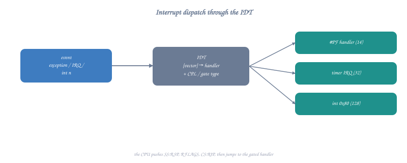

# Topic 26: Interrupts & Exceptions

## Overview

Interrupts are the mechanism by which hardware devices and software errors communicate with the CPU. They temporarily suspend normal execution to handle urgent events — from keyboard presses to division by zero errors. This topic explains the complete interrupt architecture of x86-64: the Interrupt Descriptor Table (IDT), exception handling, hardware IRQs, and how the `syscall` instruction relates to (and replaced) the old `int 0x80` mechanism.

```c
// Interrupts affect your assembly code in several ways:
// 1. Your program can be interrupted at ANY instruction boundary
// 2. Segfaults, divide-by-zero → CPU generates exceptions
// 3. The 'syscall' instruction is a controlled interrupt to kernel
// 4. Signal handlers are delivered via interrupt-like mechanisms

// You don't directly handle interrupts in user-mode programs,
// but understanding them explains:
// - Why segfaults happen
// - How system calls work internally
// - Why NMI/timer interrupts preempt your code
// - How debugger breakpoints work (INT 3)
```

---

## Part 1: Interrupt Types

```
x86-64 Interrupt Classification:

┌────────────────────────────────────────────────────────────────┐
│                    INTERRUPTS                                  │
├──────────────────────────┬─────────────────────────────────────┤
│    Synchronous           │       Asynchronous                  │
│    (caused by CPU)       │       (external events)             │
├──────────────────────────┼─────────────────────────────────────┤
│                          │                                     │
│  Exceptions:             │  Hardware Interrupts (IRQs):        │
│  ┌─────────────────────┐ │  ┌─────────────────────────────────┐│
│  │ Faults:             │ │  │ Maskable (INTR pin):            ││
│  │  #DE Divide Error   │ │  │   IRQ0  Timer                   ││
│  │  #PF Page Fault     │ │  │   IRQ1  Keyboard                ││
│  │  #GP General Prot.  │ │  │   IRQ8  RTC                     ││
│  │  #SS Stack Fault    │ │  │   IRQ12 Mouse                   ││
│  │  (instruction       │ │  │   IRQ14 Disk                    ││
│  │   retried after fix)│ │  │   (can be disabled via CLI)     ││
│  ├─────────────────────┤ │  ├─────────────────────────────────┤│
│  │ Traps:              │ │  │ Non-Maskable (NMI):             ││
│  │  #DB Debug          │ │  │   Hardware failures             ││
│  │  #BP Breakpoint     │ │  │   Watchdog timeout              ││
│  │  #OF Overflow       │ │  │   (CANNOT be disabled)          ││
│  │  (next instruction  │ │  └─────────────────────────────────┘│
│  │   after trap)       │ │                                     │
│  ├─────────────────────┤ │                                     │
│  │ Aborts:             │ │  Software Interrupts:               │
│  │  #DF Double Fault   │ │  ┌─────────────────────────────────┐│
│  │  #MC Machine Check  │ │  │ INT n   (explicit interrupt)    ││
│  │  (unrecoverable)    │ │  │ INT 3   (breakpoint)            ││
│  └─────────────────────┘ │  │ INT 0x80 (old Linux syscall)    ││
│                          │  │ SYSCALL  (modern fast syscall)  ││
│                          │  └─────────────────────────────────┘│
└──────────────────────────┴─────────────────────────────────────┘
```

---

## Part 2: The Interrupt Descriptor Table (IDT)

### IDT Structure



<details class="ascii-diagram">
<summary>ASCII diagram</summary>
<pre><code>The IDT maps interrupt/exception numbers (0-255) to handler addresses:

IDT Register (IDTR):
┌─────────────────────────────────────────┐
│  Limit (16 bits) │Base Address (64 bits)│
└─────────────────────────────────────────┘
   (loaded with LIDT instruction by kernel at boot)

IDT Entry (Gate Descriptor, 16 bytes on x86-64):
┌────────────────────────────────────────────────────────────┐
│ Bytes 0-1:   Offset low (bits 15:0 of handler address)     │
│ Bytes 2-3:   Segment Selector (code segment, usually 0x08) │
│ Byte 4:      IST (Interrupt Stack Table, bits 2:0)         │
│ Byte 5:      Type (0xE=Interrupt Gate, 0xF=Trap Gate)      │
│              + DPL (ring level) + Present bit              │
│ Bytes 6-7:   Offset mid (bits 31:16)                       │
│ Bytes 8-11:  Offset high (bits 63:32)                      │
│ Bytes 12-15: Reserved (must be 0)                          │
└────────────────────────────────────────────────────────────┘

Interrupt Gate vs Trap Gate:
  Interrupt Gate: automatically clears IF (disables further interrupts)
  Trap Gate: keeps IF unchanged (interrupts remain enabled)
  
  Exceptions (like #PF): use Trap Gate (kernel needs interrupts for I/O)
  Hardware IRQs: use Interrupt Gate (prevent interrupt nesting)</code></pre>
</details>

### IDT Entries for x86-64 Exceptions

```
Vector  Name                     Type    Error Code?
─────────────────────────────────────────────────────
  0     #DE  Divide Error        Fault   No
  1     #DB  Debug               Fault/Trap  No
  2     NMI  Non-Maskable Int    Interrupt  No
  3     #BP  Breakpoint          Trap    No
  4     #OF  Overflow            Trap    No
  5     #BR  Bound Range         Fault   No
  6     #UD  Invalid Opcode      Fault   No
  7     #NM  Device Not Avail    Fault   No
  8     #DF  Double Fault        Abort   Yes (always 0)
  9     (reserved)
 10     #TS  Invalid TSS         Fault   Yes
 11     #NP  Segment Not Present Fault   Yes
 12     #SS  Stack Segment Fault Fault   Yes
 13     #GP  General Protection  Fault   Yes
 14     #PF  Page Fault          Fault   Yes
 15     (reserved)
 16     #MF  x87 FP Exception    Fault   No
 17     #AC  Alignment Check     Fault   Yes
 18     #MC  Machine Check       Abort   No
 19     #XM  SIMD FP Exception   Fault   No
 20     #VE  Virtualization      Fault   No
 21-31  (reserved by Intel)
 32-255 Available for OS use (IRQs, syscalls, etc.)
```

---

## Part 3: What Happens During an Exception

### Page Fault (#PF, Vector 14) — Step by Step


```
Your code: mov rax, [0x0]     ← NULL pointer dereference!

CPU Page Fault Sequence:
┌─────────────────────────────────────────────────────────────────┐
│ 1. MMU detects page not present (P=0 in PTE for address 0x0)    │
│                                                                 │
│ 2. CPU pushes to KERNEL stack (found via TSS.RSP0):             │
│    ┌────────────────────────────┐                               │
│    │ SS        (user stack seg) │ RSP+40                        │
│    │ RSP       (user stack ptr) │ RSP+32                        │
│    │ RFLAGS    (saved flags)    │ RSP+24                        │
│    │ CS        (user code seg)  │ RSP+16                        │
│    │ RIP       (faulting instr) │ RSP+8  ← points to mov!       │
│    │ Error Code (page fault)    │ RSP+0                         │
│    └────────────────────────────┘                               │
│                                                                 │
│ 3. CPU stores faulting address in CR2                           │
│    CR2 = 0x0000000000000000                                     │
│                                                                 │
│ 4. CPU loads handler address from IDT[14]                       │
│    RIP = page_fault_handler (kernel function)                   │
│                                                                 │
│ 5. CPU clears IF if Interrupt Gate (keeps for Trap Gate)        │
│                                                                 │
│ 6. CPU changes to ring 0 (kernel mode)                          │
│                                                                 │
│ 7. Execution continues at kernel's page_fault_handler           │
└─────────────────────────────────────────────────────────────────┘

Error code for #PF:
  Bit 0: P   - 0=not present, 1=protection violation
  Bit 1: W/R - 0=read, 1=write caused fault
  Bit 2: U/S - 0=kernel mode, 1=user mode
  Bit 3: RSVD - 1=reserved bits set in PTE
  Bit 4: I/D - 1=instruction fetch

For NULL deref: error_code = 0b00100 = 4
  (user mode, read access, page not present)
```

### General Protection Fault (#GP, Vector 13)

```nasm
; Common causes of #GP:
; 1. Accessing kernel memory from user mode
; 2. Writing to read-only segment
; 3. Exceeding segment limit
; 4. Invalid system instruction in user mode

; This triggers #GP in user mode:
section .text
    global _start
_start:
    ; Attempt to read kernel memory → #GP → SIGSEGV
    ; mov rax, [0xFFFF800000000000]  ; kernel address!
    
    ; Attempt privileged instruction → #GP → SIGILL or SIGSEGV
    ; cli                            ; clear interrupt flag (ring 0 only!)
    ; hlt                            ; halt CPU (ring 0 only!)
    ; mov cr3, rax                   ; write control register (ring 0 only!)
    ; lgdt [rdi]                     ; load GDT (ring 0 only!)
    
    ; The kernel's #GP handler will:
    ; 1. Check if fault occurred in user mode (error code bit 2)
    ; 2. If user mode: deliver SIGSEGV to the process
    ; 3. If kernel mode: oops/panic!
    
    mov rax, 60
    xor rdi, rdi
    syscall
```

---

## Part 4: Hardware Interrupts (IRQs)

### Interrupt Delivery Path

```
Hardware device → Interrupt Controller → CPU → IDT → Handler

Modern path (x2APIC):
┌──────────────┐     ┌─────────────┐     ┌─────────────┐
│  Device      │────→│  I/O APIC   │────→│  Local APIC │──→ CPU
│  (keyboard,  │     │  (routes IRQ│     │ (per-core,  │
│   disk, NIC) │     │   to CPU)   │     │  prioritize)│
└──────────────┘     └─────────────┘     └─────────────┘

Legacy path (8259 PIC):
┌──────────────┐     ┌─────────────┐
│  Device      │────→│  8259 PIC   │────→ CPU INTR pin
└──────────────┘     │ Master/Slave│
                     └─────────────┘

IRQ → IDT vector mapping (typical Linux):
  IRQ 0  (Timer)    → Vector 32
  IRQ 1  (Keyboard) → Vector 33
  IRQ 8  (RTC)      → Vector 40
  IRQ 14 (IDE disk) → Vector 46
  (Vectors 0-31 reserved for CPU exceptions)
```

### Timer Interrupt (IRQ 0) — How Preemption Works

```
Timer fires every ~1ms (HZ=1000 or tickless):

1. CPU is executing your user-mode code
2. Timer hardware fires IRQ 0
3. CPU:
   - Finishes current instruction
   - Saves state to kernel stack (SS, RSP, RFLAGS, CS, RIP)
   - Loads IDT[32] handler address
   - Switches to ring 0

4. Kernel timer handler:
   - Update jiffies (time accounting)
   - Check if current process used up its time slice
   - If yes: set TIF_NEED_RESCHED flag
   - Return from interrupt (IRET)

5. On return path to user mode, kernel checks TIF_NEED_RESCHED:
   - If set: call schedule() → context switch to another process!
   - Your code is now paused until rescheduled

This is INVOLUNTARY preemption:
  Your code has NO say in when it's interrupted
  The OS guarantees fair CPU sharing among processes
```

---

## Part 5: Debugger Breakpoints (INT 3)

```nasm
; INT 3 (0xCC) is a single-byte instruction that triggers exception #BP
; Debuggers use it to implement breakpoints:
;
; 1. GDB reads the byte at breakpoint address
; 2. GDB replaces it with 0xCC (INT 3)
; 3. When CPU executes 0xCC → trap #BP → kernel delivers SIGTRAP
; 4. GDB catches SIGTRAP, restores original byte
; 5. User inspects state, then GDB single-steps past, re-inserts 0xCC

section .text
    global _start

_start:
    ; Insert our own breakpoint (for debugging without GDB)
    ; This will cause SIGTRAP → program stops (or core dump if no debugger)
    int 3                   ; 0xCC — breakpoint trap!

    ; If debugger is attached, execution resumes here after user continues
    
    ; Self-debugging technique: set up SIGTRAP handler
    ; (see signal handling in Topic 22)
    
    mov rax, 60
    xor rdi, rdi
    syscall

; How single-stepping works (TRAP flag):
; The CPU has a TF (Trap Flag) in RFLAGS
; When TF=1, CPU generates #DB exception after EVERY instruction
; GDB sets TF via ptrace to implement "step" command
;
; pushfq              ; Push RFLAGS
; or qword [rsp], 0x100  ; Set TF (bit 8)
; popfq              ; Pop modified RFLAGS
; ; Next instruction will trigger #DB trap!
; nop                ; ← #DB exception fires here
```

### Hardware Breakpoints (Debug Registers)

```nasm
; x86-64 has 4 debug address registers (DR0-DR3)
; and control register DR7 for configuring them
; These enable breakpoints WITHOUT modifying code!

; DR0-DR3: breakpoint addresses (up to 4 simultaneous)
; DR6: debug status (which breakpoint triggered)
; DR7: debug control (enable/disable, condition, length)

; Types of hardware breakpoints:
;   Execute: break when RIP reaches address (like INT 3, but no code change)
;   Write:   break when address is WRITTEN (watchpoint)
;   Read/Write: break on any access (data breakpoint)
;   I/O:     break on port access (privileged)

; In user mode, you can't set DR registers directly
; (they're privileged — only kernel/debugger via ptrace)
;
; GDB's "watch" command uses hardware breakpoints:
;   (gdb) watch my_variable
;   → ptrace sets DR0 = &my_variable, DR7 = write-break
;   → CPU triggers #DB on any write to that address
;   → Kernel delivers SIGTRAP to debugger
;   → GDB shows "Watchpoint hit: my_variable changed"

; Using ptrace to set debug registers (from a debugger process):
; ptrace(PTRACE_POKEUSER, child_pid, offsetof(user, u_debugreg[0]), addr)
; ptrace(PTRACE_POKEUSER, child_pid, offsetof(user, u_debugreg[7]), ctrl)
```

---

## Part 6: The syscall Instruction vs INT 0x80

### Legacy: INT 0x80 (32-bit Linux)

```nasm
; INT 0x80 uses the IDT mechanism:
; 1. CPU looks up IDT[0x80]
; 2. Saves SS, RSP, RFLAGS, CS, RIP to kernel stack
; 3. Loads handler from IDT entry
; 4. Handler dispatches based on EAX (syscall number)
; 5. Returns via IRET

; Slow because:
; - Full privilege level checks
; - IDT lookup
; - Stack switching via TSS
; - IRET is complex (loads 5 values from stack)

mov eax, 4             ; sys_write (32-bit number!)
mov ebx, 1             ; fd
mov ecx, msg           ; buffer
mov edx, len           ; count
int 0x80               ; Trigger software interrupt 0x80
; ~200-400 cycles for the transition
```

### Modern: SYSCALL/SYSRET (64-bit)

```nasm
; SYSCALL is a special instruction (not via IDT):
; 1. Saves RIP in RCX, RFLAGS in R11
; 2. Loads kernel RIP from MSR_LSTAR
; 3. Loads kernel CS from MSR_STAR
; 4. Masks RFLAGS with MSR_FMASK
; 5. NO stack switch (kernel must do it manually)
; 6. NO privilege checks (hardcoded ring 0 transition)
;
; Much faster: ~50-100 cycles for the transition

; SYSRET (kernel → user mode):
; 1. Loads RIP from RCX
; 2. Loads RFLAGS from R11
; 3. Loads user CS/SS from MSR_STAR
; 4. Sets CPL = 3 (user mode)
;
; Even faster than IRET: ~30-50 cycles

mov rax, 1             ; sys_write (64-bit number)
mov rdi, 1             ; fd
lea rsi, [rel msg]     ; buffer
mov rdx, len           ; count
syscall                ; Fast path to kernel
; RCX and R11 are clobbered!
; (RCX = return RIP, R11 = saved RFLAGS)
```

### Why RCX and R11 are Clobbered

```nasm
; IMPORTANT: After syscall, RCX and R11 contain kernel data:
;   RCX = the return address (old RIP)
;   R11 = the old RFLAGS
;
; If you need RCX/R11 across a syscall, save them first!

section .text
_start:
    mov rcx, 42            ; Important value in RCX
    mov r11, 99            ; Important value in R11

    ; Save before syscall
    push rcx
    push r11

    mov rax, 1
    mov rdi, 1
    lea rsi, [rel msg]
    mov rdx, 5
    syscall                ; Destroys RCX and R11!

    ; Restore after syscall
    pop r11                ; R11 = 99 again
    pop rcx                ; RCX = 42 again

    mov rax, 60
    xor rdi, rdi
    syscall

section .rodata
    msg db "Hello"
```

---

## Part 7: vDSO — Virtual Dynamically-linked Shared Object

```nasm
; Some "syscalls" don't actually enter the kernel!
; The vDSO is a kernel-mapped shared library in every process's address space
;
; Functions in vDSO (execute entirely in user mode):
;   clock_gettime()  — reads time without syscall
;   gettimeofday()   — reads time without syscall
;   time()           — reads time without syscall
;   getcpu()         — reads CPU number without syscall
;
; How it works:
; 1. Kernel maps a special page into every process (visible in /proc/self/maps)
; 2. The page contains optimized code that reads kernel-maintained data
; 3. Kernel updates a shared memory region with current time, CPU info, etc.
; 4. User-mode code reads this shared region directly (no syscall needed!)
;
; Result: clock_gettime() takes ~20ns instead of ~100ns
;
; Finding the vDSO:
; - In auxiliary vector (AT_SYSINFO_EHDR, type 33)
; - Or by parsing /proc/self/maps (look for [vdso])

; The vDSO page appears at a random address (ASLR):
; $ cat /proc/self/maps | grep vdso
; 7ffd1b9f4000-7ffd1b9f6000 r-xp 00000000 00:00 0  [vdso]
;
; $ objdump -d /path/to/extracted/vdso.so
; Shows user-mode implementations of clock_gettime, etc.
```

---

## Part 8: Interrupt Latency and Real-Time

```nasm
; Interrupt latency = time from hardware event to handler execution
;
; Sources of latency:
; 1. Current instruction must complete (can be slow for DIV, REP)
; 2. CPU pipeline flush
; 3. Mode switch overhead
; 4. Handler prologue (save registers)
; 5. If interrupts were disabled (CLI): must wait for STI
;
; Typical latency on modern x86-64:
;   Best case: ~1μs (interrupt already enabled, short instruction)
;   Worst case: ~100μs (interrupts disabled, long critical section)
;
; Critical for:
;   Audio: must deliver samples every ~5ms (44.1kHz × buffer size)
;   Network: packet processing at 10Gbps = ~67ns per packet
;   Storage: NVMe completion in ~10μs

; CLI/STI — Disable/Enable interrupts (kernel only!):
; cli                     ; Clear Interrupt Flag (IF=0)
;                         ; Maskable interrupts are now blocked!
;                         ; ... critical section ...
; sti                     ; Set Interrupt Flag (IF=1)
;                         ; Interrupts can fire again

; In user mode, CLI/STI trigger #GP (privilege violation)
; User programs can't disable interrupts — only the kernel can
; This ensures the timer interrupt can always preempt user code
```

---

## Part 9: Exception Handling in Practice

### Catching SIGSEGV (from Assembly)

```nasm
; When your code triggers an exception (e.g., page fault on invalid address):
; 1. CPU generates exception → kernel handler
; 2. Kernel checks: is this a valid fault? (VMA lookup)
; 3. If invalid: deliver signal to process
;    - SIGSEGV for memory access violations
;    - SIGFPE for division errors
;    - SIGILL for illegal instructions
;    - SIGBUS for bus errors (alignment on some archs)
;
; You CAN catch these signals and recover!

section .data
    segv_msg db "Caught segfault! Recovered gracefully.", 10
    segv_len equ $ - segv_msg

    align 8
    sa_struct:
        dq segv_handler        ; sa_handler
        dq 0x04000004          ; sa_flags = SA_RESTORER | SA_SIGINFO
        dq sa_restorer         ; sa_restorer
        times 16 db 0          ; sa_mask

    jmp_buf resb 200           ; Save point for recovery

section .text
    global _start

sa_restorer:
    mov rax, 15                ; sys_rt_sigreturn
    syscall

segv_handler:
    ; Signal handler for SIGSEGV
    ; At this point, we can't just return (would re-execute faulting instruction!)
    ; Instead, modify the saved RIP to skip past the bad instruction
    ;
    ; RDI = signal number
    ; RSI = siginfo_t*
    ; RDX = ucontext_t* (contains saved registers)
    
    ; ucontext_t layout (simplified):
    ;   [rdx+0x28..]: mcontext_t.gregs[] (register file)
    ;   REG_RIP is at index 16 in gregs array
    ;   Each greg is 8 bytes, offset = 0x28 + 16*8 = 0xA8
    
    ; Skip the faulting instruction (advance RIP past it)
    ; mov instruction is typically 7 bytes for mov rax, [addr]
    add qword [rdx + 0xA8], 7  ; Skip past faulting instruction
    
    ; Print message
    push rax
    push rdi
    push rsi
    push rdx
    mov rax, 1
    mov rdi, 1
    lea rsi, [rel segv_msg]
    mov rdx, segv_len
    syscall
    pop rdx
    pop rsi
    pop rdi
    pop rax
    ret

_start:
    ; Install SIGSEGV handler
    mov rax, 13                ; sys_rt_sigaction
    mov rdi, 11                ; SIGSEGV
    lea rsi, [rel sa_struct]
    xor rdx, rdx              ; old_act = NULL
    mov r10, 8                 ; sigsetsize
    syscall

    ; Deliberately trigger segfault
    xor rax, rax
    mov rax, [rax]             ; Read from NULL! → SIGSEGV
    ; Handler advances RIP, execution continues here

    ; We survived the segfault!
    mov rax, 60
    xor rdi, rdi               ; Exit success
    syscall
```

### Division by Zero Handler

```nasm
; Integer division by zero triggers #DE (exception 0)
; Kernel delivers SIGFPE to the process

section .data
    fpe_msg db "Division by zero caught!", 10
    fpe_len equ $ - fpe_msg

    align 8
    fpe_sa:
        dq fpe_handler
        dq 0x04000004          ; SA_RESTORER | SA_SIGINFO
        dq fpe_restorer
        times 16 db 0

section .text
    global _start

fpe_restorer:
    mov rax, 15
    syscall

fpe_handler:
    ; Skip the DIV instruction (~2 bytes for div ecx)
    add qword [rdx + 0xA8], 2
    
    ; Set RAX to a safe value (so code can continue)
    ; mcontext gregs: RAX is at index 13, offset = 0x28 + 13*8 = 0x90
    mov qword [rdx + 0x90], 0  ; Set recovered RAX = 0
    
    mov rax, 1
    mov rdi, 2                 ; stderr
    lea rsi, [rel fpe_msg]
    mov rdx, fpe_len
    syscall
    ret

_start:
    ; Install SIGFPE handler
    mov rax, 13
    mov rdi, 8                 ; SIGFPE
    lea rsi, [rel fpe_sa]
    xor rdx, rdx
    mov r10, 8
    syscall

    ; Trigger division by zero
    mov eax, 42
    xor ecx, ecx              ; ECX = 0
    div ecx                    ; 42 / 0 → #DE → SIGFPE!
    ; Handler skips past div, sets RAX=0, continues here

    ; Survived!
    mov rax, 60
    xor rdi, rdi
    syscall
```

---

## Part 10: Interrupt Descriptor Table Setup (Kernel Context)

```nasm
; This section shows how the kernel sets up the IDT at boot
; You can't run this in user mode, but understanding it
; completes the picture of how interrupts work

; NOTE: This is x86-64 kernel-mode code (for educational purposes)
; Setting up a single IDT entry:

; %macro SET_IDT_ENTRY 3   ; vector, handler_addr, type_attr
;     ; Calculate entry address: IDT_BASE + vector * 16
;     mov rdi, IDT_BASE
;     add rdi, %1 * 16
;     
;     ; Write the 16-byte gate descriptor:
;     mov rax, %2            ; Handler address
;     
;     ; Bytes 0-1: offset low
;     mov word [rdi], ax
;     
;     ; Bytes 2-3: code segment selector
;     mov word [rdi+2], 0x08  ; Kernel code segment
;     
;     ; Byte 4: IST (0 = don't use IST)
;     mov byte [rdi+4], 0
;     
;     ; Byte 5: type + DPL + present
;     mov byte [rdi+5], %3   ; e.g., 0x8E = present, DPL=0, interrupt gate
;     
;     ; Bytes 6-7: offset mid
;     shr rax, 16
;     mov word [rdi+6], ax
;     
;     ; Bytes 8-11: offset high
;     shr rax, 16
;     mov dword [rdi+8], eax
;     
;     ; Bytes 12-15: reserved
;     mov dword [rdi+12], 0
; %endmacro

; Example entries:
; SET_IDT_ENTRY 0, divide_error_handler, 0x8F    ; #DE (Trap gate)
; SET_IDT_ENTRY 3, breakpoint_handler, 0xEF      ; #BP (Trap gate, DPL=3!)
; SET_IDT_ENTRY 14, page_fault_handler, 0x8E     ; #PF (Interrupt gate)
; SET_IDT_ENTRY 32, timer_handler, 0x8E          ; Timer IRQ

; Note: #BP (breakpoint) has DPL=3, meaning user-mode code CAN trigger it
; with INT 3. All other exceptions have DPL=0 (only kernel can INT them).

; Load the IDT:
; lidt [idtr_descriptor]
; idtr_descriptor:
;     dw IDT_SIZE - 1        ; Limit
;     dq IDT_BASE            ; Base address
```

---

## Exercises

1. **Exception explorer**: Write a program that installs handlers for SIGSEGV, SIGFPE, and SIGILL, then deliberately triggers each one. Print which exception was caught.

2. **Breakpoint insertion**: Write a simple debugger that `fork()`s, uses `ptrace` to insert INT 3 at a specific address in the child, and catches the resulting SIGTRAP.

3. **Timing interrupts**: Use `rdtsc` to measure how long a tight loop iteration takes. Run it many times and observe the occasional spike caused by timer interrupts preempting your code.

4. **Signal vs exception**: Compare the behavior of `kill(getpid(), SIGSEGV)` (signal delivery) vs actually dereferencing NULL (CPU exception). How does the handler's ucontext differ?

5. **vDSO discovery**: Parse the auxiliary vector to find AT_SYSINFO_EHDR, dump the vDSO ELF, and disassemble `clock_gettime` to see how it reads time without a syscall.

---

## Key Takeaways

| Concept | Hardware Reality |
|---------|-----------------|
| IDT | 256-entry table mapping vectors to handler addresses |
| Exception | Synchronous: caused by instruction (fault/trap/abort) |
| Interrupt | Asynchronous: caused by hardware device (IRQ) |
| Page Fault | #PF (vector 14): CPU pushes error code + saves RIP to kernel stack |
| INT 3 | Single-byte (0xCC) breakpoint trap; debuggers patch code with it |
| SYSCALL | Not an interrupt! Uses MSRs for fast ring transition |
| Timer IRQ | Fires every ~1ms; enables preemptive multitasking |
| CLI/STI | Kernel-only instructions to mask/unmask IRQs |
| Signal delivery | Kernel modifies user stack to call signal handler on return |

---

## Next Topic

[Topic 27: Context Switching →](topic-27-context-switching.md) — How the OS saves one process's state and restores another's, enabling multitasking.
