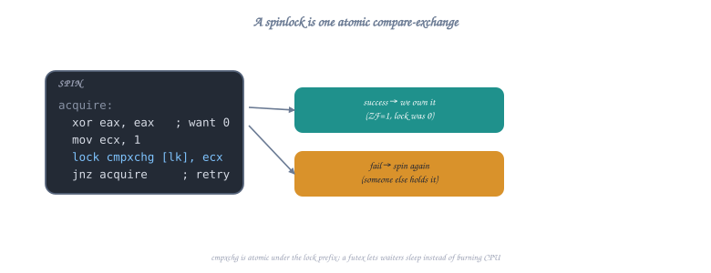
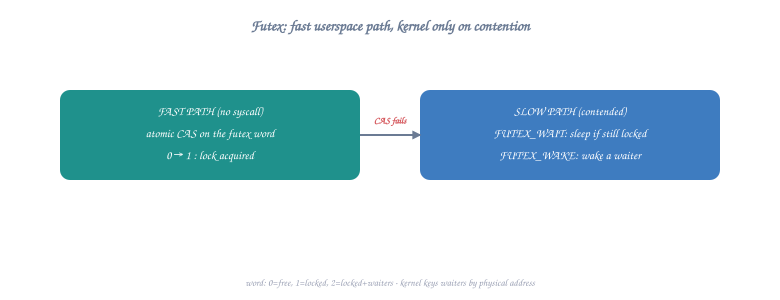

# Topic 28: Synchronization Primitives

## Overview

When multiple threads or processes share memory, they need synchronization to prevent data races. This topic covers the complete hierarchy of synchronization mechanisms — from hardware atomic instructions up through OS-assisted mutexes — all at the assembly level.

```c
// The fundamental problem:
// Thread 1: counter++    →  load counter; add 1; store counter
// Thread 2: counter++    →  load counter; add 1; store counter
//
// Without synchronization, both might load the same value,
// both add 1, and both store — result: incremented only once!
// This is a RACE CONDITION.

// Solutions (from lowest to highest level):
// 1. Atomic instructions (LOCK prefix, CMPXCHG)
// 2. Spinlocks (busy-wait using atomics)
// 3. Futex (fast userspace mutex — hybrid: atomic + kernel wait)
// 4. Mutexes (pthread_mutex = futex wrapper)
// 5. Read-write locks
// 6. Semaphores
// 7. Condition variables
```

---

## Part 1: Memory Ordering and the Problem

### Why Simple Load/Store Isn't Enough

```
CPU cores have store buffers and can reorder memory operations!

x86-64 memory model (TSO — Total Store Order):
  ✓ Loads are NOT reordered with other loads
  ✓ Stores are NOT reordered with other stores
  ✓ Loads are NOT reordered with older stores to same address
  ✗ Loads CAN be reordered with older stores to DIFFERENT addresses
  ✗ Stores can be delayed in store buffer (other CPUs see stale data)

Problem example (store buffer):
  Initially: x = 0, y = 0

  CPU 0:           CPU 1:
  mov [x], 1      mov [y], 1
  mov rax, [y]    mov rbx, [x]

  Possible result: rax = 0, rbx = 0  (!)
  Both stores in store buffers, not yet visible to other CPU!
  
  Solution: memory barriers (MFENCE, LOCK prefix)
```

### Memory Barriers

```nasm
; x86-64 memory barrier instructions:

; MFENCE: Full memory barrier (all prior stores visible before subsequent loads)
mfence                     ; Drains store buffer, prevents all reordering

; SFENCE: Store barrier (all prior stores visible before subsequent stores)
sfence                     ; Rarely needed on x86 (stores already ordered)

; LFENCE: Load barrier (all prior loads complete before subsequent loads)
lfence                     ; Serializes loads (useful for rdtsc ordering)

; LOCK prefix: atomic operation + full barrier
; Every LOCK'd instruction acts as a full memory barrier
lock add qword [counter], 1  ; Atomic increment + memory barrier

; In practice on x86-64:
; - LOCK prefix is your primary synchronization tool
; - MFENCE is for special cases (e.g., non-temporal stores + normal loads)
; - Most "memory barrier" concerns from other architectures are handled
;   automatically by x86's strong memory model (TSO)
```

---

## Part 2: Atomic Instructions

### The LOCK Prefix

```nasm
; LOCK prefix makes a read-modify-write operation ATOMIC
; No other CPU can access the cache line between the read and write
; Also serves as a full memory barrier

section .data
    align 8
    counter dq 0           ; Shared counter

section .text

; Atomic increment (thread-safe counter++)
atomic_increment:
    lock inc qword [rel counter]
    ret

; Atomic add (thread-safe counter += value)
; Input: RDI = value to add
atomic_add:
    lock add qword [rel counter], rdi
    ret

; Atomic exchange (swap register and memory atomically)
; Input: RDI = new value
; Output: RAX = old value
atomic_exchange:
    mov rax, rdi
    xchg [rel counter], rax    ; XCHG is implicitly LOCK'd!
    ret

; Atomic fetch-and-add (get old value while adding)
; Input: RDI = value to add
; Output: RAX = old value (before add)
atomic_fetch_add:
    mov rax, rdi
    lock xadd [rel counter], rax  ; RAX = old value, [counter] = old + rax
    ret

; Atomic OR (set bits atomically)
atomic_or:
    lock or qword [rel counter], rdi
    ret

; Atomic AND (clear bits atomically)
atomic_and:
    lock and qword [rel counter], rdi
    ret
```

### CMPXCHG — Compare and Swap (CAS)

```nasm
; CMPXCHG: The fundamental building block of lock-free algorithms
;
; Semantics:
;   if ([mem] == RAX) {
;       [mem] = new_value;
;       ZF = 1;  // Success
;   } else {
;       RAX = [mem];  // Load actual value
;       ZF = 0;  // Failure
;   }
;
; Used to implement: mutexes, lock-free stacks, lock-free queues, etc.

; Compare-and-swap wrapper
; Input: RDI = address, RSI = expected, RDX = new value
; Output: RAX = actual old value, ZF = success
cas:
    mov rax, rsi           ; Expected value in RAX
    lock cmpxchg [rdi], rdx  ; if *RDI == RAX: *RDI = RDX
    ret                    ; RAX = old value, ZF = success/fail

; Atomic increment using CAS (retry loop):
cas_increment:
    mov rax, [rel counter]      ; Load current value
.retry:
    lea rdx, [rax + 1]         ; New value = old + 1
    lock cmpxchg [rel counter], rdx
    jnz .retry                 ; If failed (another thread changed it), retry
    ; RAX = the value we successfully incremented from
    ret

; 128-bit CAS (CMPXCHG16B) — for lock-free data structures
; Atomically compares and swaps 16 bytes
; Input: RDI = address of 16-byte value
;        RCX:RBX = new value (RCX=high, RBX=low)
;        RDX:RAX = expected value (RDX=high, RAX=low)
cas_128:
    lock cmpxchg16b [rdi]  ; Compare RDX:RAX with [RDI], swap with RCX:RBX
    ret
```

---

## Part 3: Spinlocks

### Simple Spinlock (Test-and-Set)



```nasm
; A spinlock is the simplest mutex: busy-wait until lock is free
; Good for: very short critical sections, kernel context (can't sleep)
; Bad for: long critical sections (wastes CPU cycles spinning)

section .data
    align 8
    spinlock dq 0          ; 0 = unlocked, 1 = locked

section .text

; Acquire spinlock (busy-wait)
spin_lock:
    mov rax, 1
.try:
    xchg [rel spinlock], rax   ; Atomically swap 1 into lock
    test rax, rax              ; Was it 0 (unlocked)?
    jnz .spin                  ; No → it was already locked, spin
    ret                        ; Yes → we acquired it!

.spin:
    pause                      ; CPU hint: we're spinning (saves power, avoids
                               ; memory order violation pipeline flush)
    cmp qword [rel spinlock], 0  ; Check without LOCK (reduces bus traffic)
    jne .spin                  ; Still locked? Keep waiting
    jmp .try                   ; Looks free! Try to acquire again

; Release spinlock
spin_unlock:
    mov qword [rel spinlock], 0  ; Simple store (x86 store ordering is sufficient)
    ret                          ; No need for LOCK prefix on release (on x86)
```

### Ticket Spinlock (Fair Ordering)

```nasm
; Problem with simple spinlock: no guarantee of fairness
; Thread that just released might immediately re-acquire!
;
; Ticket lock: serves threads in FIFO order (like a bakery number system)

section .data
    align 8
    ticket_next dq 0       ; Next ticket to be served
    ticket_tail dq 0       ; Next ticket to be dispensed

section .text

; Acquire ticket lock
ticket_lock:
    ; Take a ticket (atomic increment of tail)
    mov rax, 1
    lock xadd [rel ticket_tail], rax  ; RAX = our ticket number
    ; Now wait until our ticket is being served
.wait:
    cmp [rel ticket_next], rax
    je .acquired
    pause
    jmp .wait
.acquired:
    ret

; Release ticket lock
ticket_unlock:
    ; Serve next ticket
    lock inc qword [rel ticket_next]
    ret
```

---

## Part 4: The Futex Syscall

### What is a Futex?



```
Futex = Fast Userspace muTEX

The problem with spinlocks: waste CPU while waiting
The problem with kernel mutexes: syscall overhead even when uncontended

Futex solution: HYBRID approach
  - Uncontended case (common): pure user-space atomic operation (no syscall!)
  - Contended case (rare): kernel puts thread to sleep

Performance comparison:
  Spinlock uncontended:  ~10ns (atomic exchange)
  Futex uncontended:     ~10ns (atomic CAS, no syscall)
  Spinlock contended:    burns CPU (100% utilization while waiting)
  Futex contended:       ~1μs (syscall + sleep, 0% CPU while waiting)
  Kernel mutex always:   ~100ns (syscall even when uncontended)
```

### Futex Operations

```nasm
; futex(uint32_t *uaddr, int futex_op, uint32_t val,
;       const struct timespec *timeout, uint32_t *uaddr2, uint32_t val3)
;
; Syscall number: 202 (sys_futex)
;
; Key operations:
;   FUTEX_WAIT (0): if *uaddr == val, sleep until woken
;   FUTEX_WAKE (1): wake up at most val threads waiting on uaddr

section .data
    align 4
    futex_var dd 0         ; 0 = unlocked, 1 = locked (no waiters)
                           ; 2 = locked (has waiters)

section .text

; FUTEX_WAIT: sleep until *addr != val
; Input: RDI = addr, ESI = expected_val
futex_wait:
    mov rax, 202           ; sys_futex
    ; RDI = uaddr (already set)
    mov esi, esi           ; Clear upper ESI (val)
    mov edx, esi           ; val = expected value
    mov esi, 0             ; op = FUTEX_WAIT
    xor r10, r10           ; timeout = NULL (wait forever)
    xor r8, r8             ; uaddr2 = NULL
    xor r9, r9             ; val3 = 0
    ; Correction: let me redo the argument mapping
    ; RDI = uaddr, RSI = op, RDX = val, R10 = timeout
    mov rax, 202
    ; rdi already = address
    xor esi, esi           ; FUTEX_WAIT = 0
    mov edx, edx           ; val (expected value, passed in original ESI)
    xor r10, r10           ; timeout = NULL
    syscall
    ; Returns 0 on success, -EAGAIN if *uaddr != val, -EINTR if signaled
    ret

; FUTEX_WAKE: wake up waiting threads
; Input: RDI = addr, ESI = max_threads_to_wake
futex_wake:
    mov rax, 202           ; sys_futex
    ; RDI = uaddr (already set)
    mov edx, esi           ; val = number to wake
    mov esi, 1             ; op = FUTEX_WAKE
    syscall
    ; Returns number of threads woken
    ret
```

### Implementing a Mutex with Futex

```nasm
; This is essentially what pthread_mutex does internally:
; Three states:
;   0 = unlocked
;   1 = locked, no waiters
;   2 = locked, there are waiters (must wake on unlock)

section .data
    align 4
    mutex dd 0

section .text

; mutex_lock()
mutex_lock:
    ; Fast path: try to change 0 → 1 (uncontended case)
    xor eax, eax           ; Expected: 0 (unlocked)
    mov ecx, 1             ; Desired: 1 (locked, no waiters)
    lock cmpxchg dword [rel mutex], ecx
    je .locked             ; Got it! (ZF=1 means CAS succeeded)

    ; Slow path: lock is contended
    ; Change state to 2 (locked with waiters) and sleep
.wait_loop:
    ; If state is already 2, or we can change 1→2
    mov eax, 2
    xchg dword [rel mutex], eax  ; Set to 2, get old value
    test eax, eax
    jz .locked             ; Was 0? We got lucky, locked now!

    ; Sleep until woken (FUTEX_WAIT with expected value 2)
    mov rax, 202           ; sys_futex
    lea rdi, [rel mutex]   ; uaddr
    xor esi, esi           ; FUTEX_WAIT
    mov edx, 2             ; val = 2 (expected value)
    xor r10, r10           ; timeout = NULL
    syscall

    ; Woke up! But might not have the lock — try again
    mov eax, 2
    xchg dword [rel mutex], eax
    test eax, eax
    jnz .wait_loop         ; Still locked? Back to sleep

.locked:
    ret

; mutex_unlock()
mutex_unlock:
    ; Atomically decrement: if it was 1→0, done (no waiters)
    mov eax, 1
    lock xadd dword [rel mutex], eax  ; Atomic fetch-and-subtract... 
    ; Actually let's use a different approach:
    
    ; Better approach: exchange with 0
    xor eax, eax
    xchg dword [rel mutex], eax  ; Unlock, get old state
    
    cmp eax, 2             ; Were there waiters?
    jne .no_waiters        ; No waiters (state was 1)

    ; Wake one waiter
    mov rax, 202           ; sys_futex
    lea rdi, [rel mutex]   ; uaddr
    mov esi, 1             ; FUTEX_WAKE
    mov edx, 1             ; Wake 1 thread
    syscall

.no_waiters:
    ret
```

---

## Part 5: Lock-Free Data Structures

### Lock-Free Stack (Treiber Stack)

```nasm
; A stack where push and pop are atomic — no locks needed!
; Uses CMPXCHG to atomically update the head pointer

struc node
    .next resq 1           ; Pointer to next node
    .data resq 1           ; Data payload
endstruc

section .data
    align 8
    stack_head dq 0        ; Head of lock-free stack (NULL = empty)

section .text

; Push a node onto the lock-free stack
; Input: RDI = pointer to node (node.data already set)
lockfree_push:
    ; Load current head
    mov rax, [rel stack_head]
.retry:
    ; Set new node's next to current head
    mov [rdi + node.next], rax
    ; CAS: if head still == rax, set head = new node
    lock cmpxchg [rel stack_head], rdi
    jnz .retry             ; Head changed! Reload and retry
    ret

; Pop a node from the lock-free stack
; Output: RAX = pointer to popped node (or NULL if empty)
lockfree_pop:
    mov rax, [rel stack_head]
.retry:
    test rax, rax
    jz .empty              ; Stack is empty
    ; Read next pointer (will become new head)
    mov rdx, [rax + node.next]
    ; CAS: if head still == rax, set head = rax->next
    lock cmpxchg [rel stack_head], rdx
    jnz .retry             ; Head changed! Reload and retry
    ret                    ; RAX = popped node
.empty:
    xor eax, eax           ; Return NULL
    ret

; ABA problem warning:
; Between our load and CAS, another thread might:
;   pop A, pop B, push A back
; Our CAS sees head==A and succeeds, but the stack structure changed!
; Solution: use 128-bit CAS (CMPXCHG16B) with a counter to detect this:
;   head = {pointer, version_counter}
;   On every push/pop, increment counter
;   CMPXCHG16B compares both pointer AND counter
```

### Lock-Free Counter with Exponential Backoff

```nasm
; When many threads contend on one atomic variable,
; CAS retries can cause "livelock" (everyone failing continuously)
; Solution: exponential backoff

section .data
    align 8
    shared_counter dq 0

section .text

; Increment with backoff on contention
atomic_inc_backoff:
    push rbx
    mov ebx, 1             ; Initial backoff = 1 iteration

.retry:
    mov rax, [rel shared_counter]
    lea rdx, [rax + 1]
    lock cmpxchg [rel shared_counter], rdx
    je .done               ; Success!

    ; CAS failed — backoff before retrying
    mov ecx, ebx
.backoff:
    pause                  ; CPU-friendly spin
    dec ecx
    jnz .backoff

    ; Double backoff (cap at 1024)
    shl ebx, 1
    cmp ebx, 1024
    jle .retry
    mov ebx, 1024
    jmp .retry

.done:
    pop rbx
    ret
```

---

## Part 6: Read-Write Lock

```nasm
; Read-write lock: many readers OR one writer (not both)
; Readers don't block each other (great for read-heavy workloads)
;
; Implementation using a single atomic value:
;   state > 0: number of active readers
;   state = 0: unlocked
;   state = -1: writer holds lock

section .data
    align 8
    rwlock dq 0            ; 0=free, >0=readers, -1=writer

section .text

; Acquire read lock
read_lock:
    mov rax, [rel rwlock]
.retry:
    cmp rax, -1
    je .wait_reader        ; Writer active, can't read

    ; Try to increment reader count
    lea rdx, [rax + 1]    ; New value = old + 1
    lock cmpxchg [rel rwlock], rdx
    jne .retry             ; Someone else changed it, retry (RAX updated)
    ret

.wait_reader:
    pause
    mov rax, [rel rwlock]
    jmp .retry

; Release read lock
read_unlock:
    lock dec qword [rel rwlock]  ; Decrement reader count
    ret

; Acquire write lock
write_lock:
    xor eax, eax          ; Expected: 0 (completely free)
    mov rdx, -1           ; Desired: -1 (writer)
.retry:
    lock cmpxchg [rel rwlock], rdx
    je .got_write          ; Was 0? Now -1, we have it!

    ; Not free — wait
    pause
    xor eax, eax
    jmp .retry

.got_write:
    ret

; Release write lock
write_unlock:
    mov qword [rel rwlock], 0  ; Simple store (was -1, set to 0)
    ret
```

---

## Part 7: Semaphores

```nasm
; Semaphore: counter that allows N concurrent accesses
; sem_wait: decrement (block if would go negative)
; sem_post: increment (wake one waiter)

section .data
    align 4
    semaphore dd 3         ; Allow up to 3 concurrent accesses

section .text

; sem_wait (decrement, potentially blocking)
sem_wait:
.retry:
    mov eax, [rel semaphore]
    test eax, eax
    jle .block             ; Counter is 0 or negative, must block

    ; Try to decrement
    lea edx, [eax - 1]
    lock cmpxchg dword [rel semaphore], edx
    jne .retry             ; Changed, retry
    ret                    ; Decremented successfully

.block:
    ; Use futex to sleep
    mov rax, 202           ; sys_futex
    lea rdi, [rel semaphore]
    xor esi, esi           ; FUTEX_WAIT
    xor edx, edx           ; val = 0 (expected)
    xor r10, r10           ; no timeout
    syscall

    jmp .retry             ; Woke up, try again

; sem_post (increment, potentially waking)
sem_post:
    lock inc dword [rel semaphore]

    ; Wake one waiter
    mov rax, 202
    lea rdi, [rel semaphore]
    mov esi, 1             ; FUTEX_WAKE
    mov edx, 1             ; Wake 1
    syscall
    ret
```

---

## Part 8: Condition Variables

```nasm
; Condition variable: wait until a condition is true
; Always used with a mutex:
;   lock(mutex)
;   while (!condition)
;       cond_wait(&cond, &mutex)  // atomically unlock + sleep
;   // condition is true here, mutex is held
;   unlock(mutex)
;
; Another thread signals:
;   lock(mutex)
;   set_condition_true()
;   cond_signal(&cond)    // wake one waiter
;   unlock(mutex)

section .data
    align 4
    cond_seq dd 0          ; Sequence number (incremented on signal)
    cond_mutex dd 0        ; Associated mutex

    ; Shared state
    data_ready dd 0        ; Our condition: is data ready?
    shared_data dq 0       ; The data itself

section .text

; Wait on condition variable
; Must hold cond_mutex on entry!
; Input: RDI = pointer to cond_seq, RSI = pointer to mutex
cond_wait:
    push r12
    push r13
    mov r12, rdi           ; Save cond address
    mov r13, rsi           ; Save mutex address

    ; Read current sequence number
    mov eax, [r12]         ; seq before sleep
    mov r14d, eax

    ; Release mutex (so other threads can make condition true)
    mov rdi, r13
    call mutex_unlock

    ; Sleep until sequence number changes (FUTEX_WAIT)
    mov rax, 202           ; sys_futex
    mov rdi, r12           ; uaddr = &cond_seq
    xor esi, esi           ; FUTEX_WAIT
    mov edx, r14d          ; val = seq number we saw
    xor r10, r10           ; no timeout
    syscall

    ; Woke up! Re-acquire mutex before returning
    mov rdi, r13
    call mutex_lock

    pop r13
    pop r12
    ret

; Signal condition (wake one waiter)
; Input: RDI = pointer to cond_seq
cond_signal:
    ; Increment sequence number (so FUTEX_WAIT sees change)
    lock inc dword [rdi]

    ; Wake one waiter
    mov rax, 202
    ; rdi already = address
    mov esi, 1             ; FUTEX_WAKE
    mov edx, 1             ; wake 1
    syscall
    ret

; Broadcast (wake all waiters)
cond_broadcast:
    lock inc dword [rdi]

    mov rax, 202
    mov esi, 1             ; FUTEX_WAKE
    mov edx, 0x7FFFFFFF    ; Wake all (MAX_INT)
    syscall
    ret
```

---

## Part 9: Producer-Consumer with Ring Buffer

```nasm
; Lock-free single-producer single-consumer ring buffer
; (No locks needed when there's exactly one reader and one writer!)
; Uses memory ordering guarantees of x86-64

RING_SIZE equ 1024         ; Must be power of 2
RING_MASK equ RING_SIZE - 1

section .bss
    align 64               ; Cache line alignment to avoid false sharing
    ring_buf resq RING_SIZE ; The buffer
    
    align 64
    ring_head resq 1       ; Write position (only producer modifies)
    
    align 64               ; Separate cache line!
    ring_tail resq 1       ; Read position (only consumer modifies)

section .text

; Producer: write one item
; Input: RDI = value to write
; Output: RAX = 0 on success, -1 if full
ring_push:
    mov rax, [rel ring_head]
    mov rcx, rax
    inc rcx
    and rcx, RING_MASK     ; Wrap around
    
    ; Check if full
    cmp rcx, [rel ring_tail]
    je .full               ; Would wrap into tail → buffer full!
    
    ; Write data
    mov [rel ring_buf + rax*8], rdi
    
    ; Update head (store barrier implicit on x86 for stores)
    ; Consumer will see the data write BEFORE the head update
    ; because x86 doesn't reorder store-store
    mov [rel ring_head], rcx
    
    xor eax, eax          ; Return success
    ret

.full:
    mov rax, -1
    ret

; Consumer: read one item
; Output: RAX = value, or -1 if empty
ring_pop:
    mov rax, [rel ring_tail]
    cmp rax, [rel ring_head]
    je .empty              ; Tail == Head → buffer empty
    
    ; Read data
    mov rdx, [rel ring_buf + rax*8]
    
    ; Update tail
    inc rax
    and rax, RING_MASK
    mov [rel ring_tail], rax
    
    mov rax, rdx           ; Return the value
    ret

.empty:
    mov rax, -1
    ret
```

---

## Part 10: Practical Example — Thread-Safe Counter

```nasm
; Complete working example: multiple threads incrementing a shared counter
; Uses clone() to create threads, atomic operations for synchronization

section .data
    align 64
    counter dq 0           ; Shared counter
    barrier dd 0           ; Startup barrier
    
    num_threads equ 4
    increments_per_thread equ 1000000
    expected_total equ num_threads * increments_per_thread

    result_msg db "Final counter: "
    result_len equ $ - result_msg
    newline db 10
    expected_msg db "Expected:      "
    expected_len equ $ - expected_msg

section .bss
    thread_stacks resb num_threads * 65536  ; 64KB stack per thread

section .text
    global _start

; Thread function: increment counter N times
thread_func:
    ; Wait for all threads to be created (barrier)
.wait_barrier:
    pause
    cmp dword [rel barrier], num_threads
    jl .wait_barrier

    ; Increment shared counter
    mov ecx, increments_per_thread
.inc_loop:
    lock inc qword [rel counter]
    dec ecx
    jnz .inc_loop

    ; Exit thread
    mov rax, 60            ; sys_exit (exits just this thread with CLONE_THREAD)
    xor rdi, rdi
    syscall

_start:
    ; Create threads
    mov r12, num_threads
    xor r13, r13           ; Thread index

.create_loop:
    cmp r13, r12
    jge .threads_created

    ; Calculate stack top for this thread
    lea rax, [rel thread_stacks]
    mov rcx, r13
    inc rcx
    imul rcx, 65536        ; Stack size
    add rax, rcx           ; Top of this thread's stack
    sub rax, 8             ; Alignment

    ; Clone (create thread)
    mov rax, 56            ; sys_clone
    ; flags: CLONE_VM | CLONE_FS | CLONE_FILES | CLONE_SIGHAND | 
    ;        CLONE_THREAD | CLONE_SYSVSEM
    mov rdi, 0x00010F00    ; Simplified thread flags
    or rdi, 17             ; | SIGCHLD
    mov rsi, rax           ; child_stack = stack top
    xor rdx, rdx           ; parent_tid
    xor r10, r10           ; child_tid
    xor r8, r8             ; tls
    
    ; Put thread entry point on child stack
    mov qword [rsi], thread_func
    sub rsi, 8
    
    mov rax, 56
    syscall

    test rax, rax
    js .clone_error

    ; Signal barrier
    lock inc dword [rel barrier]

    inc r13
    jmp .create_loop

.threads_created:
    ; Signal that all threads are created
    lock inc dword [rel barrier]  ; Extra increment for main

    ; Wait for threads to finish (simple spin on counter)
    ; In production, use futex or proper join mechanism
.wait_done:
    pause
    cmp qword [rel counter], expected_total
    jl .wait_done

    ; Small delay to let threads exit
    mov rax, 35
    sub rsp, 16
    mov qword [rsp], 0     ; 0 seconds
    mov qword [rsp+8], 50000000  ; 50ms
    mov rdi, rsp
    xor rsi, rsi
    syscall
    add rsp, 16

    ; Print result
    mov rax, 1
    mov rdi, 1
    lea rsi, [rel result_msg]
    mov rdx, result_len
    syscall

    ; Print counter value
    mov rdi, [rel counter]
    call print_number

    ; Print expected
    mov rax, 1
    mov rdi, 1
    lea rsi, [rel expected_msg]
    mov rdx, expected_len
    syscall

    mov rdi, expected_total
    call print_number

    ; Exit
    mov rax, 60
    xor rdi, rdi
    syscall

.clone_error:
    mov rax, 60
    mov rdi, 1
    syscall

; Print number followed by newline
print_number:
    push rbp
    mov rbp, rsp
    sub rsp, 32
    
    mov rax, rdi
    lea rsi, [rbp - 1]
    mov byte [rsi], 10     ; Newline
    mov rcx, 1
    mov r8, 10

.digits:
    xor rdx, rdx
    div r8
    add dl, '0'
    dec rsi
    mov [rsi], dl
    inc rcx
    test rax, rax
    jnz .digits

    mov rax, 1
    mov rdi, 1
    mov rdx, rcx
    syscall

    leave
    ret
```

---

## Exercises

1. **Race condition demo**: Create a program with two threads incrementing a counter WITHOUT atomics. Run it many times and observe the incorrect final count.

2. **Spinlock vs Futex benchmark**: Implement both and measure throughput under low contention (2 threads) and high contention (8 threads) scenarios.

3. **Lock-free queue**: Implement a multi-producer, multi-consumer lock-free queue using CMPXCHG. Handle the ABA problem with CMPXCHG16B.

4. **Readers-writer benchmark**: Create a workload with 90% reads and 10% writes. Compare throughput of a mutex vs a read-write lock.

5. **Producer-consumer**: Implement a bounded producer-consumer using the ring buffer. Create 2 producers and 2 consumers. Measure throughput.

---

## Key Takeaways

| Concept | Assembly Implementation |
|---------|------------------------|
| Atomic increment | `lock inc qword [addr]` |
| Compare-and-swap | `lock cmpxchg [addr], new` (expected in RAX) |
| Memory barrier | `mfence` or any LOCK'd instruction |
| Spinlock | XCHG loop with PAUSE instruction |
| Futex (fast path) | Atomic CAS — no syscall needed! |
| Futex (slow path) | `sys_futex(FUTEX_WAIT)` → kernel sleeps thread |
| Lock-free stack | CAS on head pointer (watch for ABA problem) |
| SPSC ring buffer | No atomics needed! (x86 TSO handles ordering) |
| False sharing | Separate variables on different 64-byte cache lines |

---

## Further Reading

- Intel SDM Vol. 3A, Chapter 8: Multiple-Processor Management
- `man 2 futex` — Linux futex interface
- "The Art of Multiprocessor Programming" by Herlihy & Shavit
- Linux kernel source: `kernel/futex.c`, `kernel/locking/`
